Oracle Cloud Infrastructure Data Science Professional
https://mylearn.oracle.com/ou/course/oracle-cloud-infrastructure-data-science-professional/148465/219697

PDF en Google Drive con Oracle Cloud Infrastructure Data Science Professional - Guia Estudiante
file:///C:/Users/claud/Documents/ShareX/Screenshots/2025-07/documento_final.pdf

Oracle Cloud Infrastructure Data Science Professional: Hands-on Workshop (Student Guide)
Student Guide
https://mylearn.oracle.com/ou/ekit/148465/35644/04b86f72-aa46-4700-985f-fb48dca67558/course


Oracle Cloud Infrastructure Data Science Professional: Hands-on Workshop (Activity Guide)
Activity Guide
https://mylearn.oracle.com/ou/ekit/148465/35644/07be1cda-a554-4f9f-b8a6-ebc06efc9ac8/course


Important! Read Me Before Performing the Hands-On Labs
Activity Guide
https://mylearn.oracle.com/ou/ekit/148465/35644/a1be7f45-93d2-46e4-9f2c-4ac7daa5c311/course

- 🔴 [ ] Model Deployment
- 🟡 [ ] ADS SDK
- 🟢 [x] Model Catalog

- ❌ [ ] Data Labeling
- ⚠️ [ ] Data Labeling
- ✅ [x] Notebook Session


******************************************************************************************************************************************************************************************************************************************************************************************
                                          1. Welcome to Data Science
*********************************************************************************************************************************************


## 🎓 Curso Profesional de Data Science con Oracle Cloud Infrastructure (OCI)

Este curso está diseñado para formar a **Data Scientists**, **Ingenieros de Machine Learning** y **Ingenieros de IA** en el uso efectivo del conjunto completo de herramientas que ofrece OCI para la ciencia de datos.

### 🌐 ¿Qué cubre el curso?
Abarca todo el **ciclo de vida del aprendizaje automático**, desde la creación del espacio de trabajo hasta el despliegue y supervisión de modelos en entornos reales. Aprenderás a:
- Construir, entrenar y desplegar modelos de ML.
- Aplicar buenas prácticas de MLOps.
- Integrar otros servicios de OCI para **optimizar los flujos de trabajo**.

---

## ✅ Al completar el curso podrás:

- **Identificar los servicios de OCI adecuados** para implementar soluciones de Machine Learning en casos de negocio.
- **Configurar y administrar espacios de trabajo y proyectos** en OCI Data Science.
- Utilizar el SDK de **Accelerated Data Science (ADS)** para agilizar procesos.
- Implementar un **ciclo de vida de ML completo**: preparación de datos, entrenamiento, evaluación y despliegue.
- Aplicar prácticas de **MLOps** para automatizar y monitorear los flujos de ML.
- Integrar con otros servicios OCI:  
  - **OCI Vault**  
  - **OCI Object Storage**  
  - **OCI Generative AI**  
  - **OCI Data Flow**  
  - **OCI Data Labeling**

---

## 🎯 Beneficios y habilidades adquiridas

| Área                          | Habilidades clave                                                                 |
|------------------------------|------------------------------------------------------------------------------------|
| Entornos de OCI Data Science | Configurar y administrar espacios/proyectos + uso del SDK ADS                      |
| Ciclo de vida de ML          | Preparación de datos, entrenamiento, evaluación y despliegue                       |
| MLOps                        | Automatización y monitoreo de flujos de trabajo                                   |
| Integración de servicios     | Vault, Storage, IA Generativa, Data Flow, Etiquetado de datos                     |
| Buenas prácticas en la nube  | Identificar y aplicar estrategias para soluciones escalables y robustas           |
| ML aplicado a negocios       | Diseñar soluciones específicas usando servicios de OCI para casos concretos        |

---

## 🧪 Información adicional

- **Familia de servicios cloud**: OCI Hands-On Labs  
  (*Laboratorios prácticos para aprender haciendo*)

---

Si querés, puedo ayudarte a mapear estos contenidos con los temas del curso que ya estás transitando, armar un esquema de seguimiento, o incluso convertir esto en tu guía modular personalizada. ¿Te gustaría que la vayamos armando como hoja de ruta?


#############################################################################################################################################

######################### 1.1 Course Overview
######################### [AUDIO LOGO] TRADUCIDO

## 📘 Bienvenida al Curso de Data Science con Oracle Cloud Infrastructure (OCI)

La ciencia de datos es el arte y la ciencia de **extraer conocimiento útil** a partir de los datos, para resolver problemas reales y empresariales. Es un momento ideal para mejorar y capacitar equipos ante la creciente demanda de profesionales en esta área.

### 🎙️ Equipo del curso
Participan expertos como Wes Prichard, John Peach, John Stanesby, JR Gauthier, Lyudmil Pelov, Praveen Patil y Hemant Gahankari. También colaboraron decenas de personas organizadas por equipos.

---

## 🎯 Audiencia objetivo
Este curso fue diseñado principalmente para:
- **Data Scientists**
- **Ingenieros de Machine Learning (ML)**
- **Ingenieros de Inteligencia Artificial (IA)**

### ✅ Prerrequisitos
- Al menos **un año de experiencia** en alguno de los roles mencionados.
- Experiencia previa con **Python para ML**.
- Conocimiento general de **bibliotecas open-source** para ciencia de datos.
- Ideal tener alguna práctica en **Oracle Cloud Infrastructure (OCI)**.

---

## 🧪 Objetivo del curso y examen
El curso te prepara para la certificación oficial. El examen validará tu capacidad para:
- Identificar servicios de OCI aplicables a soluciones de ML.
- Implementar buenas prácticas en entornos de ML en la nube.
- Construir, entrenar, desplegar y administrar modelos ML con OCI Data Science.
- Integrar servicios complementarios de **Datos e IA** en OCI.

---

## 🧩 Estructura del curso
Se compone de **cinco módulos principales**:
1. **Introducción a Data Science en OCI**
   - Principios y configuración del entorno en la nube.
2. **Configuración de espacio de trabajo**
   - Preparación del entorno para trabajar con OCI Data Science.
3. **Ciclo de vida del ML**
   - Herramientas para abordar todas las etapas del proceso ML.
4. **MLOps**
   - Prácticas como escalabilidad y monitoreo de modelos.
5. **Servicios OCI relacionados**
   - Servicios complementarios útiles para soluciones integrales.

💡 *Cada módulo incluye lecciones impartidas por especialistas, muchas con demostraciones grabadas.*

---

## 🧪 Laboratorio práctico
- Se usa un caso real de **deserción de empleados** para entrenar, evaluar y desplegar modelos ML.
- Necesitás acceso a una cuenta OCI (podés usar una gratuita).
- Recomendado también el acceso al **repositorio de muestras en GitHub**.

---

## 🤝 Recursos adicionales
- **Formulario “Ask Your Instructor”** para consultas directas.
- **Comunidad OU** para colaborar con otros estudiantes y expertos.
- **Consejos para el curso**:
  - Tomá notas basadas en tus conocimientos previos.
  - Usá la transcripción del curso para seguirlo mejor.
  - Hacé pausas regulares 🧘‍♂️
  - Completá los ejercicios y exámenes de práctica 🧠

---

## 📈 Mejora continua
El equipo OCI recopila datos de uso y feedback para mejorar el curso. Se agradecen mucho tus calificaciones y comentarios.

---

#############################################################################################################################################

######################### 1.2 Consejos de expertos: Introducción
######################### [AUDIO LOGO] TRADUCIDO

---

## 👋 Bienvenida al curso profesional de Data Science en OCI

Primero que nada, gracias por elegir el curso **Oracle Cloud Infrastructure (OCI) Data Science Professional** y apostar por certificarte.  
Mi nombre es **Hemant Gahankari**, soy líder principal de formación en Oracle University.

---

## 🔬 Rol del profesional de ciencia de datos

Como **científicos de datos** o **ingenieros de Machine Learning**, nuestro trabajo cotidiano incluye:

- Obtener datos 📥  
- Prepararlos para su análisis 🧹
- Construir y entrenar modelos 🧠
- Evaluar su rendimiento 📊  
- Desplegar los modelos en producción 🚀  
- Escalar sus capacidades y automatizar los flujos de trabajo 🔁  

Gracias a los servicios de **OCI Data Science** y **OCI AI**, podemos realizar todas estas tareas **de forma eficiente**.

---

## 🎥 Recursos en video

A lo largo del curso, tendrás acceso a una serie de **videos con consejos de expertos**, donde mostraremos cómo utilizar algunas de las funciones más potentes (y a la vez simples) de los servicios de OCI para Data Science e Inteligencia Artificial.

Esperamos que estos videos te resulten útiles en tu formación y práctica profesional.  
¡Gracias por escucharnos y ser parte de esta experiencia!

---

******************************************************************************************************************************************************************************************************************************************************************************************************************************************************************

                                                2. Introducción y configuración

######################### 2.1 Data Science: Introduction
######################### [AUDIO LOGO] TRADUCIDO


## 📦 Módulo 1: Introducción y Configuración

### 🧑‍🏫 Presentación del curso
> “Hola, soy Wes Pritchard, gerente senior de producto en Oracle, especializado en Data Science y Servicios de IA. Esta primera lección es una introducción al servicio Oracle Cloud Infrastructure Data Science.”

---

## 🕰️ Un viaje histórico hacia la ciencia de datos

Antes de entrar en la ciencia de datos y su aplicación en Oracle, el curso propone un recorrido breve y entretenido por momentos clave:

| Año      | Evento                                                                                                      |
|----------|-------------------------------------------------------------------------------------------------------------|
| 1300s    | **Guillermo de Ockham** propone preferir teorías simples: “Navaja de Ockham”, un principio aplicable a ML. |
| 1750s    | **Tobias Mayer**, astrónomo, defiende que “más datos = mayor precisión”. Es considerado el primer data scientist. |
| 1952     | **Arthur Samuel (IBM)** acuña el término *machine learning* al crear un juego de damas que aprende por experiencia. |
| 1962     | **John W. Tukey** predice el impacto de la computación moderna en el análisis de datos décadas antes del Big Data. |
| 1997     | La supercomputadora **Deep Blue** vence al campeón mundial de ajedrez Garry Kasparov en solo 19 jugadas.       |
| 2008     | **DJ Patil (LinkedIn)** y **Jeff Hammerbacher (Facebook)** acuñan el término *data science* como disciplina emergente. |

---

## 🦠 Aplicación actual: uso de Data Science en contexto COVID-19

En **2021**, el profesor **Anthony Klotz** introduce el concepto de *The Great Resignation*, describiendo una ola de renuncias vinculada al malestar laboral.  
💡 Esto inspira a muchas empresas a **analizar y predecir la retención de empleados**.

---

## 📊 Caso de uso en el curso: deserción laboral

Se utilizará el problema de **deserción de empleados** como escenario práctico para aplicar técnicas de ML durante el laboratorio independiente del estudiante.

Podrás **construir un modelo predictivo**, ponerlo en práctica y vincularlo a un problema de negocio real.

---

## 📡 El enfoque de Oracle en Data Science e IA

La clave está en **aprovechar todos los datos**, no solo los estructurados de aplicaciones empresariales. Oracle permite trabajar con datos:

- De sensores de equipos
- Aplicaciones móviles
- Redes sociales
- Interacciones con clientes (voz/texto)
- Imágenes, videos, documentos...

🌐 Las organizaciones modernas quieren **crear nuevos productos de datos** e **insights** para:

- Mejorar operaciones
- Anticipar demanda
- Prevenir fallos de equipos
- Ofrecer mejores experiencias a sus clientes

Para lograrlo, necesitamos las capacidades combinadas de **Data Science, Machine Learning e Inteligencia Artificial**.

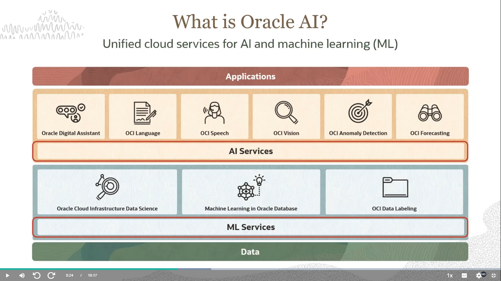

---

## ☁️ Introducción a Oracle AI y OCI Data Science

### 🔍 ¿Qué es Oracle AI?

Oracle AI es una colección de servicios en la nube diseñados para que las organizaciones aprovechen **todo tipo de datos** en escenarios modernos.  
🔽 En la base está el **dato** — necesario para que IA y ML funcionen.  
🔼 En la parte superior están las **aplicaciones**, donde se consume la IA: apps, procesos de negocio o sistemas analíticos.

---

## 🧠 Dos grupos de servicios entre aplicaciones y datos

| Grupo de servicios | Uso principal                                                                 |
|--------------------|--------------------------------------------------------------------------------|
| **AI Services**     | Modelos ML preconstruidos listos para usar vía API (algunos entrenados, otros por el cliente). |
| **Machine Learning Services** | Usados por científicos de datos para construir, entrenar, desplegar y gestionar modelos. |

➡️ En este curso, el foco principal es **OCI Data Science**, que pertenece al segundo grupo.

---

## 🏷️ Servicio clave: OCI Data Labeling  
Ayuda a **etiquetar datos** para entrenar modelos con texto, imagen o audio. Es esencial para ML supervisado.

---

## 🧰 Otros servicios complementarios

Estos servicios no funcionan solos: se apoyan en toda la infraestructura de OCI que incluye:

- Analítica empresarial
- Analítica de grafos
- Integración y gestión de datos

Se pueden combinar en **arquitecturas flexibles** para múltiples escenarios.


---

## 📚 OCI Data Science: servicio central del curso

Es el servicio cloud para **todo el ciclo de vida de ML**, con soporte para **Python** y librerías **open-source**.  
Se trabaja en **JupyterLab**, gestionando modelos con un catálogo centralizado.

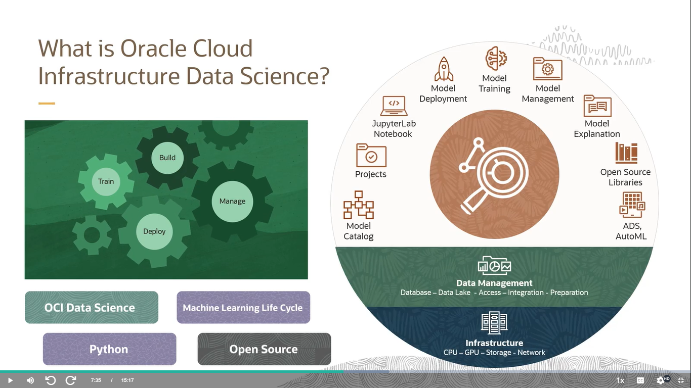

---

## 🧭 Tres principios fundamentales

1. **Aceleración individual**  
   - Librerías open-source preinstaladas  
   - Escalabilidad sin gestionar infraestructura  
   - Librería propia de Oracle para simplificar tareas

2. **Colaboración en equipo**  
   - Compartir recursos  
   - Reducir trabajo duplicado  
   - Facilitar reproducibilidad y trazabilidad

3. **Nivel empresarial (Enterprise-grade)**  
   - Seguridad y protocolos integrados  
   - Infraestructura gestionada automáticamente  
   - Enfoque en el análisis, no en configuración

---

## 🔍 Terminología clave del producto

| Concepto            | Descripción                                                                 |
|---------------------|------------------------------------------------------------------------------|
| **Projects**         | Contenedores de trabajo colaborativo. Se pueden crear sin límite.           |
| **Notebook Sessions**| Entorno Jupyter con librerías preinstaladas. Se elige CPU/GPU y almacenamiento sin configuración manual. |
| **Conda**            | Gestor de entornos y paquetes para Python, integrado al servicio.           |
| **ADS SDK**          | Librería Python de Oracle para conectar datos, visualizar, entrenar con AutoML, evaluar y explicar modelos. |
| **Model Catalog**    | Repositorio centralizado de modelos con metadatos, versiones y trazabilidad. |
| **Model Deployment** | Permite exponer el modelo como endpoint HTTP para predicciones en tiempo real. |
| **Jobs de Data Science** | Definición de tareas ML repetibles sobre infraestructura gestionada.     |

---

## 💻 Formas de acceso

- **OCI Console**: interfaz web principal del curso
- **API REST**: acceso vía programación
- **SDKs**: disponibles para Java, Python, JS, Go, .NET, Ruby
- **CLI (Command Line Interface)**: acceso rápido sin scripting

---

## 🌍 Disponibilidad global

OCI Data Science está disponible en **regiones** distribuidas mundialmente (comerciales, gubernamentales y dedicadas).  
Oracle sigue ampliando regiones — se puede consultar en [oracle.com/cloud](https://oracle.com/cloud).

---

Este módulo presenta OCI Data Science y sus fundamentos. El siguiente cubrirá cómo **provisionar y configurar tu entorno** para usarlo a lo largo del ciclo de vida del Machine Learning.

---


######################### 2.2 ADS SDK Overview (Descripcion general)
######################### [AUDIO LOGO] TRADUCIDO
---

## 📦 Acceso a Datos con Oracle ADS - Accelerated Data Science (Ciencia de datos acelerada) - Objetivos y Capacidades

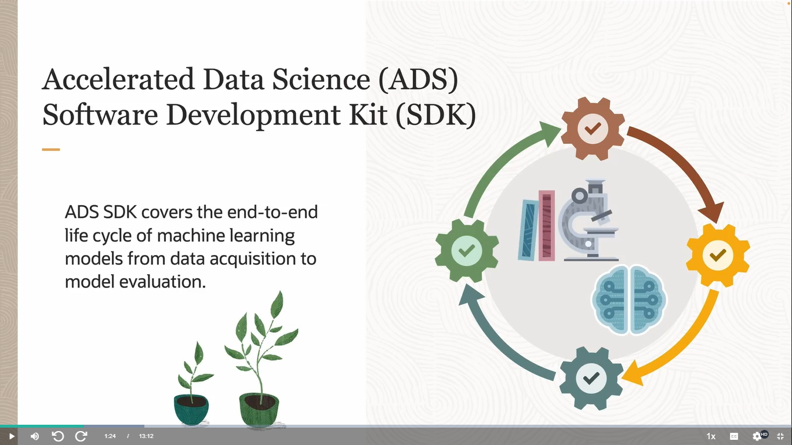

### 🗂️ Almacenamiento de Objetos (Object Storage)
Para conjuntos de datos grandes que necesitan compartirse, es común usar el **almacenamiento de objetos**. Oracle ADS emplea el protocolo **APE Spec** para que puedas acceder a estos archivos usando `pandas`, como si estuvieran en tu disco local.

- 🧠 Esto se logra gracias al **protocolo OCI**, que permite montar el objeto como si fuera una ruta directa.
- ✅ ADS facilita la lectura desde `Object Storage` sin copiar datos localmente.

🔍 *Validación sugerida*: incluir chequeo de formato y disponibilidad del archivo remoto antes de intentar la carga, para evitar errores silenciosos.

---

### 🗃️ Conexiones a Bases de Datos Oracle
Gran parte de los datos se encuentran en **bases de datos Oracle**. ADS proporciona una integración directa:

- 🔐 El **Oracle DB Secret Keeper** permite almacenar credenciales en el archivo **DTP wallet** dentro del **OCI Vault**, evitando exponer claves en el notebook.
- 🛡️ El **ADB Secret Keeper** funciona específicamente con bases de datos **Autonomous Database**.

💡 *Tip Ctrl+BA*: centralizar credenciales y realizar validaciones explícitas (`y/n`) antes de operar en entornos productivos.

---

### ☁️ Integración con Proveedores en la Nube


Con ADS instalado, `pandas` puede conectarse a múltiples proveedores externos:

| Proveedor                | Tipo de Almacenamiento         |
|--------------------------|--------------------------------|
| Amazon S3                | Buckets (clave/valor)          |
| Google Cloud Storage     | Archivos y carpetas            |
| Azure Data Lake Storage  | Estructura jerárquica          |
| Azure Blob Service       | Archivos binarios              |
| Dropbox                  | Directorios sincronizados      |

🎯 ADS convierte a `pandas` en una herramienta multicloud con acceso directo desde tus notebooks.

---

### 🧬 Datos No Relacionales y Big Data
- 🛠️ ADS incluye la clase **Data Set Factory**, para conectar fácilmente con **bases NoSQL**, ejecutar consultas y traer resultados.
- 🏗️ El servicio **OCI Big Data Service (BDS)**, basado en **Hadoop**, usa **HDFS** como sistema de archivos.

🔄 Podés **leer datos directamente desde BDS**, sin tener que copiarlos a tu máquina local.

---

### 🌐 Acceso a Web Pública
ADS también permite cargar archivos directamente desde la web mediante URLs HTTP/HTTPS:

```python
import pandas as pd

df = pd.read_csv("https://miarchivo.com/datos.csv")
```
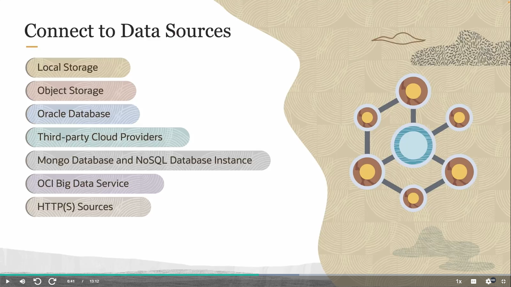
📌 Esta opción es útil para conjuntos de datos públicos o compartidos entre equipos, ideal para validaciones abiertas.

---

## 🎨 Visualización y Análisis Exploratorio de Datos

### 🔍 Exploración inicial
La exploración de datos (EDA) es crítica para comprender tu información. Sin embargo, puede llevar mucho tiempo crear clases de visualización y desecharlas para luego volver a construirlas.

- 📦 Las **clases de tipo de característica** (`feature type classes`) en ADS permiten visualizar datos con configuraciones predefinidas.
- ⚙️ Es fácil personalizar visualizaciones y **reutilizarlas** entre proyectos o equipos.

### 📊 Estadísticas y visualizaciones integradas

ADS ofrece:
- Resúmenes estadísticos por columna
- Visualizaciones automáticas por característica
- **Mapas de calor de correlación**

📌 *Validación sugerida:* incluir chequeo para detectar variables con baja varianza o alto multicolinealidad.

---

## 🧬 Ingeniería de Características (Feature Engineering)

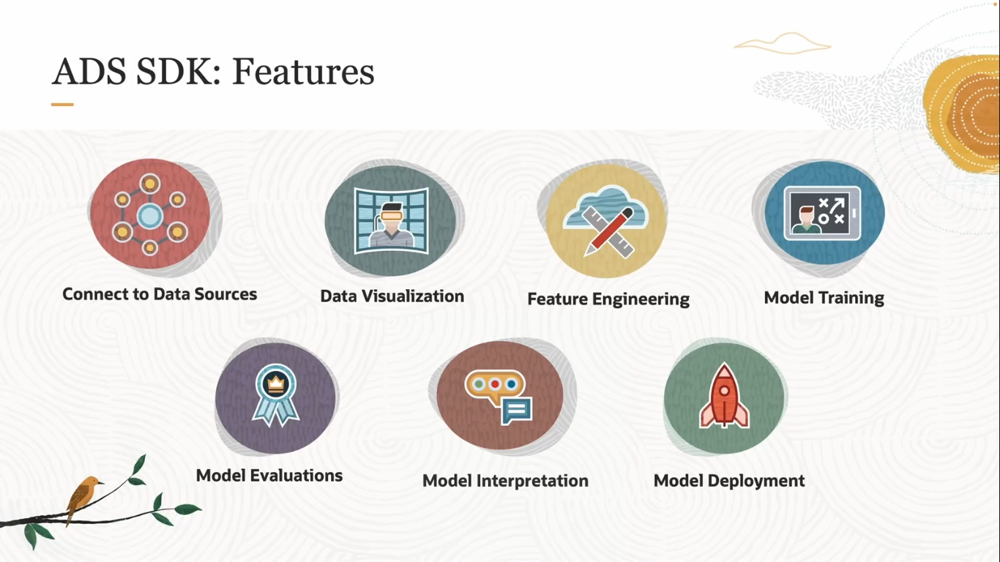


La ingeniería de características puede mejorar significativamente la calidad de tus modelos.

- 🔄 Consiste en transformar variables existentes en nuevas relaciones que el modelo pueda aprender.
- 📁 La clase **ADS Dataset** envuelve un `DataFrame` de `pandas` y sugiere transformaciones automáticamente:
  - Codificación categórica
  - Manejo de valores nulos
  - Imputación de datos

🛠️ También recomienda cambios que mejoren las características disponibles.

---

## 🧪 Entrenamiento de Modelos

Una vez preparados los datos, ADS puede automatizar el entrenamiento usando **AutoML**:

| Herramienta     | Función                                  |
|----------------|-------------------------------------------|
| `ADS AutoML`    | Probar múltiples modelos y ajustar hiperparámetros |
| `ADSTuner`      | Optimización avanzada de hiperparámetros       |

- 🧾 ADS genera métricas de rendimiento por modelo.
- 📦 Puede empaquetar todos los archivos en un **artefacto de modelo**, guardarlo en el **Model Catalog**, y enviarlo a producción en pocos pasos.

---

## 📈 Evaluación de Modelos

ADS incluye herramientas de comparación entre modelos:

- Métricas y gráficos automáticos
- Compatible con clasificación binaria, multinomial y regresión

🧠 ADS genera las visualizaciones apropiadas para cada tipo de problema, **evitando tener que rehacer evaluaciones**.

---

## 🧠 Interpretabilidad y Explicabilidad de ML

La confianza en el modelo viene de entender qué ha aprendido.

- ADS ofrece **herramientas agnósticas al tipo de modelo**
- Permite hacer **pruebas de “qué pasaría si…”** (`what-if testing`)
- Explicaciones locales: entender por qué se hizo una predicción específica
- Explicaciones globales: cómo aprende y se comporta el modelo

🎨 Incluye gráficos como:
- **Partial Dependence Plots (PDP)**
- **Accumulated Local Effects (ALE)**

🔍 Ideal para verificar si el modelo aprende lo que esperás y detectar relaciones clave.

---

## 🚀 Despliegue de Modelos

ADS facilita pasar de notebook a producción:

- 📦 Framework ADS Model para desplegar modelos de diversos tipos
- Compatibilidad con: PyTorch, scikit-learn, TensorFlow, AutoML de Oracle Labs, etc.
- 🧠 Soporte para modelos genéricos, con pocos comandos

🔒 Integra con **OCI Logging Service**, generando:
- Logs de acceso
- Logs de predicciones

🛡️ Esto permite auditar, diagnosticar y entender el uso del modelo en tiempo real.

---

## 🧾 Conclusiones del Módulo

Este módulo cubre tres objetivos clave del SDK:

1. 🔧 Cómo instalar y acceder a ADS
2. 📊 Cómo conectar y visualizar datos de forma rápida
3. 🤖 Herramientas de ingeniería de características, entrenamiento y despliegue

Además:
- Evaluar la calidad del modelo
- Interpretar su comportamiento
- Llevarlo de forma segura y escalable a producción

---

######################### 2.3 Tenancy Configuration Basics
######################### [AUDIO LOGO] TRADUCIDO

Este módulo trata sobre la **configuración de tenencia en OCI** para proyectos de ciencia de datos. Te presento la versión adaptada con estilo guía `.md`, explicaciones claras, ejemplos aplicados y estructura lista para tu archivo:

---

## 🧭 Fundamentos de la Configuración de Tenancy en OCI para Data Science

### 🏛️ ¿Qué es una Tenancy?
Una **tenancy** en OCI es como tu "casa en la nube", donde vivís con tus recursos, servicios y configuraciones. Todo lo que desplegás, creás o accedés ocurre dentro de esta unidad.


---

## 📦 Compartments (Compartimientos)

### 🔹 Descripción
Son **contenedores lógicos** para organizar los recursos de OCI. Permiten agrupar y controlar el acceso a servicios como notebooks, bases de datos, almacenamiento, etc.

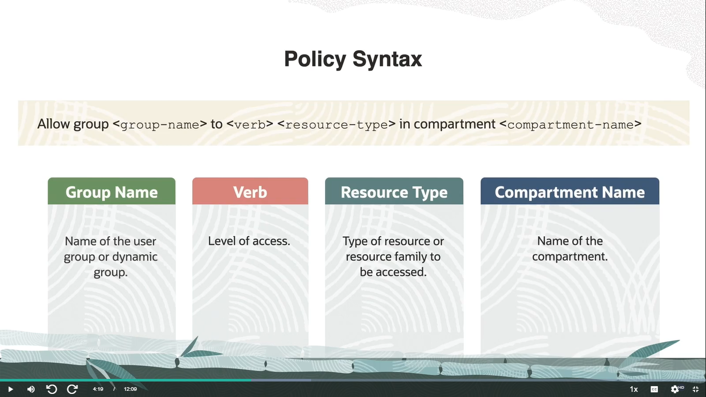

### 🛠️ Ejemplo práctico
Crear un compartimento llamado `data-science-lab` donde estén alojados tus notebooks, datasets y modelos, accesible solo para tu equipo técnico.

### 🧾 Pasos para crear un Compartimento
1. Ir a **Identity Console**
2. Seleccionar **Compartments**
3. Click en “Create Compartment”
4. Ingresar nombre y descripción → “Crear”

---

## 👥 User Groups (Grupos de Usuarios)

### 🔹 Descripción
Son grupos que agrupan **usuarios humanos** y les otorgan permisos para acceder a recursos dentro de compartimentos.

### 🧾 Pasos para configurar grupos
1. Crear los usuarios.
2. Crear los grupos.
3. Asignar usuarios a los grupos.

🧠 *Tip*: Definí claramente qué grupo necesita acceso a qué compartimento antes de escribir políticas.

---

## 🤖 Dynamic Groups (Grupos Dinámicos)

### 🔹 Descripción
Son grupos que **no contienen usuarios**, sino **recursos de OCI** (e.g., notebook sessions, ejecuciones de jobs, despliegues de modelos). Su pertenencia se define por **reglas dinámicas**.

### 🔄 ¿Cómo funciona?
- Escribís una regla que define qué recursos entran al grupo (por tipo y compartimento).
- Ejemplo: todo notebook, job y modelo en el compartimento `data-science-lab`.

### 📡 Acción con políticas
Una vez en el grupo dinámico, los recursos pueden hacer llamadas API según las políticas que escribas. Ejemplo: un notebook puede leer datos de Object Storage si su grupo dinámico tiene esa política.

---

## 📜 Policies (Políticas)

### 🔹 Descripción
Son reglas que **otorgan permisos** a grupos (de usuarios o dinámicos) sobre recursos dentro de compartimentos.

### 🧾 Sintaxis básica
```
Allow group <nombre_grupo> to <verbo> <tipo_recurso> in compartment <nombre_compartimento>
```

### 📘 Ejemplo traducido
```
Allow group data-science-team to read buckets in compartment data-science-lab
```

---

## 🔍 Verbos en las Políticas (Nivel de Acceso)

| Verbo     | Acceso concedido                                                   |
|-----------|---------------------------------------------------------------------|
| `inspect` | Listar recursos, sin acceso a metadata ni contenido real           |
| `read`    | Incluye `inspect` + leer metadata y contenido del recurso          |

🧠 *Tip Ctrl+BA*: Siempre testeá las políticas con casos simples antes de aplicarlas en producción. Y si tenés múltiples grupos, usá nombres descriptivos (e.g., `ds_notebooks_read_access`).

---

## 🧾 Verbos en las Políticas: Nivel de Permiso

| Verbo     | Descripción                                                                 |
|-----------|------------------------------------------------------------------------------|
| `inspect` | Listar recursos, sin ver metadata ni contenido real                         |
| `read`    | Ver metadata y contenido del recurso                                         |
| `use`     | Incluye `read` + modificar o actualizar el recurso (sin crear o borrar)     |
| `manage`  | Incluye todos los permisos: crear, leer, actualizar y borrar                |

🧠 *Tip*: Usá `use` para permitir interacción sin riesgo de destrucción; `manage` para acceso completo.

---

## 📚 Tipos de Recursos

- Podés escribir políticas para **recursos individuales** (e.g., `data-science-model`).
- También existe el tipo **agregado** llamado `data-science-family`, que incluye todos los recursos relevantes de Data Science (notebooks, modelos, jobs, etc).

📘 *Ejemplo de sintaxis*:
```
Allow group ds_team to manage data-science-family in compartment ds_lab
```

---

## 🧩 Políticas Requeridas para Data Science

### 🔹 Para grupos de usuarios:
```text
Allow group ds_team to manage data-science-family in compartment ds_lab
```

### 🔹 Para grupos dinámicos:
```text
Allow dynamic-group ds_dyn to manage data-science-family in compartment ds_lab
```

---

## 📈 Políticas Requeridas para Métricas y Logging

| Grupo           | Acción                                                |
|-----------------|--------------------------------------------------------|
| Grupo de usuarios | `read metrics`, `manage log-groups`, `use log-content` |
| Grupo dinámico   | `use log-content`                                       |

📘 *Ejemplos*:
```text
Allow group ds_team to read metrics in compartment ds_lab
Allow dynamic-group ds_dyn to use log-content in compartment ds_lab
```

---

## 🌐 Políticas para Redes (Networking Personalizado)

| Actor           | Permiso otorgado                                |
|-----------------|--------------------------------------------------|
| Servicio Data Science | `use virtual-network-family`               |
| Grupo de usuarios     | `use virtual-network-family`               |
| Grupo dinámico        | `use virtual-network-family`               |

---

## 🗃️ Políticas útiles para otros servicios (e.g., Object Storage)

| Grupo           | Permiso otorgado                           |
|-----------------|---------------------------------------------|
| Grupo de usuarios | `manage object-family`                    |
| Grupo dinámico   | `manage object-family`                    |

---

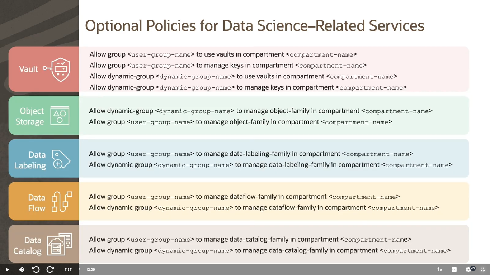

## 🛠️ Pasos prácticos (Resumen)

### 🔹 Crear Compartimento
1. Navegá a **Identity > Compartments**
2. Click en “Create Compartment”
3. Nombre, descripción, y opcional: tags
4. Guardar el **OCID** para políticas

### 🔹 Crear Usuario
1. Identity > Users > “Create User”
2. Nombre, email, descripción

### 🔹 Crear Grupo
1. Identity > Groups > “Create Group”
2. Asignar nombre, descripción
3. “Add User to Group”

### 🔹 Crear Dynamic Group
1. Identity > Dynamic Groups > “Create”
2. Nombre y descripción
3. Ingresar reglas:
   - Data Science Notebook Sessions
   - Model Deployments
   - Job Runs
   - Usar OCID del compartimento

### 🔹 Crear y Editar Políticas
1. Identity > Policies > “Create Policy”
2. Nombre, descripción
3. Switch a **Manual Editor**
4. Ingresar sentencias
5. Para editar: agregar reglas adicionales y guardar cambios

---

## 🧠 Conclusión del Módulo

- Se explicaron **compartimentos**, **grupos de usuarios**, **grupos dinámicos** y **políticas**.
- Se mostró la **sintaxis básica** y los **verbos clave**.
- Se configuraron políticas para acceso a:
  - Recursos de Data Science
  - Métricas y logs
  - Servicios relacionados como redes y almacenamiento
- Se dieron pasos prácticos para implementar la configuración desde el **Identity Console**.

---

######################### 2.4 Configure a Tenancy with OCI Resource Manager
######################### [AUDIO LOGO] TRADUCIDO

🧠 ¿Qué significa realmente este concepto? Es el conjunto de principios, estructuras y pasos iniciales necesarios para organizar los recursos en OCI (Oracle Cloud Infrastructure) dentro de tu entorno de nube llamado “tenancy”.
Una tenencia es como tu contenedor principal en la nube: ahí adentro vivís con todos tus compartimentos, usuarios, políticas y servicios.

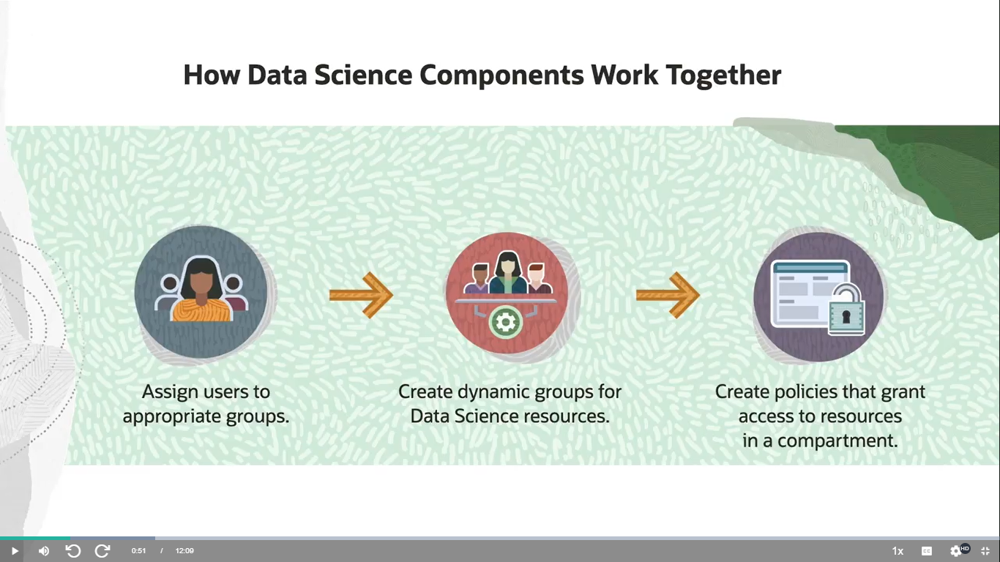
---

## ⚙️ Configuración automática de tenencia con OCI Resource Manager especialmente para proyectos de Data Science!

### 🧠 ¿Qué es Resource Manager (ORM)?
Es una herramienta que permite **desplegar infraestructura como código**, usando plantillas o scripts Terraform. Evita configurar manualmente usuarios, políticas y grupos.

---

## 🧩 Plantilla predefinida: Data Science Service Template

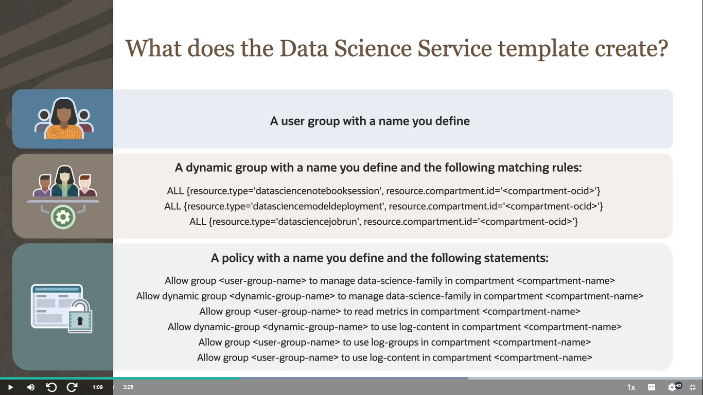

### 📦 ¿Qué crea automáticamente?

- Un **grupo de usuarios** (con el nombre que elijas)
- Un **grupo dinámico** (también personalizable)
- Reglas de coincidencia para incluir recursos:
  - `datasciencenotebooksession`
  - `datasciencemodeldeployment`
  - `datasciencejobrun`
- Una **política** con los siguientes permisos:
  - Permitir al grupo de usuarios: `manage data-science-family` en el compartimento elegido
  - Permitir al grupo dinámico: `manage data-science-family` en el compartimento
  - Permitir al grupo de usuarios: `read metrics` en el compartimento
  - Permitir al grupo dinámico: `use log-content` en el compartimento

---

## 🛠️ Proceso para ejecutar el stack de ORM

1. Navegá a **Resource Manager** → **Stacks**
2. Click en **Create Stack**
3. Elegí **Template** como origen → seleccioná “Data Science”
4. Elegí el **compartimento**
5. Completá variables si lo deseás → Click en **Next**
6. Click en **Create** y esperá que se aplique el stack
7. 🔄 Por último, agregá tus usuarios al grupo creado


🧠 *Tip Ctrl+BA*: Aunque el template es automático, podés editar los componentes después y adaptarlos a tu arquitectura.

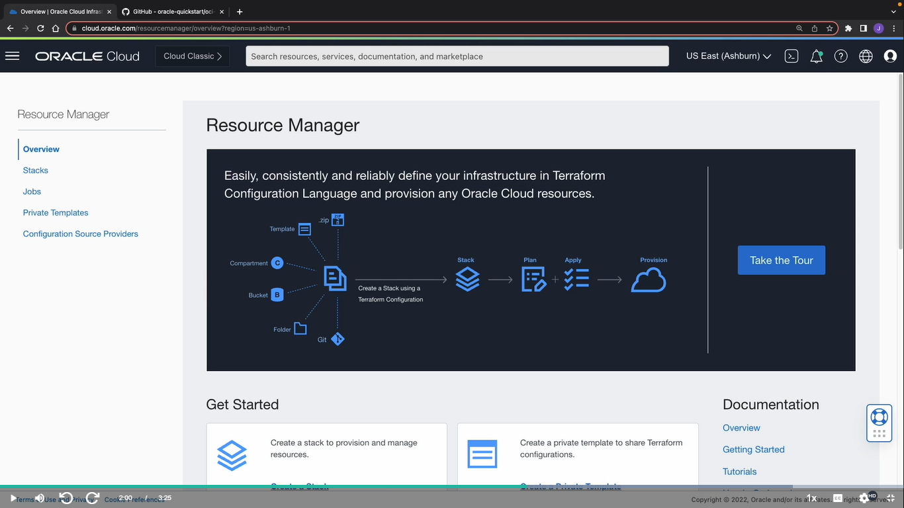
---

## 📘 Alternativa: usar tu propio script Terraform

- También podés usar un **script personalizado** desde un repositorio público de GitHub.
- Esto da máxima flexibilidad si tenés necesidades específicas de IAM, redes o servicios.

---

## 🧾 Conclusión del Módulo

- Aprendiste a usar la plantilla de configuración automática de OCI para proyectos de Data Science.
- Identificaste los componentes creados: **grupos, políticas, reglas y recursos**
- Te mostraron cómo ejecutar el stack desde la consola.
- Conociste la opción de usar **Terraform desde GitHub** como solución alternativa.

---
## 🧾 Comparación  entre usar la **plantilla predefinida de Data Science en Resource Manager** y desplegar tu propia solución con **Terraform personalizado**. Ideal para decidir según tus necesidades:

---

## 📊 Comparativa: Plantilla Predefinida vs Terraform Personalizado en OCI Resource Manager

| Aspecto                          | 📦 Plantilla Data Science (predefinida)     | 🧪 Terraform Personalizado                   |
|----------------------------------|---------------------------------------------|---------------------------------------------|
| **Facilidad de uso**             | Muy alta (instalación guiada vía consola)   | Requiere conocimientos previos en Terraform |
| **Velocidad de configuración**   | Rápida (en pocos clics se crea la tenencia) | Variable (depende del script y variables)   |
| **Recursos creados automáticamente** | Grupos, dinámicos, políticas, reglas         | Todo lo que defina tu script (flexible)     |
| **Flexibilidad de configuración**| Limitada a lo que incluye la plantilla      | Total (IAM, redes, variables, etc.)         |
| **Reusabilidad y versionado**    | Baja (cambios limitados post-creación)      | Alta (modificás el script y versionás)      |
| **Accesibilidad**                | Solo desde la consola OCI                   | Desde GitHub, local o consola               |
| **Integración con otros servicios** | Básica (centrado en recursos de Data Science) | Total (podés incluir Object, Vault, etc.)   |
| **Escenario recomendado**        | Primeros pasos o configuraciones estándar   | Arquitecturas personalizadas o complejas    |

---

💡 *Tip Ctrl+BA*: Usá la plantilla cuando querés acelerar el despliegue inicial con buenas prácticas preconfiguradas. Usá Terraform cuando querés controlar cada detalle de tu entorno y mantenerlo como código reutilizable.

¿Querés que prepare un flujo visual tipo `mermaid` para representar ambos caminos? También puedo ayudarte a convertir esta tabla en una sección visual para tu Copilot Page. ¡Vos decidís, estratega de la infraestructura ☁️📘!


-------------------------------

## Proceso de despliegue completo 0.con **OCI Resource Manager y la plantilla de Data Science**. Incluye los tres recursos creados, sus propósitos, las reglas definidas, y una tabla resumen con los permisos asignados. Acá va:

# 📦 Configuración automática con OCI Resource Manager – Data Science Template

## ✅ Recursos creados

| Recurso        | Nombre                    | Propósito                                                                 |
|----------------|---------------------------|---------------------------------------------------------------------------|
| Grupo dinámico | `DataScienceDynamicGroup` | Permite que notebooks, jobs y modelos actúen dentro del compartimento.   |
| Grupo de usuarios | `DataScienceGroup`     | Agrupa usuarios con permisos sobre recursos de Data Science.             |
| Política       | `DataSciencePolicies`     | Define los permisos para los grupos sobre los servicios de OCI.          |

---

## 🔎 Matching Rules del Dynamic Group

```hcl
any {
  all {resource.type='datasciencenotebooksession', resource.compartment.id='<OCID>'},
  all {resource.type='datasciencejobrun', resource.compartment.id='<OCID>'},
  all {resource.type='datasciencemodeldeployment', resource.compartment.id='<OCID>'}
}
```

Este bloque vincula automáticamente los recursos de Data Science del compartimento al grupo dinámico.

---

## 📜 Política generada: Permisos otorgados

| Tipo de acceso           | Grupo afectado              | Recurso destino                     |
|--------------------------|-----------------------------|-------------------------------------|
| `manage`                 | Grupo de usuarios           | `data-science-family`               |
| `read`                   | Grupo de usuarios           | `metrics`                           |
| `use`                    | Grupo de usuarios           | `log-content`, `virtual-network-family`, `object-family` |
| `manage`                 | Grupo de usuarios           | `log-groups`                        |
| `use`                    | Dynamic Group               | `log-content`, `object-family`, `virtual-network-family` |
| `read`                   | Dynamic Group               | `repos`                             |
| `manage`                 | Dynamic Group               | `data-science-family`               |
| `use`                    | Servicio Data Science       | `virtual-network-family`           |

---

## 🧠 Tip Ctrl+BA

Este despliegue automatizado crea una **arquitectura base lista para entrenar y desplegar modelos**, con seguridad, monitoreo y red configurados. ¡Ideal para avanzar sin enredarte en IAM manual!

---

######################### 2.5 Networking for Data Science
######################### [AUDIO LOGO] TRADUCIDO

Este módulo introduce los conceptos fundamentales de networking en OCI aplicados al servicio de Data Science. Incluye componentes, patrones, y un resumen práctico del asistente de VCN:

🌐 Networking en OCI para Data Science – Fundamentos

### 📘 Networking en OCI para Data Science – Fundamentos

| Componente        | Propósito en Data Science 📦 | Objetivo 🎯 | Consideraciones técnicas 🧠 |
|-------------------|------------------------------|-------------|-----------------------------|
| **VCN (Virtual Cloud Network)** | Crear un entorno privado para tus recursos en la nube | Aislar tus máquinas virtuales del caos de Internet | Actúa como una red propia. Tiene CIDR propio, permite definir subnets. Pensalo como el perímetro de seguridad del hotel. |
| **Subnet** | Separar servicios por tipo y controlar accesos | Agrupar recursos que necesitan reglas similares | Pueden ser públicas o privadas. Se conectan por IP interna y tienen Security Lists. Ej: notebook sin acceso desde Internet. |
| **VNIC (Virtual NIC)** | Permitir que una instancia se conecte a la red | Darle “enchufe de red” a tu recurso | Asocia una IP privada (y opcionalmente pública). Sin VNIC, el recurso no “habla” con nadie. |
| **Service Gateway** | Acceder a servicios OCI (como Object Storage) sin exponer la red | Comunicarte internamente sin usar Internet | Solo sirve para servicios “dentro del hotel OCI”. Usa HTTPS, pero con IPs internas. Ideal para leer datos sin riesgos. |
| **NAT Gateway** | Salir a Internet desde una subnet privada sin recibir conexiones | Instalar librerías, hacer requests web | Permite tráfico saliente (ej: `pip install`), bloquea entradas. Usa protocolo TCP, puerto 443 (HTTPS). |
| **Internet Gateway** | Permitir entrada y salida directa a Internet | Conectarte sin barreras, como en una red abierta | Riesgoso para instancias sensibles. Se usa cuando querés que algo esté disponible públicamente (ej: una API REST). |
| **Security List / NSG** | Controlar qué puertos están abiertos y a quién | Definir reglas como firewall | Se definen por protocolo (TCP/UDP), puertos (ej: 22 para SSH, 443 para HTTPS), y rangos de IP. Son clave para proteger tu modelo y datos. |
| **Routing Table** | Indicar cómo se dirige el tráfico según el destino | Elegir el camino correcto para cada conexión | Define si un paquete va al NAT, al Service Gateway o a otro VCN. Pensalo como las señales viales dentro del hotel. |

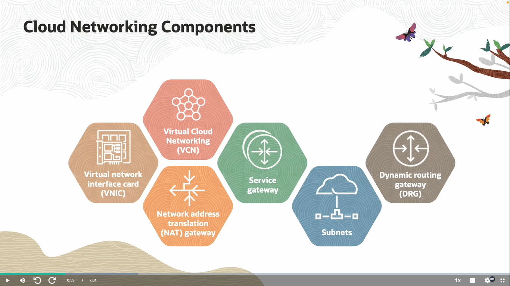

🔗 Cómo se conectan los componentes
- El VCN es la base.
- Dentro se crean subnets, cada una con sus VNICs.
- Las VNICs conectan recursos (como notebooks) con la red.
- Los routers virtuales (DRG, NAT, Service Gateway) permiten flujo seguro según tipo de recurso:
- VCN ↔ otra VCN
- VCN ↔ on-premise
- VCN ↔ servicios internos de Oracle

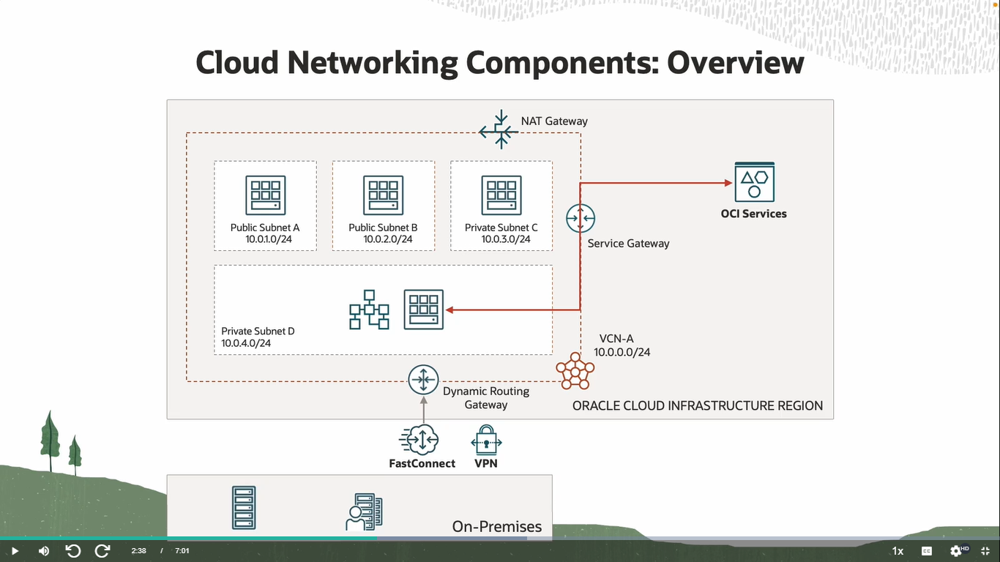

⚙️ Workloads de Data Science y conectividad
🧠 ¿Qué es un “workload”?
Son recursos que ejecutan código personalizado:
- Notebook Sessions
- Jobs y Job Runs
- Model Deployments

🛠️ Patrones de Networking en Data Science
| Patrón | Descripción | 
| Default | OCI proporciona automáticamente una subnet con acceso a Internet (NAT) y a servicios Oracle | 
| Custom | Usás una subnet propia, creada dentro de tu tenencia → mayor control y conectividad privada | 


🔒 Para acceder a recursos privados (e.g., Git corporativo, DB interna), debés usar custom networking y tener políticas adicionales.

🚀 Asistente para crear VCN
🧾 Pasos
- Ir a Networking > Virtual Cloud Networks
- Click en Start VCN Wizard
- Elegir Create VCN with Internet Connectivity
- Asignar nombre al VCN → Click en Next → Create
- Ver VCN en la consola
🧠 Nota: Si usás OCI Resource Manager, este paso puede omitirse: la VCN ya fue creada automáticamente.

📘 Resumen del módulo
- Se explicaron los componentes de red de OCI y su función.
- Se detallaron los dos patrones de networking para Data Science.
- Se mostró cómo configurar una VCN con el asistente.
- Se relacionó la red con los recursos como notebooks, modelos y jobs.

--------------------------------------------------------------------

Vamos a “desenredar la red” ☁️🔌. En lugar de ver cada componente como un ítem técnico, pensemos en ellos como elementos de una **infraestructura hotelera moderna conectada al mundo digital**, donde los datos fluyen como huéspedes bien atendidos.

---

## 🧩 ¿Por qué es importante el networking en Data Science?

Cuando creás un modelo de Machine Learning en la nube, necesitás que ese modelo:
- 🔎 Encuentre sus datos (e.g., reservas del hotel).
- 🧠 Se entrene con ellos.
- 🛰️ Se conecte a servicios (como almacenamiento, monitoreo, bases de datos).
- 🚪 Tenga salidas seguras (enviar resultados, conectarse a APIs) sin abrirle puertas inseguras a Internet.

---

## 🏨 Analogía: el hotel inteligente

Imaginá que tu modelo vive en una habitación dentro de tu hotel digital. ¿Cómo se conecta con el resto del mundo?

### 🧱 VCN (Virtual Cloud Network)
Es el **edificio del hotel**, con pasillos internos (red privada). Protege los recursos del caos de Internet abierto.

### 🚪 Subnets
Son **pisos temáticos** del hotel. Uno para modelos de predicción, otro para bases de datos, otro para almacenamiento. Cada uno tiene reglas de acceso y decoración distinta.

### 🔌 VNICs
Son **enchufes y tomas de red** que conectan las habitaciones (instancias) con los pasillos (subnets). Es la forma en que tu notebook accede a otros servicios.

### 🛂 NAT Gateway
Es el **guardia de seguridad en la puerta trasera** del hotel: permite que tus modelos salgan a buscar datos en Internet, pero no deja que nadie entre sin permiso.

### 🧳 Service Gateway
Conecta internamente con **servicios especiales del hotel**, como lavandería o depósito. Tu modelo puede hablar con Object Storage sin salir al “exterior”.

### 🛰️ DRG (Dynamic Routing Gateway)
Es el **transporte privado** entre hoteles (VCN ↔ otros VCN u on-prem). Ideal si tus reservas viven en una base de datos interna lejos del OCI.

---

## 🎯 ¿Por qué te conviene entender esto?

Porque te permite elegir:
- Si tu modelo va a estar en un piso listo para conectarse (default networking).
- O si querés diseñar una planta personalizada con más seguridad, accesos privados, y comunicación cruzada con otros departamentos (custom networking).

Es como decidir si tu hotel usa arquitectura prefabricada o personalizada.

---

¡Genial, Claudio! Sigamos construyendo una narrativa clara y útil sobre networking en OCI con foco en Data Science ☁️📘.

Ahora que entendés los elementos como IP, subnets, gateways y reglas, pasemos al **flujo típico de trabajo** en Data Science en OCI y veamos cómo se conectan los puntos. Lo estructuramos como si diseñaras un sistema, paso a paso:

---

## 🧠 Caso práctico: "Quiero entrenar un modelo en OCI usando datos de Object Storage"

### 1. 📦 **Datos almacenados en Object Storage**
- Viven dentro de un _bucket_ accesible por servicios en OCI.
- No es necesario exponerlo a Internet; se accede vía **Service Gateway**.

### 2. 💻 **Notebook Session de OCI Data Science**
- Está en una instancia dentro de una **Subnet privada** (sin IP pública).
- Tiene una **VNIC** con IP privada (ej: 10.0.0.5).
- Se conecta al bucket por Service Gateway, usando HTTPS (puerto 443).

### 3. 📤 **Instalación de paquetes externos**
- Tu notebook necesita bajar librerías (como scikit-learn o pandas).
- Se conecta a Internet _solo para salir_, vía **NAT Gateway**.
- La **Security List** permite tráfico saliente por puerto 443, y bloquea entrantes no deseados.

### 4. 🔐 **Validación y monitoreo**
- El tráfico está **ruteado** por la **Routing Table** que especifica el camino: si va a Internet, Service Gateway o DRG.
- Los accesos están filtrados por **NSG o Security List**, evitando exposiciones innecesarias.

---

## 🏗️ Checklist: ¿qué componentes de red necesitas?

| Propósito                | Componente            | Ejemplo práctico |
|----------                |------------           |------------------|
| Acceso a datos internos  | Service Gateway       | Notebook leyendo CSV del bucket |
| Salida segura a Internet | NAT Gateway           | `pip install` sin IP pública |
| Control de accesos       | Security List / NSG   | Solo salida por HTTPS, entrada bloqueada |
| Comunicación interna     | Subnet + VNIC         | IP privada, solo dentro del VCN |

---

* guía tipo “cómo decidir el diseño de red según el tipo de proyecto de Data Science”. 


######################### 2.6 Authenticate to OCI APIs
######################### [AUDIO LOGO] TRADUCIDO


Perfecto, Claudio. Vamos a destilar esta unidad en un esquema claro y listo para tu preparación. 🧪🔐

---

## 🔐 Unidad: Autenticación en OCI para Data Science

### 🌐 ¿Por qué importa la autenticación?
Para que tus notebooks, jobs o despliegues puedan interactuar con otros servicios (como Object Storage o Data Flow), tu código debe hacerlo como **usuario autenticado**.

---

### 🛠️ Interfaces para interactuar con las APIs de OCI

| Interfaz         | Modo de autenticación                         | Notas clave                         | Script                                                                 |
|------------------|-----------------------------------------------|-------------------------------------|------------------------------------------------------------------------|
| **ADS SDK**      | Resource Principal / Config File + API Key    | Recomendado usar Resource Principal | `import ads`<br>`ads.set_auth(auth='resource_principal')`              |
| **OCI Python SDK** | Resource Principal / Config File + API Key | Config para IAM user                | `import oci`<br>`from oci.data_science import DataScienceClient`<br>`rps = oci.auth.signers.get_resource_principals_signer()`<br>`dsc = DataScienceClient(config={}, signer=rps)` |
| **OCI CLI**      | Resource Principal / Config File + API Key    | Ideal para automatización           | `oci data-science project list --`<br>`auth resource_principal`             |

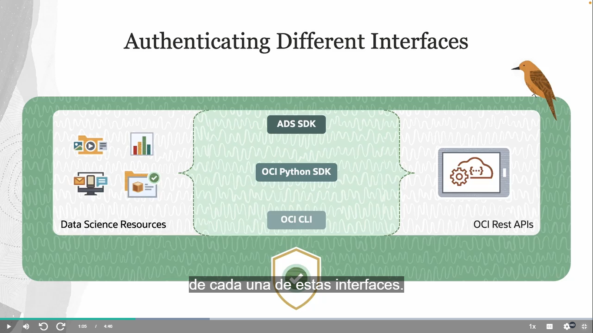
---

### 👤 Tipos de autenticación

#### ✅ Resource Principal
- Cada recurso (notebook, job) tiene **su propia identidad**.
- Usa certificados que se **generan y rotan automáticamente**.
- Más seguro: no necesitás subir credenciales.
- Ideal en **jobs**, donde no hay interfaz para cargar config files.
- 🔄 Token se cachea por 15 minutos → cambios de políticas tardan ese tiempo en aplicar.

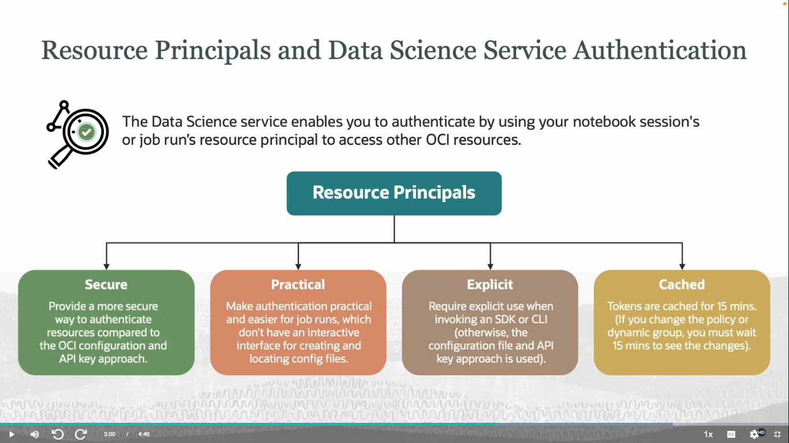

#### 🗂️ Config File + API Key (IAM user - Identity and Access Management user)

- Accedés como usuario personal IAM.
- Requiere subir `.config` y archivos `.pem`.
- Podés generarlos desde el notebook de ejemplo `api_keys`.
- ⚠️ Usado por defecto si no se especifica el uso de Resource Principal.

---
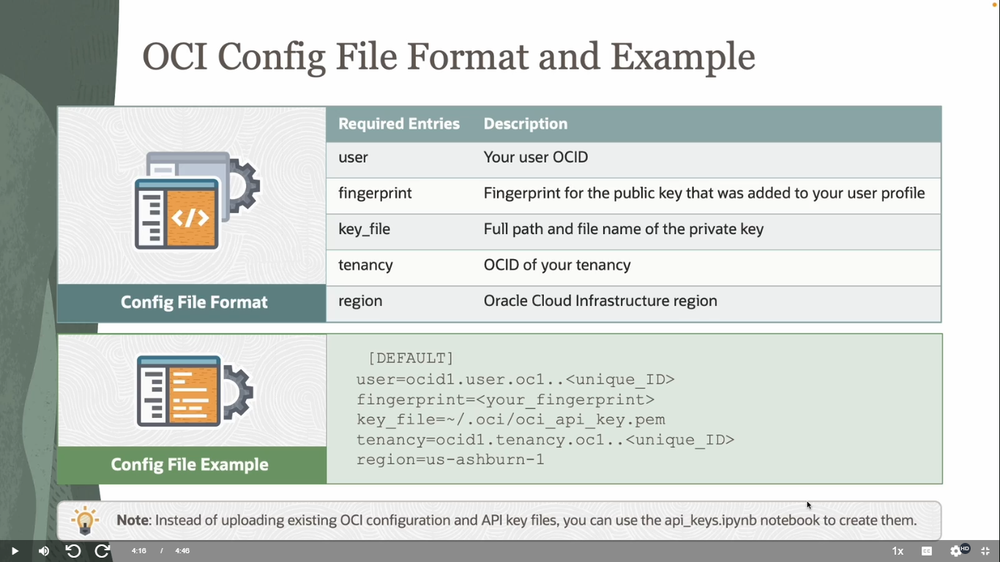
---

### 🛠️ OCI Config File – Formato y Uso

#### 📄 ¿Qué es?

Un archivo `.config` usado para autenticarte como **usuario IAM (Identity and Access Management)** en OCI mediante el método de API Key. Es obligatorio cuando no usás `resource_principal`.

---

### 📁 Estructura del archivo

```ini
[DEFAULT]
user=ocid1.user.oc1..<unique_ID>
fingerprint=<your_fingerprint>
key_file=~/.oci/oci_api_key.pem
tenancy=ocid1.tenancy.oc1..<unique_ID>
region=us-ashburn-1
```

---

### 🧩 Descripción de cada campo

| Campo         | Descripción breve                                         |
|---------------|-----------------------------------------------------------|
| `user`        | OCID de tu usuario IAM                                    |
| `fingerprint` | Identificador de la clave pública cargada en OCI          |
| `key_file`    | Ruta local al archivo `.pem` con la clave privada         |
| `tenancy`     | OCID de tu tenencia                                       |
| `region`      | Región OCI donde vas a operar (ej: `us-ashburn-1`)        |

OCID: Oracle Cloud Identifier (Identificador de Oracle Cloud)

---

### 🧪 ¿Cómo se genera?

Podés usar el notebook de ejemplo en JupyterLab llamado:  
**`api_keys.ipynb`**  
Este notebook te guía para crear el par de claves y configurar el archivo `.config` automáticamente.

---

### 💡 Consideraciones clave

- Este método **no es ideal para jobs o entornos sin UI - User Interface**, ya que requiere subir archivos manualmente.
- En notebooks, si no especificás `set_auth('resource_principal')`, se usará por defecto este archivo.
- Tené en cuenta los permisos del archivo `.pem` (debe estar protegido), y la ruta correcta en sistemas Linux/Mac (`~/.oci/`).

---

### 🧭 Diferencia clave

| Concepto      | Definición                           |
|---------------|---------------------------------------|
| **Autenticación** | Verifica que seas una identidad válida en OCI |
| **Autorización** | Define lo que esa identidad puede hacer       |

*(La autorización se ve en la unidad de Tenancy Configuration)*

---

### 🧠 Tip Copilot para el parcial

- Oracle valora que **sepas cuándo usar cada tipo de autenticación**.
- Muestran preferencia por soluciones **seguras y automatizadas** → eso implica usar **Resource Principal** en jobs.
- Podrías tener preguntas del tipo:  
  - “¿Cuál es el método de autenticación más recomendado para jobs que acceden a Object Storage?”
  - “¿Qué sucede si modificás una política en el dynamic group y probás inmediatamente?”

---

**IAM** es la sigla de **Identity and Access Management**, y es un pilar central en la arquitectura de Oracle Cloud Infrastructure (OCI) y otros sistemas cloud. Te lo desgloso:

---

## 🛡️ IAM: Identity and Access Management

### 📘 ¿Qué hace?

- **Autenticación:** Verifica *quién sos* (usuario, recurso, servicio).
- **Autorización:** Decide *qué podés hacer* según tu rol, políticas y permisos.

---

### 🧩 Componentes clave en OCI

| Elemento            | Rol en el sistema                    |
|---------------------|--------------------------------------|
| **Users**           | Personas que acceden a recursos      |
| **Groups**          | Conjuntos de usuarios con mismos permisos |
| **Policies**        | Reglas que definen qué puede hacer cada grupo |
| **Compartments**    | Espacios organizativos de recursos   |
| **Dynamic Groups**  | Recursos (como notebooks o jobs) que se agrupan para autorizar acciones sin intervención humana |

---

### 🎯 En tu curso de Data Science, ¿por qué importa IAM?

- Permite que tus **jobs o notebooks se autentiquen sin claves personales**, usando **Resource Principals**.
- Define quién puede acceder a tus modelos, ejecutar jobs, o escribir en Object Storage.
- Es fundamental para **automatizar despliegues y procesos seguros**.

---

### 🧬 ¿Cómo se ve un OCID?

Tiene una estructura como esta:

```
ocid1.user.oc1..<unique_ID>
```

Y se compone de varias partes:

- `ocid1`: versión del identificador
- `user` (o el tipo de recurso): puede ser `tenancy`, `instance`, `volume`, etc.
- `oc1`: el *realm* (conjunto de regiones que comparten entidades)
- `<unique_ID>`: una cadena larga que identifica de forma única el recurso

---

### 🧭 ¿Para qué sirve?

- Es necesario para autenticarte con la API
- Se usa en configuraciones como el archivo `.config` que mencionaste
- Permite referenciar recursos de forma precisa en scripts, políticas IAM (Identity and Access Management), y automatizaciones

---


