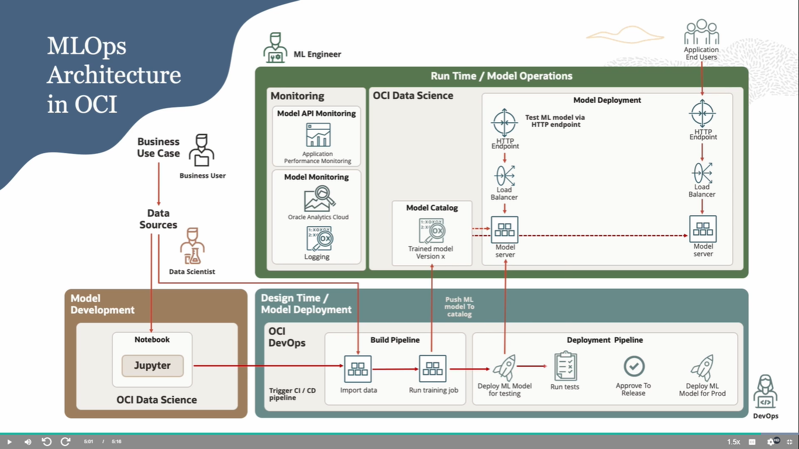
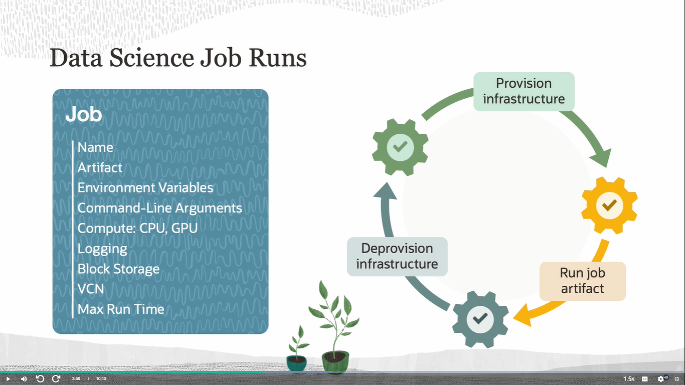
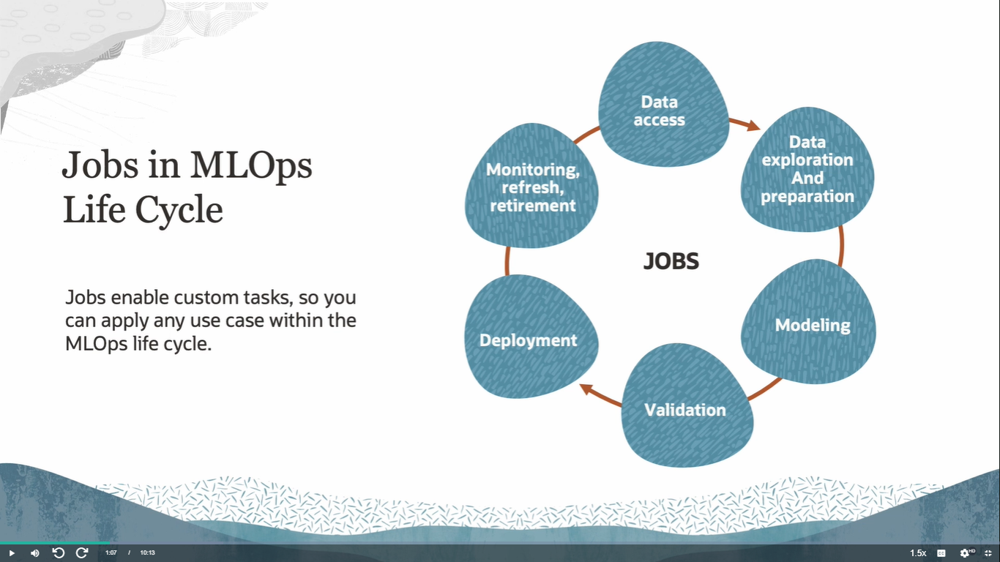
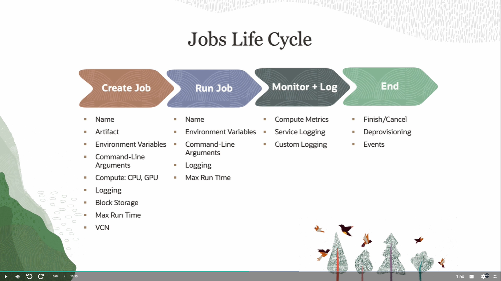
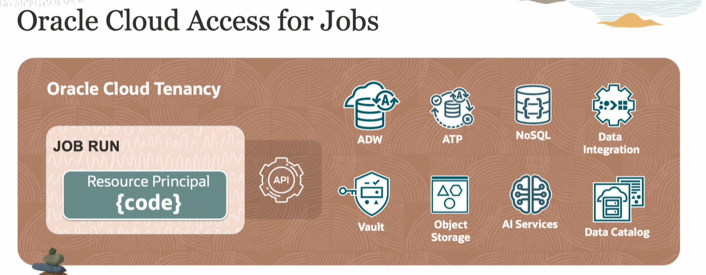
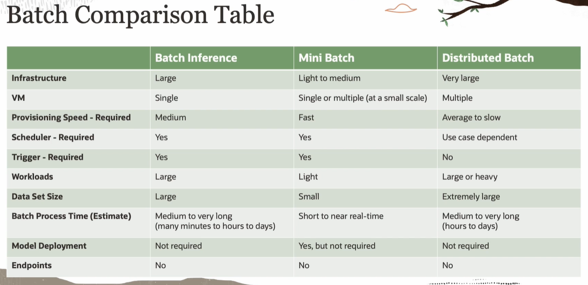
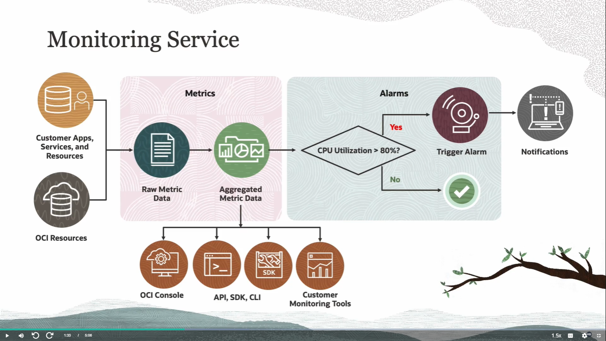
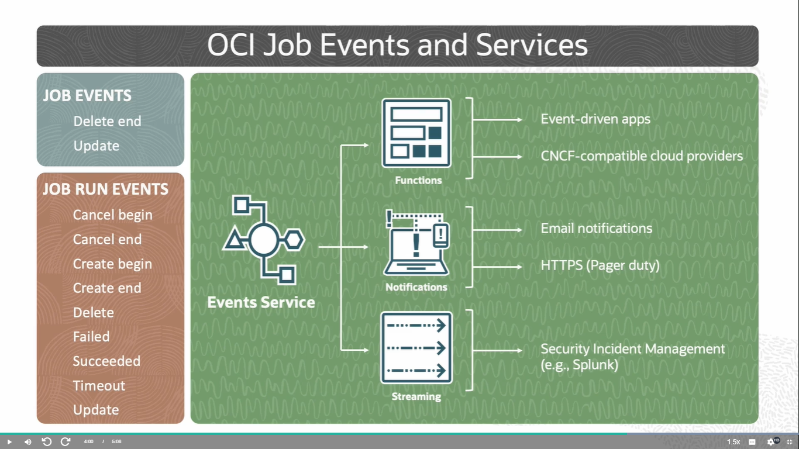
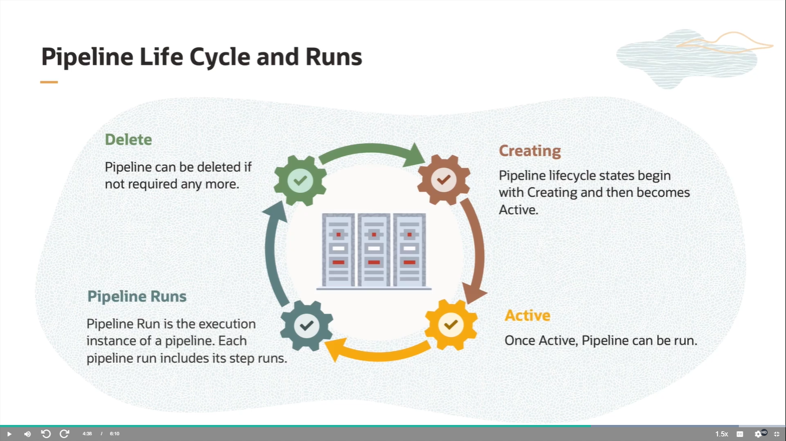
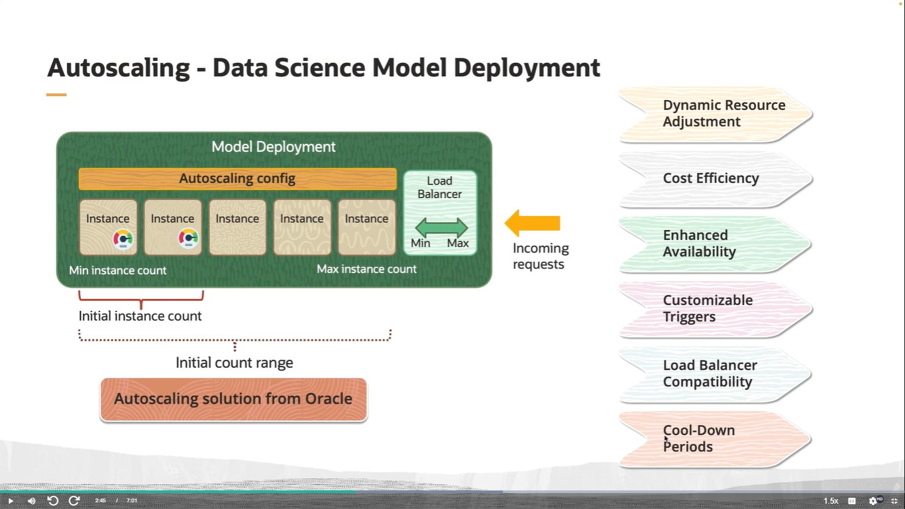

# <center>🌐 Bienvenido a Ciencia de Datos</center>
---
---
## 📚 Índice temático del curso OCI Data Science 

### 1. **Bienvenida e Introducción General**
- Qué es Data Science y por qué es relevante hoy
- Objetivo del curso y habilidades requeridas
- Casos de uso: Employee Attrition
- Estructura del curso por módulos
- Consejos de estudio y comunidad de aprendizaje

### 2. **Historia y Evolución de Data Science**
- Filosofía: Navaja de Ockham
- Primeros enfoques científicos (Mayer, Tukey, Samuel)
- Hitos tecnológicos (Deep Blue, AutoML)
- Nacimiento del término “Data Science”
- Aplicaciones modernas: Great Resignation y predicción de abandono

### 3. **Servicios de Oracle para Data Science y AI**
- Diferencias entre ML Services y AI Services
- OCI Data Labeling y Catálogo de Modelos
- Arquitectura: datos, aplicaciones, servicios
- Principios guía: aceleración individual, colaboración y escalabilidad empresarial

### 4. **Terminología y Componentes Clave de OCI Data Science**
- Projects, Notebook Sessions, Conda
- ADS SDK: funcionalidades y flujo completo
- Model Catalog, Model Deployment, Data Science Jobs
- Interfaces disponibles: consola, SDK, CLI, API REST

### 5. **Visualización, Ingeniería de Features y Entrenamiento**
- Acceso a datos: local, object storage, bases Oracle y terceros
- Exploración de datos: Feature Types, heatmaps, estadísticas
- Feature Engineering: codificación, imputación, recomendaciones
- Entrenamiento de modelos: AutoML, ADSTuner
- Evaluación de modelos y explicación (interpretabilidad local/global)

### 6. **Políticas, Tenencia y Configuración IAM**
- Compartments, grupos de usuarios, grupos dinámicos
- Sintaxis de políticas: verbs, resource types
- Políticas requeridas y útiles para logging, métricas, red y servicios relacionados
- Ejemplo de configuración manual y con OCI Resource Manager
- Acceso y estructura del Terraform Script

### 7. **Networking para Data Science**
- Componentes de red: VCN, Subnets, VNICs, DRG, NAT, Service Gateway
- Patrones: red por defecto vs red personalizada
- Uso del VCN Wizard
- Requisitos para conectar workloads a activos externos

### 8. **Autenticación en APIs de OCI**
- Interfaces disponibles: ADS SDK, Python SDK, CLI
- Diferencias entre autenticación y autorización
- Resource Principals: seguridad, rotación de certificados
- Archivos de configuración y claves API (.pem)
- Notebooks de ejemplo para crear credenciales</br></br>


---
---
# *** 1. WELCOME TO DATA SCIENCE ***
---
---

# 🎓 Lección 1.1: Course Overview
## 📘 Introducción al curso de Oracle Cloud Infrastructure Data Science

### 1. Bienvenida

¡Bienvenido al curso de **OCI Data Science**!
La ciencia de datos es el arte y la ciencia de extraer valor de los datos para resolver problemas reales y de negocio.

Este es un gran momento para **capacitarte o recapacitar a tu equipo** y responder a la creciente demanda de profesionales en ciencia de datos.

---

### 2. ¿Qué es OCI?

Usaremos el término **OCI** para referirnos a **Oracle Cloud Infrastructure**, la plataforma en la que se basa este curso.

---

### 3. Equipo del curso

A lo largo del curso escucharás a varios especialistas, entre ellos:

- Wes Prichard  
- John Peach  
- John Stanesby  
- JR Gauthier  
- Lyudmil Pelov  
- Praveen Patil  
- Hemant Gahankari  

Además, decenas de personas colaboraron en el desarrollo del curso.

---

### 4. Audiencia objetivo

Este curso está diseñado principalmente para:

- 👩‍🔬 Científicos de datos
- 🤖 Ingenieros de ML
- 🧠 Ingenieros de IA

Se espera que tengas:

- Experiencia en Python para ML
- Conocimiento general de librerías open source (ej. scikit-learn, pandas, etc.)
- Idealmente, al menos 1 año de experiencia en roles afines
- Familiaridad básica con OCI

---

### 5. Objetivo del curso

Prepararte para:

- Usar OCI Data Science y servicios relacionados
- Construir, entrenar, desplegar y gestionar modelos ML
- Aplicar buenas prácticas en la nube
- Aprobar el examen de certificación de OCI Data Science

---

### 6. Estructura del curso

El curso se divide en 5 módulos principales:

| Módulo | Contenido |
|--------|----------|
| **1. Introducción a Data Science** | Qué es OCI Data Science y cómo configurar tu tenancy |
| **2. Configuración del entorno** | Uso del entorno de trabajo en OCI Data Science |
| **3. Ciclo de vida del ML** | Capacidades de OCI para cada etapa del ciclo de vida |
| **4. Prácticas de MLOps** | Escalado, monitoreo y automatización |
| **5. Servicios relacionados de OCI** | Otros servicios útiles para soluciones de ciencia de datos |

🔹 Cada módulo incluye lecciones con demostraciones grabadas.  
🔹 Se recomienda seguir los módulos en orden.

---

### 7. Laboratorio de práctica

Incluye un laboratorio de punta a punta con el caso de uso:

> **Predicción de rotación de empleados**  
> Predice la probabilidad de que un empleado deje la organización según múltiples características.

📌 Requiere una cuenta de Oracle Cloud (puede ser gratuita).  
📌 Se recomienda acceder al repositorio de ejemplos en GitHub: `oci-data-science-ai-samples`.

---

### 8. Comunidad y soporte

- Si tenés dudas, podés usar el formulario **Ask Your Instructor**.
- También podés unirte a la **comunidad de Oracle University (OU)** para interactuar con otros estudiantes y expertos.

---

### 9. Consejos para el curso y el examen

- Tomá notas según tu conocimiento previo
- Usá las transcripciones para seguir el contenido
- Hacé pausas cada hora y movete
- Completá los ejercicios prácticos y el laboratorio
- Realizá el examen de práctica antes del examen oficial

---

### 10. Mejora continua

El equipo de OCI está en constante mejora del curso.
Tus comentarios y calificaciones ayudan a optimizar la experiencia de aprendizaje.

---
---

# 🎯 Lección 1.2: Expert Tips – Introducción  
## 📘 Consejos prácticos para profesionales de ciencia de datos en OCI

### 1. Bienvenida

Gracias por elegir el curso **OCI Data Science Professional** y por dar el paso hacia tu certificación.  
Soy **Hemant Gahankari**, líder principal de entrenamiento en Oracle University.

---

### 2. ¿Qué hacemos como científicos de datos o ingenieros de ML?

Nuestro trabajo diario incluye:

- 📥 Obtener y preparar datos
- 🧠 Construir y entrenar modelos
- 📊 Evaluar resultados
- 🚀 Desplegar y escalar modelos
- 🔁 Automatizar pipelines de machine learning

🔹 Con los servicios de **OCI Data Science** y **OCI AI**, podemos realizar todas estas tareas de forma eficiente.

---

### 3. ¿Qué incluye esta serie?

A través de una serie de **videos de consejos expertos**, aprenderás a usar funciones potentes y a la vez simples de:

- OCI Data Science Service
- OCI AI Services

🔹 El objetivo es ayudarte a aplicar estas herramientas en tus proyectos reales de forma práctica y efectiva.

---
---
# *** 2. INTRODUCTION AND CONFIGURATION ***
---
---

# 🧠 2.1 Lección: Data Science – Introducción (Parte 1)
## 📘 Módulo : Introducción y configuración

### 1. Bienvenida

Hola, soy **Wes Pritchard**, gerente principal de producto para Data Science y AI Services en Oracle.  
Esta lección presenta el servicio **OCI Data Science Cloud Service**.

---

### 2. Breve historia de la ciencia de datos

| Año | Evento |
|-----|--------|
| 1300s | William Ockham propone la **navaja de Ockham**: preferir soluciones simples |
| 1700s | Tobias Mayer recopila datos lunares → precursor del análisis cuantitativo |
| 1952 | Arthur Samuel (IBM) acuña el término **machine learning** con un juego de damas |
| 1962 | John Tukey predice el impacto de la computación en el análisis de datos |
| 1997 | Deep Blue (IBM) vence a Kasparov en ajedrez con 200 mil millones de cálculos |
| 2008 | DJ Patil y Jeff Hammerbacher acuñan el término **data science** en LinkedIn y Facebook |
| 2021 | Anthony Klotz define la **Gran Renuncia** → caso de uso para predicción de rotación laboral |

---

### 3. Caso de uso del curso

Usaremos el caso de **rotación de empleados** para conectar el aprendizaje automático con un problema real de negocio.

🔹 En el laboratorio final, construirás tu propio modelo predictivo.

---

### 4. Evolución del dato

Antes: solo datos estructurados de aplicaciones empresariales  
Ahora: también datos **no estructurados** como:

- Sensores
- Apps móviles
- Redes sociales
- Voz, texto, imágenes, video, documentos

🔹 Las organizaciones quieren usar **todos los datos** para:

- Mejorar operaciones
- Anticipar demanda
- Prevenir fallas
- Crear mejores experiencias

---

### 5. Arquitectura de Oracle AI

| Capa | Descripción |
|------|-------------|
| **Datos** | Base de todo: estructurados y no estructurados |
| **Servicios ML** | Para científicos de datos: entrenar, desplegar, gestionar |
| **Servicios AI** | Modelos preentrenados o entrenables vía API |
| **Aplicaciones** | Consumen los modelos: apps, procesos, analítica |

🔹 OCI Data Science es el servicio central para científicos de datos.  
🔹 Compatible con frameworks open source y Python.

---

### 6. Servicios complementarios

- **Oracle Database ML**: algoritmos integrados
- **OCI Data Labeling**: etiquetado de datos para entrenar modelos
- **AI Services**: modelos listos para usar vía API
- **Infraestructura OCI**: analítica, grafos, integración y gestión de datos

🔹 Estos servicios se combinan para crear arquitecturas flexibles y escalables.

---

### 7. Principios fundamentales del servicio

| Principio | Descripción |
|----------|-------------|
| **1. Aceleración individual** | Facilita el trabajo del científico de datos con librerías open source y potencia de cómputo escalable |
| **2. Colaboración** | Permite compartir activos, evitar duplicaciones y asegurar reproducibilidad y trazabilidad |
| **3. Nivel empresarial** | Infraestructura gestionada, integrada con seguridad OCI, sin necesidad de aprovisionamiento manual |

---

### 8. Características del servicio

- Servicio en la nube para **construir, entrenar, desplegar y gestionar modelos ML**
- Soporte completo para **Python** y librerías **open source**
- Interfaz basada en **JupyterLab notebooks**
- Modelos almacenados en el **Model Catalog**
- Despliegue como **endpoints HTTP** sobre infraestructura gestionada

---

### 9. Terminología clave

| Término | Definición |
|--------|------------|
| **Project** | Contenedor colaborativo para notebooks, modelos y activos |
| **Notebook Session** | Entorno JupyterLab con librerías preinstaladas y recursos configurables (CPU/GPU, almacenamiento) |
| **Conda** | Sistema de gestión de entornos y paquetes para Python |
| **ADS SDK** | Librería Python de Oracle para automatizar el flujo de trabajo de ciencia de datos |
| **Model** | Representación matemática del negocio y los datos |
| **Model Catalog** | Repositorio centralizado para almacenar, rastrear y compartir modelos |
| **Model Deployment** | Despliegue de modelos como endpoints HTTP para inferencia en tiempo real |
| **Data Science Job** | Tareas ML repetibles sobre infraestructura gestionada |

---

### 10. Acceso al servicio

| Método | Descripción |
|--------|-------------|
| **OCI Console** | Interfaz web principal para notebooks y recursos |
| **REST API** | Acceso programático a funcionalidades del servicio |
| **SDKs** | Interfaces para Java, Python, JS, .NET, Go, Ruby |
| **CLI** | Acceso rápido y completo desde terminal, sin scripting obligatorio |

---

### 11. Disponibilidad global

- OCI Data Science está disponible en **regiones distribuidas globalmente**
- Incluye regiones comerciales, gubernamentales y dedicadas
- Oracle agrega nuevas regiones frecuentemente → [oracle.com/cloud](https://oracle.com/cloud)

---

### 12. Conclusión

En esta lección conociste:

- Los principios que guían OCI Data Science
- Sus componentes clave
- La terminología que se usará en todo el curso

🔜 En la próxima lección: **provisionamiento y configuración del entorno cloud** para usar OCI Data Science en todo el ciclo de vida del ML.

---

---

# 🧰 2.2 Lección: ADS SDK Overview
## 📘 Introducción al Accelerated Data Science SDK

### 1. Bienvenida

Hola, soy **John Peach**, científico de datos en el equipo de OCI Data Science.  
En este módulo vas a conocer los objetivos y capacidades del **ADS SDK**.

---

### 2. ¿Qué es ADS SDK?

- Librería diseñada **por y para científicos de datos**
- Cubre todo el **ciclo de vida del machine learning**
- Integra servicios de OCI en flujos de trabajo reales

🔹 Ejemplo: integración con **Autonomous Database** y **Big Data Service** mediante clases como `SecretKeeper` para gestionar credenciales de forma segura.

---

### 3. Capacidades destacadas

| Función | Descripción |
|--------|-------------|
| 🔍 Exploración de datos | Feature types, visualización inteligente |
| 🎯 Optimización | `ADSTuner` para ajuste de hiperparámetros |
| ⚙️ AutoML | Entrenamiento automatizado de modelos |
| 🧠 Explicabilidad | Interpretación de modelos para generar confianza |

---

### 4. Versiones disponibles

| Versión | Acceso |
|--------|--------|
| **Pública** | Instalación vía GitHub o PyPi |
| **Privada (OCI)** | Incluida en entornos Conda de OCI con AutoML y explicabilidad activados

---

### 5. Formas de acceso

- Preinstalado en entornos **Conda** de OCI Data Science
- Instalación manual vía:
  - `pip install oracle-ads`
  - Clonación desde GitHub

---

### 6. Funcionalidades clave

#### 🔗 Conexión a fuentes de datos
- ADS ofrece **conectores** para múltiples orígenes
- Permite limitar la transferencia de datos cuando son muy grandes
- Acceso directo a:
  - 📦 Almacenamiento local (block storage)
  - ☁️ Object Storage vía protocolo **OCI + APE Spec** → compatible con `pandas`

#### 📊 Visualización de datos
- Smart plotting: gráficos automáticos según tipo de dato
- Feature types: visualización reutilizable por tipo de medición
- Correlaciones entre variables

#### 🧪 Ingeniería de features
- ADS analiza los datos y sugiere transformaciones
- Mejora la calidad del modelo con recomendaciones automáticas

#### 🏋️‍♂️ Entrenamiento de modelos
- AutoML con Oracle Labs
- `ADSTuner` para optimización manual
- Clases para empaquetar modelos y prepararlos para despliegue

#### 📈 Evaluación de modelos
- Métricas estándar con pocas líneas de código

#### 🧠 Interpretabilidad
- Explicación de qué aprende el modelo
- Herramientas para comunicar resultados a otros

#### 🚀 Despliegue de modelos
- Soporte para modelos comunes y genéricos
- Despliegue con pocas líneas de código

---

### 7. Conexión a fuentes de datos

ADS facilita el acceso a múltiples orígenes:

| Origen | Acceso |
|--------|--------|
| **Oracle DB** | Con `SecretKeeper` y credenciales en OCI Vault |
| **Autonomous DB** | Integración directa con `ADBSecretKeeper` |
| **Cloud externos** | Compatible con S3, GCS, Azure, Dropbox, etc. vía `pandas` |
| **NoSQL** | Conexión vía `DataSetFactory` |
| **Big Data Service (BDS)** | Acceso directo a HDFS sin copiar datos |
| **Web (HTTP/HTTPS)** | Lectura directa de archivos a `DataFrame`

---

### 8. Visualización y análisis exploratorio

- 📊 Clases `FeatureType` para visualización reutilizable
- 📈 Estadísticas resumen por feature
- 🔥 Mapas de correlación
- 🎨 Personalización y reutilización en distintos proyectos

---

### 9. Ingeniería de features

- Clase `ADSDataSet` envuelve un `DataFrame` de `pandas`
- Sugerencias automáticas de transformación
- Soporte para:
  - Codificación categórica
  - Imputación de nulos
  - Recomendaciones para mejorar calidad del modelo

---

### 10. Entrenamiento de modelos

| Método | Descripción |
|--------|-------------|
| **AutoML** | Entrenamiento automatizado con múltiples algoritmos |
| **ADSTuner** | Optimización de hiperparámetros |

🔹 ADS empaqueta los artefactos del modelo, los guarda en el **Model Catalog** y los prepara para producción.

---

### 11. Evaluación de modelos

- Comparación entre modelos con `ADSEvaluator`
- Métricas y gráficos automáticos según tipo de problema:
  - Clasificación binaria
  - Multiclase
  - Regresión

🔹 Evita la necesidad de generar gráficos manualmente.

---

### 12. Interpretabilidad y explicabilidad

ADS ofrece herramientas **agnósticas al tipo de modelo**:

| Tipo | Descripción |
|------|-------------|
| **Local** | Explica predicciones específicas (modelo tipo caja negra) |
| **Global** | Explica comportamiento general del modelo |

🔹 Herramientas incluidas:
- Gráficos de dependencia parcial (PDP)
- Gráficos ALE (Accumulated Local Effects)
- Pruebas de escenarios "what-if"

---

### 13. Despliegue de modelos

- Framework de despliegue con clases específicas
- Compatible con:
  - AutoML Oracle Labs
  - PyTorch
  - scikit-learn
  - TensorFlow
  - Modelos genéricos

🔹 Despliegue con pocos comandos  
🔹 Integración con **OCI Logging** para:
  - Logs de acceso
  - Logs de predicción

---

### 14. Conclusión del módulo

En este módulo aprendiste:

- Objetivos del ADS SDK
- Cómo instalar y acceder a la librería
- Conexión a múltiples fuentes de datos
- Visualización y análisis exploratorio
- Ingeniería de features guiada
- Entrenamiento y optimización de modelos
- Evaluación automatizada
- Interpretabilidad y explicabilidad
- Despliegue seguro y escalable

---

Perfecto, Claudio ✅. Aquí tenés la **traducción al español** de la primera parte de la lección *Tenancy Configuration Basics*, estructurada como ficha técnica para tu manual de OCI Data Science.

---

# 🛠️ 2.3 Lección: Tenancy Configuration Basics
## 📘 Fundamentos de configuración de tenancy en OCI para ciencia de datos

### 1. Bienvenida

Hola, soy **Jon Stanesby**. En esta lección repasamos los conceptos básicos de configuración de tenancy en Oracle Cloud Infrastructure (OCI), aplicados al uso de **OCI Data Science**.

---

### 2. Componentes clave

| Componente | Descripción |
|------------|-------------|
| **Compartments** | Contenedores lógicos para organizar recursos |
| **User Groups** | Grupos de usuarios con permisos compartidos |
| **Dynamic Groups** | Grupos de recursos que cumplen reglas dinámicas |
| **Policies** | Reglas que otorgan acceso a grupos dentro de compartimentos

---

### 3. Flujo de configuración

1. 🔹 Asignar usuarios a grupos de usuarios  
2. 🔹 Crear grupos dinámicos para recursos de ciencia de datos  
3. 🔹 Definir políticas que otorguen acceso dentro de compartimentos

---

### 4. Compartments

- Permiten **organizar y controlar el acceso** a recursos en la nube
- Solo los grupos con permisos pueden acceder
- Primer paso: **planificar** cómo organizar los recursos de ciencia de datos
- Luego: crear uno o varios compartimentos

🔹 Proceso rápido para crear un compartimento:

1. Ir a **Identity Console**
2. Seleccionar **Compartments**
3. Hacer clic en **Create Compartment**
4. Ingresar nombre y descripción
5. Confirmar con **Create**

---

### 5. User Groups

- Agrupan usuarios individuales en OCI
- Permiten otorgar acceso a recursos dentro de compartimentos

🔹 Pasos para configurar grupos:

1. Crear usuarios  
2. Crear grupos  
3. Agregar usuarios a grupos

---

### 6. Dynamic Groups

- Agrupan **recursos** (no personas) que cumplen reglas definidas
- Ejemplos: notebook sessions, job runs, model deployments
- La membresía cambia dinámicamente según las reglas

🔹 Los recursos actúan como **principales** (principals)  
🔹 Pueden hacer llamadas a APIs según las políticas del grupo dinámico

Ejemplo:  
Un notebook session puede acceder a Object Storage si su grupo dinámico tiene una política que lo permite.

---

### 7. Reglas de coincidencia

- Se definen con el **OCID del compartimento**
- El grupo dinámico incluirá todos los recursos que cumplan las reglas

🔹 Lo que esos recursos pueden hacer depende de las **políticas** asociadas

---

### 8. Políticas

- Definen qué pueden hacer los usuarios o recursos en OCI
- Se aplican a nivel de **grupo** y **compartimento**

🔹 Sintaxis básica:

```
Allow group <nombre_del_grupo> to <verbo> <tipo_de_recurso> in compartment <nombre_del_compartimento>
```

| Elemento | Significado |
|----------|-------------|
| **Group name** | Nombre del grupo de usuarios o dinámico |
| **Verb** | Nivel de acceso (ej. read, manage) |
| **Resource type** | Tipo de recurso (ej. object-storage, data-science) |
| **Compartment name** | Nombre del compartimento destino

---

### 9. Verbos en políticas (niveles de acceso)

| Verbo | Permisos otorgados |
|-------|--------------------|
| **inspect** | Listar recursos (sin metadatos) |
| **read** | `inspect` + ver metadatos y contenido |
| **use** | `read` + modificar (sin crear/eliminar) |
| **manage** | Todos los permisos (crear, modificar, eliminar) |

---

### 10. Tipos de recursos

- Podés escribir políticas para recursos individuales (ej. `data-science-model`)
- O usar tipos agregados como **data-science-family** para abarcar todos los recursos de ciencia de datos

---

### 11. Políticas requeridas para Data Science

| Política | Sintaxis |
|----------|----------|
| Acceso total para usuarios | `Allow group <grupo> to manage data-science-family in compartment <nombre>` |
| Acceso para recursos (notebooks, jobs, deployments) | `Allow dynamic-group <grupo> to manage data-science-family in compartment <nombre>` |

---

### 12. Políticas para métricas y logs

| Acción | Sintaxis |
|--------|----------|
| Leer métricas | `Allow group <grupo> to read metrics in compartment <nombre>` |
| Acceder a logs | `Allow dynamic-group <grupo> to use log-content in compartment <nombre>` |
| Gestionar grupos de logs | `Allow group <grupo> to manage log-groups in compartment <nombre>` |
| Usar contenido de logs | `Allow group <grupo> to use log-content in compartment <nombre>` |

---

### 13. Políticas para redes personalizadas

| Acción | Sintaxis |
|--------|----------|
| Servicio accede a red | `Allow service data-science to use virtual-network-family in compartment <nombre>` |
| Grupo de usuarios accede | `Allow group <grupo> to use virtual-network-family in compartment <nombre>` |
| Grupo dinámico accede | `Allow dynamic-group <grupo> to use virtual-network-family in compartment <nombre>` |

---

### 14. Políticas útiles adicionales

- Acceso a Object Storage:

```
Allow group <grupo> to manage object-family in compartment <nombre>
Allow dynamic-group <grupo> to manage object-family in compartment <nombre>
```

---

### 15. Pasos prácticos en la consola

#### Crear un compartimento

1. Ir a **Identity > Compartments**
2. Hacer clic en **Create Compartment**
3. Ingresar nombre, descripción y etiquetas (opcional)
4. Guardar el **OCID** para usarlo en reglas

#### Crear usuarios

1. Ir a **Identity > Users**
2. Hacer clic en **Create User**
3. Ingresar nombre, descripción y email
4. Repetir para cada usuario

#### Crear grupo de usuarios

1. Ir a **Identity > Groups**
2. Hacer clic en **Create Group**
3. Ingresar nombre y descripción
4. Agregar usuarios con **Add User to Group**

#### Crear grupo dinámico

1. Ir a **Identity > Dynamic Groups**
2. Hacer clic en **Create Dynamic Group**
3. Ingresar nombre, descripción y reglas de coincidencia:
   - Notebook Sessions
   - Model Deployments
   - Job Runs
4. Usar el OCID del compartimento creado

#### Crear políticas

1. Ir a **Identity > Policies**
2. Hacer clic en **Create Policy**
3. Ingresar nombre, descripción
4. Usar el **editor manual** para pegar las políticas requeridas
5. Guardar y luego **editar** para agregar políticas adicionales si es necesario

---

### 16. Conclusión

En esta lección cubrimos:

- Conceptos clave: compartimentos, grupos, grupos dinámicos y políticas
- Reglas de coincidencia para agrupar recursos
- Sintaxis de políticas y niveles de acceso
- Políticas requeridas y útiles para ciencia de datos
- Pasos prácticos para configurar el tenancy desde la consola

---

---

# ⚙️ 2.4 Lección: Configure a Tenancy with OCI Resource Manager
## 📘 Automatización de configuración con plantillas y Terraform

### 1. Introducción

Hola, soy **John Stanesby**.
En esta lección aprenderás a configurar tu **tenancy de OCI** para ciencia de datos usando **OCI Resource Manager (ORM)**.

---

### 2. ¿Por qué usar Resource Manager?

- Evita la configuración manual
- Usa una **plantilla preconfigurada** para Data Science
- Crea automáticamente:
  - Grupos de usuarios
  - Grupos dinámicos
  - Políticas requeridas

---

### 3. Recursos creados por la plantilla

| Recurso | Detalles |
|--------|----------|
| **User Group** | Nombre definido por el usuario |
| **Dynamic Group** | Nombre definido por el usuario |
| **Matching Rules** | Para: `datasciencenotebooksession`, `datasciencemodeldeployment`, `datasciencejobrun` |
| **Políticas** | Permisos para gestionar recursos, leer métricas y acceder a logs |

---

### 4. Flujo para ejecutar el stack ORM

1. 🧱 Crear el stack
2. 📄 Seleccionar la plantilla
3. 📦 Elegir el compartimento
4. ▶️ Ejecutar el stack (`Apply`)
5. 👥 Agregar usuarios al grupo creado

🔹 Las plantillas están disponibles **solo desde la consola**  
🔹 El stack puede editarse posteriormente

---

### 5. Alternativa: usar Terraform

- También podés usar tu propio script Terraform
- Repositorio público disponible en GitHub

---

### 6. Ejemplo paso a paso

1. Ir a **Resource Manager > Stacks**
2. Hacer clic en **Create Stack**
3. Seleccionar **Template** como origen
4. Ir a **Service > Data Science**
5. Elegir el compartimento deseado
6. Completar variables adicionales (opcional)
7. Hacer clic en **Create** y ejecutar `Apply`
8. Agregar usuarios al grupo creado

---

### 7. Conclusión

En esta lección aprendiste:

- Cómo usar la plantilla de Data Science en OCI Resource Manager
- Qué recursos se crean automáticamente
- Cómo ejecutar el stack paso a paso
- Dónde acceder al script Terraform alternativo

---

---

# 🌐 2.5 Lección: Networking for Data Science  
## 📘 Componentes, patrones y configuración de red en OCI

### 1. Introducción

Hola, soy **Jon Stanesby**.  
En esta lección exploramos los conceptos básicos de **redes en la nube** aplicadas a OCI Data Science.

🔹 No se cubren temas avanzados de redes, solo lo esencial para configurar conectividad en tus workloads.

---

### 2. Componentes clave de red en OCI

| Componente | Descripción |
|------------|-------------|
| **VCN (Virtual Cloud Network)** | Red privada virtual en los data centers de Oracle |
| **Subnets** | Segmentos dentro de un VCN que agrupan VNICs |
| **VNICs (Virtual Network Interface Cards)** | Interfaces que conectan instancias a la red |
| **DRG (Dynamic Routing Gateway)** | Conexión privada entre VCN y red on-premises o entre regiones |
| **NAT Gateway** | Salida a internet sin exponer IP pública |
| **Service Gateway** | Acceso privado a servicios de Oracle (ej. Object Storage)

---

### 3. Cómo se conectan los componentes

- Las **subnets** contienen VNICs que determinan cómo se conecta una instancia
- Los **routers virtuales** (DRG, NAT, Service Gateway) permiten:
  - Conexión privada entre VCNs o con red on-prem
  - Acceso a internet sin IP pública
  - Acceso a servicios de Oracle sin salir a internet

---

### 4. Recursos de Data Science como workloads

| Tipo | Ejemplo |
|------|---------|
| **Notebook Sessions** | Código interactivo |
| **Jobs / Job Runs** | Tareas programadas |
| **Model Deployments** | Inferencia en producción |

🔹 Todos estos se consideran **workloads** que pueden requerir acceso a recursos externos.

---

### 5. Acceso a recursos externos

- Archivos de código, datos, librerías, secretos, logs
- Otros workloads en OCI (ej. Data Flow)
- Pueden estar en internet público o en red privada

🔹 Es necesario asegurar **conectividad de red** entre el workload y el recurso externo.

---

### 6. Patrones de red disponibles

| Tipo | Descripción |
|------|-------------|
| **Default Networking** | Conexión automática a VCN gestionado por OCI |
| **Custom Networking** | Conexión a subnet propia del usuario (BYON: Bring Your Own Network) |

---

### 7. Default Networking

- El workload se conecta vía VNIC secundaria a una subnet preconfigurada
- Permite:
  - Salida a internet vía NAT Gateway
  - Acceso a servicios OCI vía Service Gateway

🔹 Ideal para comenzar rápido sin configurar red ni escribir políticas

---

### 8. Custom Networking

- Se especifica una subnet propia del tenancy
- El workload se conecta vía VNIC secundaria a esa subnet
- Permite acceso a recursos privados (ej. Git corporativo, base de datos on-prem)

🔹 Requiere:
  - Configuración de VCN por el administrador de red
  - Políticas adicionales (ver lección de configuración de tenancy)

---

### 9. Configuración rápida con VCN Wizard

Pasos:

1. Ir a **Networking > Virtual Cloud Networks**
2. Hacer clic en **Start VCN Wizard**
3. Elegir **Create VCN with Internet Connectivity**
4. Ingresar nombre del VCN
5. Hacer clic en **Next > Create**
6. Ver el VCN creado en la consola

🔹 Si usaste **OCI Resource Manager**, este paso ya está hecho

---

### 10. Conclusión

En esta lección aprendiste:

- Componentes clave de red en OCI
- Cómo se conectan entre sí
- Tipos de workloads en Data Science
- Patrones de conectividad: default vs custom
- Cómo crear un VCN rápidamente

---
---

# 🔐 2.6 Lección: Authenticate to OCI APIs  
## 📘 Autenticación para acceder a servicios OCI desde ciencia de datos

### 1. Introducción

Hola, soy **Jon Stanesby**.  
En esta lección aprenderás cómo **autenticarse ante las APIs de OCI** desde recursos de ciencia de datos como:

- 📓 Notebook Sessions  
- ⚙️ Jobs / Job Runs  
- 🚀 Model Deployments

---

### 2. ¿Por qué autenticarse?

Para que tu código pueda interactuar con otros servicios OCI, como:

- Leer/escribir en Object Storage  
- Ejecutar aplicaciones en Data Flow  
- Acceder a secretos, logs, bases de datos, etc.

🔹 La autenticación verifica tu identidad como usuario o recurso autorizado.  
🔹 La autorización (permisos) se cubre en la lección de **Tenancy Configuration**.

---

### 3. Interfaces comunes para autenticarse

| Interfaz | Método de autenticación |
|----------|-------------------------|
| **ADS SDK** | Resource Principal o archivo de configuración |
| **OCI Python SDK** | Igual que ADS |
| **OCI CLI** | Igual que ADS |

---

### 4. ¿Qué es un Resource Principal?

- Funcionalidad de **IAM** que permite a los recursos actuar como actores autorizados
- Cada recurso tiene su propia identidad
- Se autentica mediante **certificados gestionados automáticamente**
- Evita tener que guardar credenciales en notebooks o jobs

🔹 Más seguro y práctico que usar archivos de configuración y claves API  
🔹 Ideal para jobs que no tienen interfaz interactiva

---

### 5. Funcionamiento del Resource Principal

- El token se **cachea por 15 minutos**
- Si cambiás la política o el grupo dinámico, hay que esperar ese tiempo para que se refleje

🔹 El código para activar el resource principal varía según la interfaz (ADS, SDK, CLI)

---

### 6. Alternativa: archivo de configuración + clave API

- Método por defecto si no se usa resource principal
- Requiere:
  - Subir archivo `config` a la carpeta OCI del notebook
  - Subir o generar archivos `.pem` correspondientes

🔹 Podés usar el notebook `api_keys` para generar estos archivos  
🔹 Se accede desde **Notebook Examples** en el launcher de JupyterLab

---

### 7. Conclusión

En esta lección aprendiste:

- La importancia de autenticarse para acceder a servicios OCI
- Qué interfaces usan autenticación y cómo
- Qué es un resource principal y cómo funciona
- Cómo usar archivos de configuración y claves API como alternativa


---
---
# 🧠 UNIDAD 3: Workspace Design and Setup (Diseño y configuración del espacio de trabajo)
---
---

# 🎓 3.1 Lección: Projects

Instructor: *John Stanseby*
## 1. 📌 Tema central: El proyecto como componente principal

Un **proyecto de ciencia de datos** en OCI es un espacio colaborativo donde los equipos organizan su trabajo en torno a un caso de uso o pregunta de negocio.  
Todos los recursos de ciencia de datos (como notebooks y modelos) se crean **dentro de un proyecto**.

---

## 2. 🛠️ Creación de proyectos

### 1. Desde la **Consola de OCI**

Pasos:
- Iniciar sesión con políticas adecuadas
- Ir a **Analytics & AI → Machine Learning → Data Science**
- Clic en **Create Project**
- Seleccionar el **compartimento**

Opciones recomendadas:
- **Nombre único** (si no se define, se genera automáticamente con timestamp)
- **Descripción** (útil para otros usuarios)
- **Tags decorativos**: seleccionar namespace, clave y valor  
  → Para más de un tag: clic en *Add Additional Tags*

Al finalizar:
- Clic en **View Detail page** y luego en **Create**
- Se habilita la creación de notebooks y modelos asociados al proyecto

---

### 2. Desde el **SDK de ADS (Python)**

Usar el objeto `ProjectCatalog` y el método `create_project`, especificando el `compartment_id`.  
Ejemplo: usar la variable de entorno del notebook para crear el proyecto en el mismo compartimento.

---

## 3.🧾 Gestión de proyectos

### 🔍 Visualización
- Ir a la **Project List page**
- Clic en un proyecto para ver detalles:  
  - Nombre, descripción  
  - OCID  
  - Fecha y autor de creación  
  - Tags

### ✏️ Edición
- Solo se pueden editar:  
  - Nombre  
  - Descripción  
  - Tags (desde el menú de detalles)

### 🗑️ Eliminación
- Requisito: el proyecto debe estar **vacío**
- Eliminar notebooks, modelos y recursos asociados primero
- Confirmar escribiendo el **nombre exacto** del proyecto
- Estado pasa a **"deleting"**, luego a **"deleted"**
- Se puede filtrar por estado (ej. ocultar los eliminados)

---

## 4.🧩 Consideraciones clave

| Elemento | Recomendación |
|---------|----------------|
| Nombre | Único, descriptivo |
| Descripción | Breve, clara, útil para terceros |
| Tags | Decorativos, funcionales, agrupables |
| Compartimento | Bien definido, con políticas IAM adecuadas |
| Eliminación | Solo si está vacío, con confirmación exacta |

---

# 3.2 Lección: Notebook Sessions en OCI

## 1. 🧠 ¿Qué son?
- Interfaces JupyterLab gestionadas por OCI para construir y entrenar modelos ML.
- Infraestructura totalmente administrada: no requiere interacción directa con APIs de cómputo o almacenamiento.

### ⚙️ Características clave
- Soporte para CPU y GPU (AMD, Intel, Nvidia).
- Almacenamiento persistente para datos, notebooks y entornos.
- Actualizaciones y parches automáticos.
- Escalables: podés cambiar forma de cómputo y tamaño de almacenamiento.

### 🛠️ Creación desde la consola
1. Crear un proyecto.
2. Ir a la página de detalles del proyecto → *Create notebook session*.
3. Seleccionar compartimento (`HotelConciliacionML`, por ejemplo).
4. Elegir forma de cómputo (ej. Standard 2.2).
5. Definir tamaño de almacenamiento (mínimo 50 GB).
6. Configurar red (default o custom con VCN y subnet).
7. Agregar tags decorativos.
8. Click en *Create* → tarda unos minutos en activarse.

### 📋 Gestión de sesiones
- **Visualización**: desde la lista de sesiones o detalles del proyecto.
- **Edición**: solo el nombre es editable cuando está activa.
- **Eliminación**: requiere confirmar el nombre; se destruye instancia y volumen.
- **Activación/Desactivación**:
  - Activar: permite escalar recursos.
  - Desactivar: apaga instancia pero conserva el volumen (excepto boot volume).
  - Reactivar: se crea nueva instancia y se adjunta el volumen anterior.

### 📊 Métricas disponibles
- Uso de CPU y memoria.
- Tráfico de red (bytes in/out).

---

# 3.3  Lección: 🧪 Cómo trabajar con JupyterLab en OCI

## 1. 🧠 ¿Qué es JupyterLab?
- Interfaz web de próxima generación para notebooks.
- Utilizada en las *notebook sessions* de OCI por su familiaridad con data scientists.
- Permite integrar notebooks, editores de texto, terminales y componentes personalizados.

---

## 2.📦 Funcionalidades principales

### 🔹 Soporte de formatos
- Compatible con: `.ipynb`, `.txt`, `.csv`, `.json`, `.md`, `.pdf`, imágenes, y visualizaciones Vega/Vega Lite.

### 🔹 Diferencias con JupyterLab open source
Aunque la estructura es similar, en OCI se agregan:
- **Launcher personalizado** con acceso directo a notebooks, terminales, editores y ejemplos.
- **Environment Explorer**: GUI para gestionar entornos Conda.
- **Extensión GitHub**: para control de versiones dentro del notebook.

---

## 3. 🧭 Componentes de la interfaz

### 🔝 Barra superior (Chrome bar)
- Logo de Oracle: vuelve a la consola principal.
- Nombre de la sesión: lleva al detalle del notebook.
- Tiempo restante: por defecto 1 hora de inactividad → se puede extender hasta 24 horas.
- Icono de ayuda: acceso a documentación.
- Cierre de sesión.

### 📁 Barra lateral izquierda
- **Explorador de archivos**: navegar, abrir, crear y borrar carpetas.
- **Terminal y kernels activos**: detener procesos.
- **Extensión Git**: gestión de versiones (cubierta en otra lección).
- **Comandos**: acceso a todos los comandos de JupyterLab.
- **Inspector de propiedades**: activo en notebooks.
- **Lista de pestañas abiertas**
- **Tabla de contenidos**: generada desde Markdown.
- **Gestor de extensiones instaladas**

👉 Para ocultar la barra lateral: hacer doble clic en cualquier ícono.

---

## 4. 🧩 Área de trabajo principal
- Paneles de pestañas redimensionables.
- Actividad actual marcada con borde azul.
- **Code Consoles**: espacio temporal para ejecutar código interactivo.
- **Kernel-backed documents**: permiten ejecutar código desde cualquier archivo de texto.
- **Vista múltiple**: edición en vivo desde distintos editores o visores.
- **Gestión de kernels**: desde el menú *Kernel*, se accede a acciones como reiniciar, detener o cambiar kernel.


---

## 5. 🚀 El Launcher: 🎯 Objetivo
Explorar el uso del **Launcher**, la creación de notebooks, el manejo de celdas, kernels, extensiones y herramientas visuales dentro de JupyterLab en OCI.

- Acceso rápido a:
  - Notebooks
  - Consolas
  - Editor de texto
  - Terminales
  - **Environment Explorer**
  - **Notebook Examples**

- Parte superior: enlaces útiles para empezar, documentación y ejemplos.
- Lado izquierdo: extensiones destacadas:
  - **Environment Explorer**: descubre y gestiona entornos Conda.
  - **Notebook Examples**: accede a tutoriales y casos de uso.

- Lado derecho: crear archivos nuevos (notebooks, Markdown, texto) o sesiones (terminal, consola).

---

## 6. 📓 Creación y uso de notebooks

### 🔹 Crear notebook con kernel Python3
- Clic en el kernel → *Create Notebook*
- Se genera un archivo con tips útiles:
  - Verificación de conectividad
  - Imports típicos de ADS
  - Variables de entorno

### 🔹 Acciones básicas
- **Renombrar**: clic derecho → *Rename*
- **Ejecutar código**:
  - Clic en triángulo
  - Menú *Run → Selected Cell*
  - Atajo: `Shift + Enter`
- **Indicadores**:
  - ⭐ Estrella: celda en ejecución
  - Número: orden de ejecución

### 🔹 Tipos de celda
- Cambiar entre `Code`, `Markdown`, etc.
- Ejemplo Markdown:  
  ```markdown
  # Título
  ```

- Reordenar celdas: arrastrar desde el borde izquierdo

---

## 7. ✏️ Menú Edit

- **Merge cells**: combinar celdas seleccionadas
- **Split cells**: dividir celdas
- **Cambiar kernel**: clic en nombre del kernel → seleccionar otro

---

## 8. 📊 Ejemplo avanzado: notebook de clasificación binaria

- Desde el launcher → *Notebook Examples* → *Binary Classification Attrition* → *Load Example*
- Ejecutar todas las celdas
- Para detener: *Kernel → Interrupt Kernel*

---

## 9. 🔍 Herramientas visuales

### 🔹 Variable Inspector
- Ver variables activas
- Posicionar junto al notebook: arrastrar pestaña hasta que se marque en azul

### 🔹 Menú View
- Mostrar números de línea
- Colapsar/expandir celdas y salidas

---

## 10. 🧰 Explorador de archivos

- Crear archivos: clic derecho
- Subir archivos: arrastrar y soltar
- Visualización depende del tipo:
  - `.csv`: muestra columnas y filas

---

## 11. 🖥️ Terminal

- Comandos Linux estándar (`ls`, etc.)
- Herramientas disponibles:
  - `ODSC conda CLI`
  - `Git CLI`
  - `OCI CLI`

---

## 12. 📚 Menú Help

- Acceso a:
  - Documentación
  - FAQs
  - Material de referencia

---

## 13. 🧩 Aplicación en tus flujos

Podés usar JupyterLab para:
- Documentar pruebas con Markdown y tabla de contenidos
- Versionar código con Git desde la sesión
- Ejecutar modelos y visualizar métricas
- Usar terminal para automatizaciones con OCI CLI
- Explorar entornos Conda para pruebas familiares

---
---

# 3.04 Lección: Conda Environments en OCI Data Science</h1>

## 1. 🧪 ¿Qué es un Conda Environment?

Un **Conda Environment** es un contenedor de software que incluye:

- Intérprete (ej. Python)
- Módulos y librerías específicas (ej. `scikit-learn`, `pandas`, `tensorflow`)
- Configuraciones personalizadas

Permite trabajar de forma **aislada, reproducible y compartible**.

---

## 2. 🎯 Beneficios clave

- **Instalación selectiva**: solo los paquetes que necesitás
- **Aislamiento**: distintos entornos para distintos modelos (ej. visión vs regresión)
- **Cambio rápido**: podés alternar entre entornos sin conflictos
- **Compartibilidad**: se pueden compartir entre notebook sessions o con tu equipo
- **Reproducibilidad**: podés volver a la versión exacta de librerías usadas en un modelo

---

## 3. 🧭 Tipos de Conda Environments en OCI

| Tipo                        | ¿Quién lo gestiona? | ¿Dónde se usa?                          |
|-----------------------------|---------------------|------------------------------------------|
| **Data Science Conda**      | Oracle               | Preinstalados, listos para usar          |
| **Published Conda**         | Vos (el usuario)     | Guardados en Object Storage, compartibles |
| **Installed Conda**         | Notebook session     | Activos en tu sesión, persistentes en block volume |

---

## 4.🖥️ Environment Explorer

Una interfaz gráfica dentro de JupyterLab que te permite:

- Ver entornos en **vista de tarjetas** o **lista**
- Buscar por palabra clave
- Filtrar por GPU, estado (activo/deprecado), tipo
- Instalar, clonar o eliminar entornos
- Ver detalles técnicos y librerías incluidas

---
---
# 3.05 Lección: 🧠 Teoría de los Entornos Conda en OCI Data Science

## 1. ¿Qué es un entorno Conda en OCI?

Un entorno Conda en el servicio de Data Science de Oracle Cloud Infrastructure (OCI) es un paquete preconfigurado de herramientas, librerías y configuraciones que permite desarrollar, entrenar y desplegar modelos de machine learning de forma eficiente. Estos entornos están basados en software open source y pueden personalizarse según las necesidades del proyecto.

### ✅ Ventajas:
- Ahorra tiempo en la configuración inicial.
- Incluye librerías optimizadas para tareas específicas.
- Compatible con JupyterLab y el ecosistema de OCI.
- Permite trabajar con CPU o GPU según el entorno elegido.

---

## 2. Acceso y uso

Los entornos Conda se acceden desde la pestaña **Launcher** de JupyterLab, mediante el botón **Environment Explorer**. Todos los entornos incluyen:

- **OCI Python SDK**: para interactuar con servicios de OCI.
- **ADS SDK (oracle-ads)**: para flujos de machine learning, AutoML, ingestión de datos y explicabilidad de modelos.

---

## 3. Tipos de entornos Conda

### 🔧 Según aplicación:
- **ONNX**: para portabilidad de modelos entre frameworks.
- **PyPGX**: para grafos y análisis de redes.
- **PySpark**: para procesamiento distribuido con Apache Spark.

### 🎯 Según caso de uso:
- **Computer Vision**: procesamiento de imágenes y video.
- **Data Exploration & Manipulation**: análisis exploratorio y visualización.
- **Financial Services**: flujos específicos para servicios financieros.
- **Natural Language Processing (NLP)**: procesamiento de texto y lenguaje.

---

## 4. Familias de entornos Conda

Los entornos se agrupan por:

- **Versión de Python** (ej. 3.6, 3.7).
- **Arquitectura** (CPU o GPU).
- **Versión del entorno** (v1, v2, etc.).

Ejemplo:  
`Natural Language Processing for CPU - Python 3.7 - v2`  
→ Misma arquitectura y versión de Python que v1, pero con librerías actualizadas.

---

## 5. Convención de nombres

### 🧩 Basados en aplicación:
`TensorFlow 2.7 for CPU - Python 3.7 - v1`

### 🧪 Basados en tarea:
`Data Exploration and Manipulation for CPU - Python 3.7`

---

## 6. Entornos populares y sus librerías clave

### 📷 Computer Vision
- Tareas: detección de objetos, reconocimiento facial, seguimiento ocular.
- Librerías: `scikit-image`, `Pillow`, `PyTorch`, `OpenCV`.

### 📊 Data Exploration & Manipulation
- Tareas: ingestión, visualización, análisis exploratorio.
- Librerías: `ADS`, `Kafka`, `pandas`, `pandaparallel`, `matplotlib`, `seaborn`, `plotly`, `bokeh`.

### 🤖 General Machine Learning
- Tareas: ML supervisado, AutoML, explicabilidad.
- Librerías: `xgboost`, `lightgbm`, `keras`, `TensorFlow`, `Oracle AutoML`, `Oracle MLX`.

### 📝 Natural Language Processing
- Tareas: extracción de texto, frases clave, POS tagging.
- Librerías: `nltk`, `keybert`, `pytorch-lightning`, `simpletransformers`.

### 🔄 ONNX
- Tareas: conversión y ejecución de modelos en formato portable.
- Librerías: `ONNX`, `ONNX Runtime`.

### 🗃️ Oracle Database
- Tareas: ETL, transformaciones, consultas SQL.
- Librerías: `ipython-sql`, `SQLAlchemy`, `ADS Connector`.

### ⚡ PyTorch
- Tareas: redes neuronales, aceleración en CPU.
- Librerías: `PyTorch`, `daal4py`, `oneAPI DAL`.

### 🔥 PySpark
- Tareas: procesamiento distribuido, MLlib.
- Librerías: `PySpark`, `MLlib`, `sparksql-magic`.

### 🧬 TensorFlow
- Tareas: entrenamiento y despliegue de modelos de deep learning.
- Librerías: `TensorFlow`, `TensorBoard`, `ADS`.

---

## 7. Conclusión

Los entornos Conda en OCI Data Science son una solución modular, escalable y decorativa para acelerar proyectos de ciencia de datos. Permiten trabajar con herramientas de última generación sin preocuparse por la instalación manual, y están diseñados para adaptarse a distintos casos de uso, arquitecturas y versiones de Python.

---

## 🧠 Librerías mencionadas en entornos Conda de OCI Data Science

| 📚 Librería              | 🧩 Característica principal                                                                 | 🗂️ Categoría del entorno Conda                     |
|--------------------------|---------------------------------------------------------------------------------------------|----------------------------------------------------|
| **oracle-ads (ADS SDK)** | SDK para ML en OCI: ingestión, AutoML, explicabilidad, despliegue.                         | Todos los entornos                                 |
| **OCI Python SDK**       | Acceso a servicios de OCI desde Python.                                                    | Todos los entornos                                 |
| **scikit-image**         | Procesamiento de imágenes.                                                                 | Computer Vision                                    |
| **Pillow**               | Manipulación de imágenes.                                                                  | Computer Vision                                    |
| **PyTorch**              | Deep Learning con soporte GPU.                                                             | Computer Vision, NLP, General ML                   |
| **OpenCV**               | Algoritmos de visión por computadora.                                                      | Computer Vision                                    |
| **Kafka (Python)**       | Consumo de streams de datos.                                                               | Data Exploration & Manipulation                    |
| **pandas**               | Manipulación de datos tabulares.                                                           | Data Exploration & Manipulation, General ML        |
| **pandaparallel**        | Paralelización de pandas.                                                                  | Data Exploration & Manipulation                    |
| **task**                 | (No especificado, posiblemente auxiliar).                                                  | Data Exploration & Manipulation                    |
| **Matplotlib**           | Visualización 2D.                                                                          | Data Exploration & Manipulation                    |
| **Seaborn**              | Visualización estadística.                                                                 | Data Exploration & Manipulation                    |
| **Plotly**               | Gráficos interactivos.                                                                     | Data Exploration & Manipulation                    |
| **Bokeh**                | Visualización web interactiva.                                                             | Data Exploration & Manipulation                    |
| **xgboost**              | Algoritmo de boosting eficiente.                                                           | General Machine Learning                           |
| **lightgbm**             | Boosting rápido y ligero.                                                                  | General Machine Learning                           |
| **Keras con TensorFlow** | API de alto nivel para redes neuronales.                                                   | General Machine Learning                           |
| **Oracle MLX**           | Explicabilidad de modelos.                                                                 | General Machine Learning                           |
| **nltk**                 | Procesamiento de texto.                                                                    | Natural Language Processing                        |
| **keybert**              | Extracción de frases clave con BERT.                                                       | Natural Language Processing                        |
| **pytorch-lightning**    | Abstracción de PyTorch para NLP.                                                           | Natural Language Processing                        |
| **simpletransformers**   | Framework NLP con transformers.                                                            | Natural Language Processing                        |
| **ONNX**                 | Formato portable de modelos ML.                                                            | ONNX (Interoperabilidad y despliegue)              |
| **ONNX Runtime**         | Ejecución de modelos ONNX.                                                                 | ONNX (Interoperabilidad y despliegue)              |
| **ipython-sql**          | Comandos SQL en notebooks.                                                                 | Oracle Database                                    |
| **SQLAlchemy**           | ORM para bases de datos.                                                                   | Oracle Database                                    |
| **daal4py**              | Aceleración de scikit-learn en CPUs Intel.                                                 | PyTorch (optimizado para CPU)                      |
| **oneAPI DAL**           | Librería de Intel para análisis de datos.                                                  | PyTorch (optimizado para CPU)                      |
| **PySpark**              | API Python para Apache Spark.                                                              | PySpark (procesamiento distribuido)                |
| **MLlib**                | ML en Spark.                                                                               | PySpark                                            |
| **sparksql-magic**       | Comandos Spark SQL en notebooks.                                                           | PySpark                                            |
| **TensorFlow**           | Framework de ML y Deep Learning.                                                           | TensorFlow                                         |
| **TensorBoard**          | Visualización de métricas de entrenamiento.                                                | TensorFlow                                         |


---

# 3.06 Lección: 🧠 Gestión de entornos Conda con la herramienta de línea de comandos `odsc`

## 1. Introducción
En este módulo aprenderás a **gestionar entornos Conda** utilizando la herramienta de línea de comandos `odsc` incluida en el servicio **Oracle Cloud Infrastructure (OCI) Data Science**.

Antes de entrar en detalle, recordemos qué es un entorno Conda:  
Un **entorno Conda** es una colección de software empaquetada que incluye intérprete, librerías y configuraciones necesarias para ejecutar proyectos de ciencia de datos.  
En OCI existen:
- **Conda packs gestionados** por el equipo de Data Science Service.
- **Conda packs publicados por el usuario**, que podés crear y compartir.

Aunque gran parte de la gestión se puede hacer con la interfaz gráfica **Environment Explorer**, la CLI `odsc` ofrece **mayor control y flexibilidad**.

---

## 2. Funcionalidades principales de `odsc conda`

Con la CLI podés:

- **Explorar (browse)**: ver información detallada de entornos Conda en formato YAML (nombre, descripción, librerías clave, *slug*).
- **Buscar (search)**: combinar `odsc conda list` con herramientas como `grep` para filtrar resultados.
- **Instalar (install)**: añadir entornos Conda gestionados o publicados.
- **Clonar (clone)**: copiar un entorno a otra ubicación para modificarlo sin afectar el original.
- **Modificar (modify)**: actualizar o cambiar librerías de un entorno instalado.
- **Publicar (publish)**: guardar entornos personalizados en Object Storage para compartirlos o usarlos en despliegues y *jobs*.
- **Eliminar (delete)**: borrar entornos que ya no necesites.
- **Crear (create)**: generar entornos personalizados a partir de un archivo `environment.yaml`.

---

## 3. Exploración de entornos Conda

Podés hacerlo de dos maneras:
1. **Environment Explorer** (GUI).
2. **Línea de comandos** con:
   ```bash
   odsc conda list
   ```
   - Por defecto, muestra entornos **Data Science** gestionados.
   - Para listar solo los entornos instalados localmente en tu notebook:
     ```bash
     odsc conda list --local
     ```
   - Para listar entornos **publicados**:
     ```bash
     odsc conda list --override
     ```
     *(Requiere tener configurado el bucket de Object Storage y `odsc conda init`)*

---

## 4. Búsqueda avanzada

No existe un comando específico de búsqueda en la CLI, pero podés filtrar resultados combinando `odsc conda list` con utilidades como `grep`, `awk` o `perl`.

Ejemplo para obtener nombres y *slugs*:
```bash
odsc conda list | grep -E "name:|slug:"
```

---

## 5. Instalación de entornos Conda

- **Instalar un entorno gestionado**:
  ```bash
  odsc conda install --slug <nombre-del-slug>
  ```
- **Instalar un entorno publicado**:
  ```bash
  odsc conda install --slug <nombre-del-slug> --override
  ```
  *(El parámetro `--override` indica que se debe instalar desde entornos publicados en Object Storage, no desde los gestionados por OCI)*

---

## 6. Buenas prácticas

- **Clonar antes de modificar**: evita romper un entorno funcional.
- **Publicar entornos estables**: facilita la colaboración y el despliegue.
- **Usar nombres descriptivos en el slug**: mejora la búsqueda y el mantenimiento.
- **Documentar cambios**: registra librerías añadidas o actualizadas.

---

# 🧠 Gestión avanzada de entornos Conda con `odsc` (Parte 2)

## 7. Clonar entornos Conda

La clonación permite **copiar e instalar** un entorno Conda existente, creando una **nueva versión personalizada** sin modificar el original.

**Comando base:**
```bash
odsc conda clone --from <slug_origen> --env <nombre_nuevo_entorno>
```

- **`--from`**: *slug* del entorno Conda instalado que querés clonar.
- **`--env`**: nombre del nuevo entorno.  
  Al asignarlo, OCI genera automáticamente un nuevo *slug*.

💡 **Ventaja**: Ideal para probar cambios importantes sin arriesgar la estabilidad del entorno original.

---

## 8. Modificar un entorno Conda

Cuando querés **instalar nuevas librerías** o **actualizar versiones**, no se usa `odsc`, sino la herramienta estándar `conda`.

**Pasos:**
8.1. Activar el entorno:
   ```bash
   conda activate /home/datascience/conda/<slug_entorno>
   ```
8.2. Realizar cambios. Ejemplo: actualizar ADS a la última versión:
   ```bash
   python3 -m pip install oracle-ads --upgrade
   ```

🔹 Los cambios afectan **solo** al entorno activado.

---

## 9. Publicar un entorno Conda

Publicar un entorno lo **empaqueta y sube a un bucket de Object Storage**, permitiendo:
- Compartirlo con tu equipo.
- Usarlo en *jobs* y despliegues de modelos.
- Garantizar **reproducibilidad**.

**Preparación:**
9.1. Crear un bucket en **Object Storage**.
9.2. Anotar:
   - **Namespace** del bucket.
   - **Nombre** del bucket.
9.3. Inicializar la configuración (solo una vez por sesión):
   ```bash
   odsc conda init --bucket_namespace <namespace> --bucket_name <nombre_bucket>
   ```

**Publicar:**
```bash
odsc conda publish --slug <slug_entorno>
```

---

## 10. Eliminar un entorno Conda

Para liberar espacio:
```bash
odsc conda delete --slug <slug_entorno>
```

---

## 11. Crear un entorno Conda desde cero

Podés crear un entorno nuevo usando un **archivo de manifiesto Conda** (`environment.yaml`).

**Comando:**
```bash
odsc conda create --file <ruta/environment.yaml>
```

- Por defecto, se instalan paquetes base desde `/opt/base-env.yaml` para compatibilidad con JupyterLab.
- Si querés evitarlo:
  ```bash
  odsc conda create --file <ruta/environment.yaml> --empty
  ```
  ⚠️ No recomendado, ya que podría impedir que el entorno aparezca como kernel en JupyterLab.

---

## 12. Resumen de funcionalidades vistas

| Acción        | Comando principal                         | Uso típico |
|---------------|-------------------------------------------|------------|
| **Explorar**  | `odsc conda list`                         | Ver entornos disponibles |
| **Buscar**    | `odsc conda list | grep ...`               | Filtrar por nombre o slug |
| **Instalar**  | `odsc conda install --slug ...`            | Añadir entornos gestionados o publicados |
| **Clonar**    | `odsc conda clone --from ... --env ...`    | Crear copia editable |
| **Modificar** | `conda activate ...` + `pip install ...`   | Actualizar librerías |
| **Publicar**  | `odsc conda publish --slug ...`            | Compartir en Object Storage |
| **Eliminar**  | `odsc conda delete --slug ...`             | Borrar entornos |
| **Crear**     | `odsc conda create --file ...`             | Nuevo entorno desde YAML |

📌 **Resumen**:  
La CLI `odsc` es la herramienta más potente para gestionar entornos Conda en OCI. Te permite no solo instalar y explorar, sino también clonar, modificar, publicar y crear entornos personalizados, asegurando control total sobre tu infraestructura de ciencia de datos.


---
# 3.07 Lección: 🧠 Demo: Gestión de entornos Conda con la CLI `odsc`

## 1. Introducción

En esta demostración aprenderás a **gestionar entornos Conda** usando la herramienta de línea de comandos `odsc` en **OCI Data Science**.  
Veremos cómo:

- Explorar (*browse*)
- Buscar (*search*)
- Instalar (*install*)
- Clonar (*clone*)
- Modificar (*modify*)
- Publicar (*publish*)
- Eliminar (*delete*) entornos Conda
- Crear un entorno personalizado desde cero usando un archivo **YAML**

El comando principal que utilizaremos es:

```bash
odsc
```

Al ejecutar `odsc --help`, verás varios subcomandos. En este caso, trabajaremos con el subcomando:

```bash
odsc conda
```

---

## 2. Subcomandos disponibles

Al listar la ayuda de `odsc conda`, encontrarás opciones como:

- `list` → listar entornos
- `initialize` → inicializar configuración
- `show-configuration` → mostrar configuración actual
- `publish` → publicar entornos
- `install` → instalar entornos
- … entre otros

---

## 3. Explorando entornos Conda

### 3.1 Listar entornos gestionados por OCI
```bash
odsc conda list
```
Devuelve un archivo **YAML** con información detallada:
- **name** → nombre del conda-pack
- **slug** → identificador único
- **type** → `dataScience` (gestionado por OCI)

### 3.2 Listar entornos instalados localmente
```bash
odsc conda list --local
```
- Muestra entornos instalados en la sesión de notebook.
- El campo **type** será `local`.

### 3.3 Listar entornos publicados
```bash
odsc conda list --override
```
- Muestra entornos publicados en Object Storage.
- Requiere configuración previa (`odsc conda init`).

---

## 4. Búsqueda de información

El listado en YAML puede ser extenso. Para filtrar, combinamos `odsc conda list` con herramientas como `grep` y expresiones regulares.

Ejemplo: obtener solo nombres y slugs
```bash
odsc conda list | grep -E "name:|slug:"
```

Para buscar entornos relacionados con *Data Exploration*:
```bash
odsc conda list | grep -i "data exploration"
```

---

## 5. Instalación de un entorno Conda

Ejemplo: instalar un entorno de *Data Exploration*:

1. Buscar el slug:
   ```bash
   odsc conda list | grep -i "data exploration"
   ```
2. Instalar:
   ```bash
   odsc conda install --slug <slug_encontrado>
   ```
3. El sistema pedirá la versión a instalar.
4. Descargará y extraerá el entorno.

Verificar instalación:
```bash
odsc conda list --local | grep <slug>
```

---

## 6. Clonación de un entorno Conda

Para modificar un entorno sin afectar el original:

```bash
odsc conda clone --from <slug_origen> --env "Mi Data Exploration"
```

- `--from`: slug del entorno original.
- `--env`: nombre del nuevo entorno (OCI generará un slug automáticamente).
- El sistema pedirá la versión y luego empaquetará e instalará la copia.

---

## 7. Flujo de trabajo típico en esta demo

1. **Listar** entornos gestionados (`odsc conda list`).
2. **Filtrar** por nombre o slug con `grep`.
3. **Instalar** el entorno deseado (`odsc conda install`).
4. **Verificar** instalación (`odsc conda list --local`).
5. **Clonar** para personalizar (`odsc conda clone`).

---
# 🧠 Gestión avanzada de entornos Conda con `odsc` (Parte final del capítulo)

## 8. Verificar el *slug* del entorno clonado

Después de clonar un entorno Conda, es importante identificar su **slug** (identificador único).  
Para hacerlo:

```bash
odsc conda list --local | grep -E "name:|slug:"
```

- `--local` → lista solo los entornos instalados en la sesión de notebook.
- `grep` → filtra para mostrar únicamente los campos `name` y `slug`.

---

## 9. Modificar un entorno Conda

Para modificar un entorno (añadir librerías, cambiar versiones, etc.) **no** se usa `odsc conda`, sino la herramienta estándar `conda`.

**Pasos:**
1. Activar el entorno:
   ```bash
   conda activate /home/datascience/conda/<slug_entorno>
   ```
2. Realizar cambios. Ejemplo: instalar la librería `pendulum`:
   ```bash
   python3 -m pip install pendulum
   ```
3. Desactivar el entorno:
   ```bash
   conda deactivate
   ```

💡 **Nota:** Los cambios afectan únicamente al entorno activado.

---

## 10. Publicar un entorno Conda

Publicar un entorno lo empaqueta y lo sube a un **bucket de Object Storage**, permitiendo:
- Compartirlo con otros usuarios.
- Usarlo en *jobs* y despliegues de modelos.
- Garantizar reproducibilidad.

**Pasos:**
1. Crear un bucket en Object Storage (ej. `published-conda-environments`).
2. Anotar:
   - **Namespace** del bucket.
   - **Nombre** del bucket.
3. Inicializar la configuración (solo una vez por sesión):
   ```bash
   odsc conda init --bucket_namespace <namespace> --bucket_name <nombre_bucket>
   ```
4. Publicar el entorno:
   ```bash
   odsc conda publish --slug <slug_entorno>
   ```

---

## 11. Verificar publicación

Para confirmar que el entorno está publicado:
```bash
odsc conda list --override | grep -E "name:|slug:"
```
- `--override` → lista entornos publicados en Object Storage en lugar de los gestionados por OCI.

En el bucket, la estructura será:
```
Conda Environments/
   CPU/
      My Data Exploration/
         v1/
            <archivos del entorno>
```

---

## 12. Eliminar un entorno Conda

Para liberar espacio en la sesión de notebook:
```bash
odsc conda delete --slug <slug_entorno>
```
El sistema pedirá confirmación antes de eliminarlo.

---

## 13. Crear un entorno Conda desde un archivo YAML

Otra forma de crear un entorno es a partir de un **archivo de manifiesto Conda** (`environment.yaml`).

**Comando:**
```bash
odsc conda create --file <ruta/environment.yaml>
```

- Por defecto, se añaden paquetes base desde `/opt/base-env.yaml` para compatibilidad con JupyterLab.
- Para evitarlo:
  ```bash
  odsc conda create --file <ruta/environment.yaml> --empty
  ```
  ⚠️ No recomendado, ya que podría impedir que el entorno aparezca como kernel en JupyterLab.

---

📌 **Resumen**:  
Esta demo muestra cómo usar `odsc conda` para explorar, buscar, instalar y clonar entornos Conda en OCI Data Science, combinando la potencia de la CLI con utilidades de filtrado como `grep` para trabajar de forma más ágil y precisa.


Resumen de operaciones vistas
| Acción        | Comando principal                         | Uso típico |
|---------------|-------------------------------------------|------------|
| **Listar**    | `odsc conda list`                         | Ver entornos disponibles |
| **Buscar**    | `odsc conda list | grep ...`               | Filtrar por nombre o slug |
| **Instalar**  | `odsc conda install --slug ...`            | Añadir entornos gestionados o publicados |
| **Clonar**    | `odsc conda clone --from ... --env ...`    | Crear copia editable |
| **Modificar** | `conda activate ...` + `pip install ...`   | Actualizar librerías |
| **Publicar**  | `odsc conda publish --slug ...`            | Compartir en Object Storage |
| **Eliminar**  | `odsc conda delete --slug ...`             | Borrar entornos |
| **Crear**     | `odsc conda create --file ...`             | Nuevo entorno desde YAML |


---
# 3.08 Lección: 🧠 OCI Vault: Gestión segura de secretos y claves para Data Science

## 1. Introducción

En este módulo aprenderás:

- Por qué es importante usar el servicio **OCI Vault** para compartir y proteger secretos.
- Conceptos clave como:
  - Tipos de claves.
  - Rotación de claves.
  - Almacenamiento seguro de secretos en el Vault (en lugar de en tu código).

---

## 2. ¿Qué es OCI Vault y por qué es importante?

En un flujo de trabajo de ciencia de datos, es habitual interactuar con otros servicios para:

- Conectarse a datos importantes.
- Almacenar y recuperar artefactos.
- Importar y exportar información.

Muchas de estas interacciones requieren **credenciales** (usuarios, contraseñas, tokens, certificados).

**Mejor práctica de seguridad:**  
Nunca almacenar credenciales localmente o en el código, ya que es una de las formas más comunes de filtración.  
En su lugar, se recomienda usar un servicio especializado: **OCI Vault**.

---

## 3. Funcionalidad principal de OCI Vault

- Servicio **gestionado por Oracle** para administrar de forma centralizada:
  - **Claves de cifrado**.
  - **Credenciales** y secretos.
- Soporta tres algoritmos de cifrado:
  - **AES** (Advanced Encryption Standard)
  - **RSA** (Rivest–Shamir–Adleman)
  - **ECDSA** (Elliptic Curve Digital Signature Algorithm)
- Integración con:
  - **OCI SDK**
  - **CLI de OCI**
  - **Clientes API**
  - **ADS SDK** (con múltiples puntos de integración entre Data Science y otros servicios OCI)

Esto facilita almacenar credenciales en el Vault y conectarse a los recursos necesarios sin exponer datos sensibles en código o archivos de configuración.

---

## 4. Elementos principales del servicio

- **Vaults**: contenedores lógicos para almacenar claves y secretos.
- **Keys**: entidades lógicas que representan una o más versiones de material criptográfico.
- **Secrets**: credenciales o datos sensibles cifrados.

El Vault elimina la necesidad de guardar claves y secretos en archivos de configuración o en el código.

---

## 5. Mejores prácticas

Tanto ingenieros DevOps como científicos de datos deberían usar el Vault para **mejorar la postura de seguridad** de sus aplicaciones y servicios.

---

## 6. Tipos de Vault

Al crear un Vault, se puede elegir entre:

### 🔹 Virtual Private Vault
- Partición dedicada en un **HSM** (*Hardware Security Module*).
- Hasta **1.000 versiones de claves**.
- Mejor aislamiento.
- Permite **copias de seguridad** en Object Storage.
- Soporta **recuperación ante desastres** y **replicación entre regiones**.

### 🔹 Vault en partición compartida (opción por defecto)
- Comparte la partición HSM con otros clientes de Oracle.
- Seguridad garantizada, pero sin funciones avanzadas como backup a Object Storage.
- **Menor coste**: se cobra solo por el número de claves, versiones y secretos almacenados.

---

## 7. ¿Qué son las claves (*Keys*)?

- Entidades lógicas que representan una o más versiones de material criptográfico.
- El material criptográfico se genera para un algoritmo específico (AES, RSA o ECDSA).
- Se utilizan para:
  - **Cifrar datos**.
  - **Firmar digitalmente** información.


---

# 🔐 OCI Vault – Tipos de claves, rotación y gestión de secretos

## 8. Técnicas de cifrado y descifrado

Las tecnologías de cifrado utilizan distintos enfoques:

- **AES** → Cifrado simétrico: la misma clave puede cifrar y descifrar los datos.
- **RSA** y **ECDSA** → Cifrado asimétrico: una clave cifra y la otra descifra.

---

## 9. Tipos de claves en OCI Vault

En el servicio Vault existen tres tipos conceptuales de claves:

### 9.1 Master Encryption Key (Clave maestra de cifrado)
- Claves que creás o importás en tu Vault.
- Definís:
  - Algoritmo de cifrado (AES, RSA, ECDSA).
  - Forma de la clave (*key shape*): número de bits (AES/RSA) o ID de curva elíptica (ECDSA).

### 9.2 Data Encryption Key (Clave de cifrado de datos)
- Generadas a partir de una clave maestra.
- Se cifran dinámicamente con la clave maestra (**envelope encryption**).
- Permiten:
  - Usar múltiples claves para distintos datos.
  - Rotar claves sin afectar todo el sistema.
  - Reducir el impacto si una clave se ve comprometida (solo afecta a los datos cifrados con ella).

### 9.3 Wrapping Keys
- Usadas para proteger (envolver) otras claves durante su transporte o almacenamiento.

---

## 10. Uso de claves en servicios OCI

Servicios como **Block Storage** o **File Storage** pueden:
- Usar claves gestionadas por Oracle.
- Usar claves maestras personalizadas desde tu Vault.

Ejemplo: un bucket de Object Storage o un volumen de bloque puede usar una clave de cifrado de datos específica.

---

## 11. Rotación de claves maestras

- Cada clave tiene una **versión** asignada al crearse.
- Al rotar:
  - Se genera automáticamente una nueva versión.
  - O podés importar otra clave.
- **Mejor práctica**: rotar periódicamente para limitar la cantidad de datos cifrados con una misma versión.
- El Vault usa el **OCID** de la versión anterior para descifrar datos cifrados con ella.
  - Versiones antiguas → ya no cifran, pero sí pueden descifrar.

---

## 12. Componentes clave del servicio Vault

1. **Keys** → Claves de cifrado.
2. **HSM** (*Hardware Security Module*) con certificación **FIPS 140-2 Nivel 3**.
3. **Secrets** → Datos sensibles como contraseñas, tokens o credenciales.

---

## 13. Gestión de secretos

- **Qué son**: credenciales necesarias para acceder a servicios OCI o aplicaciones externas.
- **Ventajas de almacenarlos en Vault**:
  - Mayor seguridad que en código o archivos de configuración.
  - Recuperación bajo demanda.
  - Código más robusto: si cambian las credenciales, solo se actualizan en Vault.
- **Funcionamiento**:
  - Guardás localmente el **OCID** del secreto.
  - El código solicita las credenciales al Vault cuando las necesita.
  - Se usan y luego se descartan.
- **Control de acceso**:
  - Más fácil restringir acceso al secreto que al notebook.
- **Creación de secretos**:
  - Desde la **Consola OCI**.
  - Programáticamente con **OCI SDK**, **CLI** o **REST API**.
- **Versionado**:
  - Cada secreto tiene un OCID único que no cambia.
  - Al rotar, se crea una nueva versión con el contenido actualizado.
  - Rotar periódicamente reduce el impacto de una posible exposición.

---

## Resumen del módulo

En este capítulo aprendiste:

OCI Vault es la herramienta centralizada para almacenar y gestionar claves y secretos de forma segura en OCI. Protege credenciales, evita filtraciones y se integra con múltiples servicios y SDKs, ofreciendo opciones de aislamiento y recuperación según las necesidades y presupuesto.

- Qué es el servicio **OCI Vault** y su importancia.
- Tipos de Vault y tipos de claves.
- Concepto de versiones y rotación de claves.
- Gestión segura de secretos y credenciales.
- Por qué **no** almacenar credenciales en código, sino en el Vault.


---
# 3.09 Lección: 🔐 Gestión de cifrado y secretos en OCI: Oracle Managed Keys vs Customer Managed Keys

## 1. Introducción

En este módulo aprenderás:

- Las distintas formas de gestionar el cifrado en OCI:
  - **Oracle Managed Keys** (claves gestionadas por Oracle).
  - **Customer Managed Keys** (claves gestionadas por el cliente).
- Cómo usar el **OCI SDK** para almacenar y recuperar secretos desde el Vault.
- Clases especializadas del **ADS SDK** diseñadas para integrarse con el Vault y simplificar el acceso a recursos seguros en flujos de trabajo de ciencia de datos.

---

## 2. Cifrado en OCI

OCI utiliza cifrado en múltiples puntos del servicio.  
Al trabajar con recursos, se te pedirá elegir entre:

- **Oracle Managed Keys** → Claves maestras gestionadas por Oracle en su Vault interno.
- **Customer Managed Keys** → Claves maestras almacenadas en tu propio Vault.

### 2.1 Oracle Managed Keys
- Por defecto, OCI cifra y descifra datos usando claves maestras gestionadas por Oracle.
- Ejemplo: al aprovisionar un **Block Volume**, **Object Storage Bucket** o un **OKE Cluster**, Oracle usa una de sus claves maestras para generar la **Data Encryption Key** que cifrará los datos.

### 2.2 Customer Managed Keys
- La clave maestra está en tu Vault.
- Se usa para generar las **Data Encryption Keys**.
- Aunque no uses el Vault, **todos los datos en reposo (data at rest)** en OCI están cifrados por defecto y no se puede desactivar.
- Obligatorio en ciertos contextos, como **Security Zones**, donde no se permite usar claves gestionadas por Oracle.

💡 **Nota**: *Customer Managed Key* no es lo mismo que *Bring Your Own Key (BYOK)*.  
En este caso, la clave puede haber sido:
- Importada previamente a tu Vault.
- Generada directamente por el servicio Vault.

En ambos casos:
- La clave es tuya.
- Gestionás su rotación.
- Sos responsable de su ciclo de vida.

---

## 3. Recursos que requieren elección de tipo de clave

- Block Volumes y Boot Volumes.
- File Systems.
- Object Storage.
- Kubernetes Secrets (OKE).
- Autonomous Container Databases.
- OCI Streaming Pools.
- Y más.

---

## 4. Configuración de una Customer Managed Key

1. Seleccionar la opción **Customer Managed Key**.
2. Localizar tu Vault.
3. Elegir la clave maestra que deseas usar.
4. Esa clave generará las **Data Encryption Keys** que cifrarán los datos.

---

## 5. Trabajo con secretos en Python

### 5.1 Opciones
- **OCI SDK**:
  - API general para trabajar con el Vault.
  - Muy potente, pero más compleja.
  - No está pensada específicamente para flujos de trabajo de ciencia de datos.
- **ADS SDK**:
  - Clases adaptadas a Data Science.
  - Más simple para casos de uso comunes de científicos de datos.

---

## 6. Ejemplo: creación y almacenamiento de credenciales

**Problema común**: credenciales almacenadas en código o archivos de configuración → inseguro y difícil de mantener.

**Ejemplo motivador**: credenciales para conectarse a una **Autonomous Database** (o cualquier base de datos).

6.1. Crear un diccionario Python con:
   - Nombre de la base de datos.
   - Usuario.
   - Contraseña.
   ```python
   credentials = {
       "dbname": "...",
       "username": "...",
       "password": "..."
   }
   ```

6.2. **Vault y clave ya creados**.

6.3. **Codificación Base64**:
   - No se puede almacenar un objeto binario (diccionario Python) directamente en el Vault.
   - Convertir a JSON y luego codificar en Base64.
   - Usar `Base64SecretContentDetails`.

6.4. **Creación del objeto de detalles del secreto**:
   - Incluir:
     - Compartment OCID.
     - Vault ID.
     - Key ID.
     - Descripción.
     - Nombre del secreto.
     - Contenido codificado en Base64.

---

## 7. Almacenamiento del secreto en el Vault

7.1. Cargar configuración OCI:
   ```python
   config = oci.config.from_file()
   ```
7.2. Crear cliente de Vault:
   ```python
   vault_client = oci.vault.VaultsClient(config)
   ```
7.3. Usar `vaults_client_composite_operations` para:
   - Llamar a `create_secret_and_wait_for_state`.
   - Pasar el objeto de detalles del secreto.
   - Esperar hasta que el estado sea **ACTIVE**.

---

# 🔐 Recuperación de secretos y uso del ADS SDK con OCI Vault

## 8. Recuperar secretos desde el Vault con OCI SDK

Para recuperar secretos almacenados en el Vault usando el **OCI SDK**:

8.1. **Cliente de secretos**:
   - Usar la clase `SecretsClient`.
   - Requiere el objeto de configuración (`config`) que ya cargamos previamente.

8.2. **Método principal**:
   - `get_secret_bundle(secret_ocid)` → devuelve un **response object**.

8.3. **Estructura de acceso**:
   - `response.data` → devuelve un **secret bundle**.
   - `secret_bundle_content` → contiene el objeto con el contenido codificado en Base64.
   - `content` → el valor real del secreto en Base64.

8.4. **Decodificación**:
   - Crear un método auxiliar que:
     - Decodifique Base64.
     - Convierta el JSON resultante en un diccionario Python.

**Flujo resumido**:
```python
# 1. Crear cliente de secretos
secret_client = oci.secrets.SecretsClient(config)

# 2. Obtener el bundle
secret_bundle = secret_client.get_secret_bundle(secret_ocid)

# 3. Extraer y decodificar
decoded_secret = base64_to_dict(secret_bundle.data.secret_bundle_content.content)
```

---

## 9. Uso del ADS SDK para simplificar la gestión de secretos

El **ADS SDK** ofrece clases especializadas para almacenar y recuperar secretos en OCI Vault, pensadas para flujos de trabajo de ciencia de datos:

- **ADBSecretKeeper** → Autonomous Database (incluye opción de almacenar el *wallet file*).
- **BDSSecretKeeper** → OCI Big Data Service (HDFS, Hive, Kerberos).
- **MySQLDBSecretKeeper** → Oracle MySQL Database.
- **AuthTokenSecretKeeper** → Tokens de autenticación (ej. Streaming, GitHub).

---

## 10. Ejemplo: MySQLDBSecretKeeper

### 10.1 Guardar credenciales
```python
from ads.secrets import MySQLDBSecretKeeper

# Crear objeto
keeper = MySQLDBSecretKeeper(
    vault_id="<Vault_OCID>",
    key_id="<Key_OCID>",
    credentials={
        "dbname": "...",
        "host": "...",
        "port": 3306,
        "username": "...",
        "password": "..."
    }
)

# Guardar en el Vault
keeper.save(name="MySQL_Creds", description="Credenciales MySQL de producción")
```

### 10.2 Recuperar credenciales (mejor práctica)
Usar un **context manager** para no dejar las credenciales en memoria más tiempo del necesario:
```python
with MySQLDBSecretKeeper() as keeper:
    creds = keeper.load_secret(secret_ocid="<Secret_OCID>")
    # creds es un diccionario con las credenciales
```

---

## 11. Ventajas del ADS SDK frente al OCI SDK puro

- **Menos código**: guardar → 2 líneas, recuperar → 1 línea.
- **Adaptado a casos de uso de Data Science**.
- **Soporte para múltiples servicios** (ADB, BDS, MySQL, tokens).
- **Manejo simplificado de formatos** (no requiere codificación/decodificación manual en Base64).

---

## 12. Resumen del módulo

En este capítulo aprendiste que:

- Entendiste la diferencia entre claves gestionadas por Oracle y por el cliente.
- Viste cómo elegir y configurar una Customer Managed Key.
- Aprendiste a crear y almacenar credenciales seguras en el Vault usando Python y el OCI SDK.
- Los servicios que usan cifrado pueden tener su clave maestra gestionada por Oracle o por el cliente en su Vault.
- Las credenciales pueden convertirse de diccionario Python → JSON → Base64 y almacenarse en el Vault con el OCI SDK.
- El proceso con OCI SDK implica:
  - Crear `VaultsClient` y `SecretsClient`.
  - Usar `create_secret_and_wait_for_state` para almacenar.
  - Usar `get_secret_bundle` para recuperar.
  - Decodificar Base64 y reconstruir el diccionario.
- El **ADS SDK** simplifica enormemente este flujo con clases como `MySQLDBSecretKeeper`, `ADBSecretKeeper`, `BDSSecretKeeper` y `AuthTokenSecretKeeper`.


---

# 3.10 Lección: 📂 Sistemas de Control de Versiones en Ciencia de Datos (Parte 1)

## 1. Introducción

En este módulo veremos:

- Qué es un **sistema de control de versiones** (*Version Control System*, VCS).
- Cómo se utilizan en ciencia de datos.
- Cómo configurar uno y ejecutar comandos básicos.

Los sistemas de control de versiones, también llamados **sistemas de gestión de código fuente** (*Source Code Management Systems*), permiten gestionar distintas versiones de código, documentos, datos, análisis y otros recursos similares.  
Aunque fueron creados para el desarrollo de software tradicional, los científicos de datos los han adoptado para gestionar y versionar sus análisis.

---

## 2. Uso en ciencia de datos

Ejemplo:  
Los usuarios de ciencia de datos utilizan sistemas de control de versiones para **rastrear las distintas versiones de sus notebooks de JupyterLab**. Esto facilita:

- Gestionar cambios.
- Compartir trabajo con otros.
- Mantener un historial de versiones.

Existen múltiples sistemas de repositorios: CVS, Bazaar, Subversion, Perforce, CodeCommit, Mercurial, Helix Core, entre otros.  
Sin embargo, **Git** es el más popular y está integrado en el **OCI Data Science Service**, por lo que este módulo se centrará casi exclusivamente en Git.

---

## 3. Qué entendemos por “código”

En este contexto, “código” se refiere a **cualquier recurso que se rastree en un sistema de control de versiones**:

- Código fuente.
- Documentos.
- Informes.
- Datos recopilados.
- Análisis estadísticos o de machine learning.
- Otros productos de trabajo.

---

## 4. Concepto de repositorio

Un sistema de control de versiones puede gestionar múltiples recursos, cada uno en un **repositorio** independiente.

📦 **Analogía**:  
- El repositorio es como un **archivo o gabinete** que contiene un proyecto o análisis.
- Cada repositorio mantiene un **historial de cambios** del código base.

---

## 5. Funciones clave de un repositorio

- **Almacenamiento central** del código.
- **Versionado**: seguimiento de versiones de desarrollo y de lanzamiento.
- **Colaboración**: integración de cambios de varios usuarios (*merge*).
- **Historial**: archivo de estados previos del código y documentación.
- **Ramas (branches)**: copias independientes del código para trabajar en paralelo.
- **Commits**: puntos de guardado que permiten volver a un estado anterior.

Ejemplo:  
- Creás un modelo de ML que funciona → lo **commiteás**.
- Probás una mejora → falla → revertís al commit anterior.

---

## 6. Tipos de sistemas de control de versiones

### 🔹 Centralizados
- Un servidor central recibe todos los cambios.
- Ventajas: fácil de configurar, control administrativo.
- Ejemplos: Subversion, CVS, Perforce.

### 🔹 Distribuidos
- No dependen de un único servidor.
- Cada desarrollador clona el repositorio completo en su máquina.
- Ventajas:
  - Trabajar sin conexión.
  - Mayor flexibilidad.
  - Creación rápida de ramas.
  - Sin punto único de fallo.
- Ejemplos: Git, Bazaar, Mercurial.

---

## 7. Uso en ciencia de datos

Para un científico de datos, un sistema distribuido como Git permite:

- Crear repositorios locales sin pedir permisos en un servidor central.
- Trabajar y analizar datos localmente.
- Archivar el repositorio al finalizar el proyecto.

**Limitación**:  
En colaboración, cada persona debe configurar su sistema para compartir cambios con cada otro miembro, lo que no escala bien en equipos grandes.

---

# 📂 Sistemas de Control de Versiones en Ciencia de Datos (Parte 2)

## 8. Configuración híbrida en sistemas distribuidos

Para evitar la complejidad de que cada miembro de un equipo se conecte con todos los demás, normalmente se configura **un nodo central** al que todos envían (*push*) sus cambios.  
Cuando alguien quiere las últimas actualizaciones, las descarga (*pull*) desde ese nodo.

En la práctica, los sistemas de control de versiones distribuidos no siempre funcionan de forma totalmente distribuida.  
Muchos equipos optan por un **modelo híbrido**: por ejemplo, usar Git (distribuido) pero con un servidor central para compartir.

---

## 9. Uso de Git en el flujo de trabajo de ciencia de datos

**Git** permite:

- Rastrear cambios en un conjunto de archivos.
- Revertir a versiones anteriores.
- Versionar no solo código, sino también:
  - Notebooks de JupyterLab.
  - Informes.
  - Otros productos de trabajo.

En equipos, un repositorio compartido permite que cada miembro contribuya y fusione (*merge*) sus cambios.  
Esto es clave para proyectos de ciencia de datos y construcción de modelos.

---

## 10. Ventajas de Git como sistema distribuido

- **Velocidad**: la mayoría de operaciones son locales.
- **Trabajo offline**: solo se necesita conexión para *push* o *pull*.
- **Tolerancia a fallos**: incluso con un servidor central, se puede compartir directamente entre compañeros si el servidor cae.

---

## 11. Extensión de Git en OCI Data Science

OCI Data Science integra una **extensión de Git en JupyterLab**:

- Interfaz gráfica amigable.
- Acceso desde el ícono de Git o el menú Git.
- Funciones:
  - Crear o clonar repositorios.
  - *Push* y *pull*.
  - *Stage* de cambios para commit.
  - Comparar versiones.
- Compatible con:
  - GitHub
  - Bitbucket
  - GitLab
  - OCI Code Repository
  - Instalaciones propias de Git

---

## 12. Terminología básica en Git

- **Commit**: instantánea del estado actual del código.
  - Identificado por un **SHA ID** (hash único de 40 caracteres).
  - Puede tener etiquetas (*tags*) legibles.
- **Repositorio (repo)**: directorio que contiene todos los cambios de un proyecto.
  - Local o remoto.
  - Colección de commits.
- **Área de trabajo (working area)**:
  - Archivos de la versión actual en la que trabajás.
  - En notebooks, se almacenan en el **block storage local**.
- **Staging**:
  - Paso previo al commit.
  - Indica a Git qué archivos modificados se incluirán en la nueva versión.

---

## 13. Flujo de trabajo de un commit en Git

1. **Área de trabajo**: crear o modificar archivos.
2. **Staging**: seleccionar qué cambios incluir.
3. **Commit**:
   - Guardar cambios en el repositorio.
   - Añadir un comentario descriptivo.
   - Registrar autor y fecha.
4. **Compartir**:
   - *Push* → enviar cambios a otro repositorio/peer.
   - *Pull* → traer cambios de otro repositorio/peer.

💡 **Buenas prácticas**:
- Hacer commits frecuentes y pequeños.
- No incluir en *staging* archivos irrelevantes o que no deban ser rastreados.

---

## 14. OCI Code Repository

- Servicio similar a GitHub o Bitbucket, pero integrado en OCI.
- Funciona como **peer central**.
- Integrado con el sistema de **Identity and Access Management (IAM)** de OCI.
- Permite:
  - Commits.
  - Actualizaciones.
  - Creación de ramas (*branches*).
  - Control de acceso seguro.

---

# 📂 Sistemas de Control de Versiones en Ciencia de Datos (Parte 3)

## 15. Gestión y visualización de repositorios en OCI

- En la **consola de OCI** podés ver:
  - El **almacenamiento** utilizado por cada repositorio.
  - El **OCID** asignado a cada repo al crearlo.
- Con ese OCID podés:
  - Editar el contenido.
  - Clonar el repo a otro peer.
  - Eliminar repos que ya no necesites.
  - Ver el historial de cambios y commits.
  - Navegar por ramas (*branches*).
  - Consultar el tamaño del repositorio.

---

## 16. Trabajo con repositorios remotos y externos

En **OCI Data Science** podés trabajar con repositorios remotos como:

- GitLab
- Bitbucket
- Tus propios repos Git

También podés **conectar repos externos** (ej. GitHub) al **OCI Code Repository**.  
La conexión incluye:
- Tipo (GitHub, GitLab, etc.).
- Nombre.
- Referencia a un **secreto en OCI Vault** que almacena el *personal access token* de tu cuenta.

💡 **Ventaja**:  
Una vez definida la conexión, los cambios en tu repo de GitHub se **replican automáticamente** en el OCI Code Repository.

---

## 17. Permisos y políticas

Para dar acceso a repos y otros recursos, debés crear **políticas IAM**.  
Con un repositorio OCI o externo, podés:

- Clonarlo vía **HTTPS** o **SSH keys**.
- Crear una copia local.
- Agregar o eliminar archivos.
- Hacer commits.
- Trabajar con ramas y operaciones típicas de GitHub.

---

## 18. Git vs GitHub

- **Git** → Sistema de control de versiones.
- **GitHub** → Servicio en la nube que aloja proyectos Git.

---

## 19. Conexión mediante SSH

- **SSH** permite conectar y autenticarte a servidores remotos sin ingresar usuario/token cada vez.
- Pasos:
  1. Instalar y configurar Git (nombre y email).
  2. Crear cuenta en GitHub (si no la tenés).
  3. Generar un **par de claves SSH** (privada y pública).
  4. Agregar la clave pública a GitHub.
  5. Autenticar tu repo local con GitHub.

---

## 20. Flujo básico de trabajo con Git y GitHub

1. Tener un repo local y uno remoto (GitHub).
2. Si empezás de cero:
   - Crear repo vacío en GitHub.
   - Clonarlo en tu notebook:
     ```bash
     git clone <URL>
     ```
3. Crear/modificar archivos.
4. Hacer commit en el repo local.
5. Hacer push al repo remoto para compartir cambios.

---

## 21. Comandos básicos de Git

| Comando         | Función |
|-----------------|---------|
| `git init`      | Inicializa un nuevo repo o convierte un directorio existente en repo Git. |
| `git clone`     | Crea una copia local de un repo remoto y los vincula. |
| `git add`       | Añade archivos al *staging area* para el próximo commit. |
| `git commit`    | Guarda una instantánea de los archivos en *staging*. |
| `git remote`    | Gestiona conexiones entre repos locales y remotos. |
| `git fetch`     | Descarga commits y datos del repo remoto sin fusionar. |
| `git push`      | Sube commits locales al repo remoto. |
| `git pull`      | Descarga y fusiona cambios del repo remoto al local. |

---

## 22. Resumen del módulo

En este capítulo vimos:

- Qué es un sistema de control de versiones y sus tipos (centralizado y distribuido).
- Definición y usos de un repositorio de código.
- Importancia del control de versiones en ciencia de datos.
- Extensión de Git en JupyterLab.
- Terminología clave: commit, repo, área de trabajo, staging.
- OCI Code Repository y su integración con repos externos como GitHub.
- Pasos para configurar un repo remoto.
- Comandos esenciales de Git.


---
---
# 3.11 Lección: 📂 Demo: Creación y uso de un repositorio Git local y remoto en GitHub

## 1. Objetivo de la demo
El objetivo de esta demostración es:

- Crear un nuevo repositorio Git local.  
- Hacer commits de archivos en el repositorio.  
- Conectar con un repositorio en GitHub.  
- Enviar (*push*) y recibir (*pull*) archivos entre ambos.  

---

## 2. Configuración inicial de Git

1. Abrir una terminal.  
2. Git ya está instalado, solo hay que configurarlo:  
   ```bash
   git config user.name "Tu Nombre"
   git config user.email "tu_email@ejemplo.com"
   ```
   - Esto permite que cada commit registre quién lo realizó.  
3. Verificar configuración:  
   ```bash
   git config --list
   ```

---

## 3. Crear un repositorio local

1. En el explorador de archivos → **Nuevo Folder** → nombrarlo `demo`.  
2. En JupyterLab → ícono de Git → **Initialize Repository**.  
3. Ahora el directorio es un repositorio Git local.  

---

## 4. Autenticación con GitHub mediante SSH

GitHub requiere autenticación para hacer *push*. Esto se hace con un **par de claves SSH**.

1. Generar clave SSH:  
   ```bash
   ssh-keygen -t rsa -C "tu_email@ejemplo.com"
   ```
   - Se crean dos archivos:  
     - **Clave privada** (mantener en secreto).  
     - **Clave pública** (se puede compartir).  

2. Copiar la clave pública al portapapeles.  

3. Iniciar el agente SSH:  
   ```bash
   eval "$(ssh-agent -s)"
   ssh-add -k ~/.ssh/id_rsa
   ```

4. En GitHub → **Settings → SSH and GPG Keys → New SSH Key** → pegar la clave pública.  

---

## 5. Crear un repositorio en GitHub

1. En GitHub → **New Repository** → nombrarlo `demo`.  
2. Copiar la URL SSH (ejemplo: `git@github.com:usuario/demo.git`).  
3. En JupyterLab → Git → **Add Remote Repository** → pegar la URL.  
4. Verificar conexión:  
   ```bash
   git remote -v
   ```

---

## 6. Flujo de trabajo: crear, trackear y commitear archivos

1. Crear un nuevo notebook (`File → New → Notebook`).  
2. Git lo mostrará como **Untracked**.  
3. Hacer clic derecho → **Stage** para rastrearlo.  
4. Hacer commit:  
   - Mensaje: `"Initial Commit"`.  
   - Confirmar.  

---

## 7. Push al repositorio remoto

1. Configurar upstream (solo la primera vez):  
   ```bash
   git push --set-upstream origin master
   ```
2. Luego, simplemente:  
   ```bash
   git push
   ```

3. Verificar en GitHub → el archivo y el mensaje de commit aparecen en el repo remoto.  

---

## 8. Ejemplo de actualización

1. Editar el notebook (ej. agregar cálculos).  
2. Guardar cambios.  
3. En la pestaña Git → archivo aparece como **Changed**.  
4. Hacer **Stage** → **Commit** (ej. mensaje `"some math"`).  
5. Hacer **Push to Remote**.  
6. Verificar en GitHub → cambios reflejados.  

---

## 9. Resumen de la demo

En esta demostración:

- Configuramos Git con nombre y correo.  
- Creamos un repositorio local.  
- Generamos un par de claves SSH y lo vinculamos a GitHub.  
- Creamos un repositorio en GitHub y lo enlazamos con el local.  
- Creamos un notebook, lo rastreamos, lo commiteamos y lo subimos a GitHub.  
- Finalmente, hicimos cambios, los volvimos a commitear y los sincronizamos con el remoto.  

---

📌 **Conclusión**:  
Este flujo demuestra cómo **integrar Git y GitHub en un entorno de ciencia de datos con JupyterLab**, permitiendo versionar notebooks, colaborar y mantener sincronizados los repositorios locales y remotos.


---
---
# UNIDAD 4: Machine Learning Lifecycle  (CICLO DE VIDA APRENDIZAJE AUTOMATICO)
---
---

# 🔄4.01 Lección:  Módulo Machine Learning Lifecycle  
## 📘 Capítulo: ML Lifecycle Overview 

### 1. Introducción

Bienvenido al módulo sobre el ciclo de vida del aprendizaje automático (*Machine Learning Lifecycle*).  
Esta primera lección ofrece una **visión general** del ciclo de vida de ML.  
Soy Wes Prichard, gerente principal de producto para Data Science y Servicios de IA en Oracle.

---

### 2. ¿Por qué es importante el ciclo de vida de ML?

Las organizaciones buscan herramientas **versátiles y productivas** para sus científicos de datos, y desean que esas herramientas cubran **todo el ciclo de vida del aprendizaje automático**.  
Cuanto más fácil y eficiente sea este ciclo, más rápido y frecuentemente se podrán obtener resultados valiosos para la organización.

---

### 3. Las 6 etapas del ciclo de vida

Usaremos una versión simplificada del ciclo de vida, compuesta por **6 pasos**:

1. **Acceso a los datos**  
2. **Exploración y preparación de los datos**  
3. **Modelado** (construcción y entrenamiento del modelo)  
4. **Validación del modelo**  
5. **Despliegue del modelo**  
6. **Monitoreo del modelo** (que puede llevar a su actualización o retiro)

🔹 Todo comienza con un **problema de negocio**, que define el objetivo del modelo.

---

### 4. Un proceso iterativo

Construir un modelo de ML es un proceso **iterativo**.  
Los pasos se repiten y ajustan hasta que el rendimiento del modelo sea satisfactorio.

💡 Existen representaciones más complejas del ciclo de vida, como **CRISP-DM** (*Cross Industry Standard Process for Data Mining*), que podés explorar por tu cuenta.  
Para este curso, usaremos el ciclo simplificado como marco para abordar las tareas clave del científico de datos.

---

### 5. Acceso y adquisición de datos

Todo modelo de ML comienza con **datos**.  
En OCI Data Science, es útil almacenar los datos en la sesión de notebook para acceder rápidamente.

- El primer paso es **acceder y recopilar los datos** en el notebook.
- Conocer el **ecosistema de datos** de la organización ayuda a identificar fuentes potenciales.

#### Fuentes de datos comunes:
- **Sistemas de gestión de datos empresariales** (bases de datos, data lakes).
- **Pipelines de ingestión** desarrollados por ingenieros de datos y ML.
- **Datos no estructurados**: logs, texto, imágenes, videos.
- **Catálogo de datos**: útil para localizar conjuntos existentes.
- **Fuentes externas**:
  - Datos públicos (gobiernos, open data).
  - Scraping web.
  - Proveedores de datos.
  - Encuestas, sensores, cámaras, clickstream.

---

### 6. Exploración y preparación de datos

Una vez obtenidos los datos, el científico de datos debe:

- **Explorar** y **visualizar** los datos.
- **Transformarlos** y repetir el proceso si es necesario.
- **Prepararlos**: limpieza y procesamiento antes del análisis.

#### Tareas típicas:
- Identificar y corregir datos corruptos, duplicados o incompletos.
- Determinar si los datos están **etiquetados** (ej. imágenes con bounding boxes).
- Si no lo están, usar servicios como **OCI Data Labeling Cloud Service**.

---

### 7. Análisis exploratorio y estadístico

Después de la limpieza, se analizan las **features** (variables):

- Identificar relaciones entre variables.
- Decidir transformaciones adicionales.
- Usar herramientas de análisis estadístico y visualización.

#### Preguntas clave:
- ¿Qué tipo de features hay?
- ¿Cuál es la distribución de valores?
- ¿Hay valores nulos o inválidos?
- ¿Existen outliers?
- ¿Hay sesgos o correlaciones?
- ¿Es necesario normalizar o transformar (ej. log)?
- ¿Cómo manejar categorías con cola larga?

---

### 8. Ingeniería de features

Durante la exploración, se pueden crear nuevas features que representen mejor los datos.

Ejemplo:  
En un dataset de tráfico con conteo por hora, podés crear una feature que agrupe las horas en franjas como:

- Madrugada  
- Mañana  
- Tarde  
- Noche  

Para features categóricas, suele ser necesario convertirlas en binarias (una por categoría).

---

### 9. Modelado (inicio)

La etapa de modelado consiste en:

- Elegir el algoritmo de ML adecuado.
- Seleccionar las features que alimentarán el modelo.

🔹 En el primer paso, el científico de datos debe decidir **qué tipo de modelo** es apropiado para resolver el problema planteado.

---

### 10. Tipos de aprendizaje automático

Existen dos tipos principales:

- **Aprendizaje supervisado**:  
  - El modelo aprende a partir de datos de entrada asociados a una **salida o etiqueta**.  
  - Ejemplos: clasificación, regresión.

- **Aprendizaje no supervisado**:  
  - El modelo trabaja con datos **sin etiquetas**.  
  - Ejemplo: segmentación de clientes → el modelo asigna los segmentos automáticamente.

---

### 11. Selección de algoritmos y entrenamiento

- Se utilizan diferentes clases de modelos para problemas supervisados y no supervisados.
- Los científicos de datos suelen probar **múltiples algoritmos** y generar **varios candidatos de modelos**.
- No se sabe de antemano cuál funcionará mejor → se experimenta.

Durante el entrenamiento:

- Se prueban distintos **subconjuntos de features** como entrada.
- Reducir el número de variables:
  - Disminuye el costo computacional.
  - Mejora la generalización.
  - Puede mejorar el rendimiento.

---

### 12. División del conjunto de datos

- **Training set** → para entrenar el modelo.  
- **Testing set** → para evaluar el rendimiento en datos no vistos.

---

### 13. Evaluación del modelo

Una vez entrenado, se debe evaluar su **idoneidad**.

- Hay herramientas open-source para calcular y visualizar métricas.
- Elegir las métricas adecuadas depende del **problema de negocio**.

#### Ejemplos:

- **Clasificación**:
  - Métrica común: **accuracy**.
  - Pero en casos como detección de enfermedades raras, es mejor usar:
    - **Precisión** y **recall**.
    - **Matriz de confusión**: TP, TN, FP, FN.

- **Regresión**:
  - **RMSE** (error cuadrático medio).
  - **MAE** (error absoluto medio).
  - **R²** (coeficiente de determinación).

- **No supervisado**:
  - Se busca que los **clusters** tengan alta cohesión interna.

---

### 14. Guardado de modelos

- Los modelos se guardan en formatos como:
  - **Pickle**
  - **ONNX**
  - **PMML**
- OCI Data Science ofrece un **catálogo de modelos** para preservarlos.

Según el objetivo, el trabajo puede ser:

- Prueba de concepto.
- Experimentación.
- Despliegue en producción.

---

### 15. Despliegue del modelo

Proceso de poner el modelo en uso.  
También se debe desplegar el **pipeline de transformación de datos**.

- Los científicos de datos colaboran con **ingenieros MLOps**.
- El despliegue puede ser:
  - **Batch**: inferencias programadas (ej. cada hora/día).
  - **Tiempo real**: activadas por eventos (ej. detección de fraude en pagos).

#### Consideraciones:
- ¿Qué tan rápido se necesita la respuesta? ¿Milisegundos o segundos?
- ¿Cuántas solicitudes se esperan?
- ¿Qué tamaño tienen los datos?

---

### 16. Monitoreo del modelo

Paso desafiante pero esencial para mantener la **eficacia** del modelo.

Dos componentes:

1. **Monitoreo estadístico (drift)**:
   - Las métricas pueden degradarse con el tiempo.
   - Ejemplo: valores fuera del rango del entrenamiento, cambios en la distribución.

2. **Monitoreo operacional (ops)**:
   - Latencia de respuesta.
   - Uso de memoria y CPU.
   - Rendimiento y confiabilidad del sistema.
   - Logs y métricas para diagnóstico.

---

### 17. Iteración continua

El aprendizaje automático es un proceso **altamente iterativo**.  
Los pasos se repiten múltiples veces hasta alcanzar el objetivo de negocio.

---

### 18. Próximas lecciones

En las siguientes lecciones, veremos cómo **OCI Data Science** ayuda a los científicos de datos a ejecutar cada etapa del ciclo de vida de ML.

---
# 📥 4.02 Lección: Access Data – 🔍 Acceso a datos en OCI Data Science

## 1. Introducción

Hola y bienvenido a la siguiente lección del curso de Oracle Cloud Infrastructure Data Science.  
Soy Himanshu Raj, científico de datos y líder senior de entrenamiento en AI/ML en Oracle.

En esta lección aprenderemos sobre el **primer paso del ciclo de vida del aprendizaje automático**:  
👉 **Acceder a los datos**.

También veremos:

- Por qué necesitamos datos.
- Cómo se recopilan.
- Cuáles son las fuentes clave para acceder a datos en OCI Data Science.

---

### 2. ¿Por qué necesitamos datos?

Toda aplicación o servicio, digital o no, **genera información**.  
Esta información puede clasificarse según su tamaño o fuente:

- **Datos por lotes (batch)**: generados con el tiempo por cargas diarias (ej. backups, migraciones).
- **Datos de servicios de streaming**: mensajes o logs de eventos de usuario e IoT.
- **Datos de aplicaciones**: generados por llamadas a APIs, eventos de aplicaciones, archivos de log, etc.

🔁 Estos datos deben ser **traídos a OCI** para su preprocesamiento y entrenamiento de modelos.  
Podés acceder a ellos desde la **interfaz gráfica** o desde la **línea de comandos** usando librerías específicas.

---

### 3. ¿Qué rol cumple el dato en ciencia de datos?

La ciencia de datos es una disciplina multidisciplinaria que necesita datos para:

- Formular hipótesis y extraer conclusiones.
- Realizar investigaciones basadas en datos.
- Resolver problemas concretos.

💡 Preguntas clave:
- ¿Qué tipo de datos necesito para resolver este problema?
- ¿Con los datos que ya tengo, puedo resolver problemas existentes?

---

### 4. Fuentes clave de datos en OCI Data Science

Estas son algunas de las fuentes más comunes (aunque no las únicas):

- **OCI Object Storage**
- **Almacenamiento local**
- **Oracle Autonomous Databases**
- **MySQL**
- **Amazon S3**
- **Endpoints HTTPS**
- **DatasetBrowser**
- **PyArrow**

---

### 5. Acceso a Oracle Object Storage

Para cargar un `DataFrame` desde Object Storage:

- Usá el ejemplo proporcionado, reemplazando el nombre del bucket y archivo.
- Podés autenticarte usando:
  - **API Key**
  - **Resource Principal** (usualmente en funciones serverless)

🔐 El módulo `set_auth` permite habilitar o deshabilitar la identidad del principal o del par de claves en una sesión abierta.

📚 Para más detalles, consultá la documentación de la clase ADS.

---

### 6. Acceso a almacenamiento local

Podés acceder a archivos locales usando funciones como:

```python
pandas.read_csv("ruta/al/archivo.csv")
```

---

### 7. Acceso a Oracle Autonomous Databases

OCI Data Science soporta ambos servicios de Autonomous Database.

- Usá `ads.read_sql`, que es **15 veces más rápido** que `pandas.read_sql`.
- Esto se debe a que **evita el ORM** y está optimizado para bases de datos Oracle.

#### Si usás un wallet file:
- Definí los parámetros de conexión y la ubicación del wallet.
- Luego ejecutá la consulta con `ads.read_sql`.

#### Si no usás wallet:
- Definí `hostname` y `port` en el diccionario `connection_parameters`.
- ⚠️ Esta opción está disponible solo en **ADS versión 2.5.6 o superior**.

🔐 Se recomienda usar **bind variables** para evitar ataques de inyección SQL.

📉 El rendimiento puede verse afectado por factores como la red, latencia, etc.

### 8. Optimización del acceso a bases de datos

El **tiempo de respuesta** de una base de datos puede mejorar significativamente mediante:

- Uso de **índices**.
- Escritura de **consultas SQL eficientes**.

🔹 Aunque la red de OCI es muy rápida, factores como VPNs o topologías complejas pueden afectar el rendimiento.  
Es importante considerar el **tiempo necesario para acceder a los datos**.

---

### 9. Acceso a MySQL

Podés seguir los mismos pasos que con Oracle Autonomous Database, pero:

- Debés definir el motor como `"MySQL"`.
- Esta funcionalidad está disponible a partir de **ADS versión 2.5.6**.

Para guardar un `DataFrame` en MySQL:

```python
ads.to_sql(df, engine="MySQL", ...)
```

---

### 10. Acceso a Amazon S3

- Archivos públicos o privados de **Amazon S3** pueden ser accedidos vía `pandas`.
- Para archivos privados, debés pasar las **credenciales correctas** usando el diccionario `storage_options` de ADS.

---

### 11. Acceso vía HTTP/HTTPS

También podés acceder a datos desde **URLs** usando `pandas`:

```python
pd.read_csv("https://ejemplo.com/datos.csv")
```

---

### 12. Uso de DatasetBrowser

ADS incluye el método `DatasetBrowser` para acceder fácilmente a conjuntos de datos bien definidos desde bibliotecas de referencia como:

- **Seaborn**
- **Scikit-learn**
- **GitHub**

Podés listar los datasets disponibles con:

```python
DatasetBrowser.list()
```

Y abrir uno específico con:

```python
DatasetBrowser.open("nombre_dataset")
```

---

### 13. Acceso a datos con PyArrow y OCI FS

ADS también permite editar y procesar datos grandes usando **PyArrow** a través de **OCI File Systems (OCI FS)**.

- OCI FS es un sistema de archivos Pythonic que:
  - Contiene información de conexión.
  - Permite operaciones típicas de sistema de archivos.

---

### 14. Detección de tipos semánticos de datos

ADS detecta automáticamente los **tipos semánticos** al abrir un dataset:

- **Categóricos**: ej. color de ojos, talla de camisa.
- **Ordinales**: ej. nivel educativo (primaria, secundaria, universidad).
- **Continuos**: ej. altura, versiones de software.
- **Fechas y horas**: formato datetime.

Podés inspeccionar los tipos con:

```python
df.feature_types
df.show_in_notebook()
```

---

### 15. Fuentes y formatos soportados por ADS

ADS soporta múltiples fuentes y formatos de datos en OCI Data Science.  
📚 Están listados en la [documentación oficial](https://docs.oracle.com/es-ww/iaas/Content/data-science/using/overview.htm)¹.

🔹 No se soportan directamente:
- Archivos `.txt`, `.doc`, `.pdf`
- Imágenes sin procesar
- Estructuras como `list`, `tuple`, `range`

Pero ADS incluye un **módulo de extracción de texto** para convertir `.PDF` o `.DOC` en texto plano.

---

### 16. Cierre de la lección

Esperamos que esta lección te haya sido útil para aprender cómo acceder a datos desde fuentes comunes en Oracle Data Science.  
Este paso es esencial para iniciar cualquier flujo de trabajo de machine learning.

---

---

# 🔍 4.03 Lección: Data Exploration and Preparation  
## 📘 Exploración y preparación de datos en OCI Data Science

### 1. Introducción

Hola y bienvenido a esta nueva lección del curso de Oracle Cloud Infrastructure Data Science.  
Soy Himanshu Raj, científico de datos y líder de entrenamiento en AI/ML en Oracle.

En esta lección abordaremos el **segundo paso del ciclo de vida del aprendizaje automático**:  
👉 **Exploración y preparación de datos**.

Veremos:

- Por qué es necesario el preprocesamiento.
- Qué pasos incluye.
- Herramientas de transformación de ADS.
- Cómo dividir los datos en conjuntos de entrenamiento, prueba y validación.

---

### 2. ¿Por qué preprocesar los datos?

Los datos reales suelen tener:

- Valores faltantes.
- Errores.
- Outliers.
- Formatos inconsistentes.

🔧 Por eso, antes de buscar patrones, debemos **limpiar y transformar** los datos.

El preprocesamiento puede incluir varios pasos, según el problema y el tipo de datos.  
💡 Es común que esta etapa sea la más extensa del ciclo de vida de ML.

---

### 3. Operaciones básicas sobre datos

Cuando los datos provienen de múltiples fuentes, debemos **combinarlos**.  
ADS permite realizar operaciones como:

- Agregar o eliminar filas/columnas.
- Filtrar.
- Concatenar vertical u horizontalmente.
- Unir por columnas o índices.

📌 Las operaciones de `pandas` también se aplican a objetos `ADSData`.

---

### 4. Limpieza y validación

Es importante verificar:

- Formatos y unidades.
- Convenciones de nombres.
- Tipos de datos.
- Valores nulos.
- Duplicados.
- Estadísticas descriptivas.

---

### 5. Imputación de valores faltantes

Los valores faltantes pueden deberse a errores humanos o técnicos.  
Ejemplo: coordenadas GPS incorrectas por mal clima.

Opciones:

- ❌ Eliminar filas incompletas (no recomendado).
- ✅ Imputar con:
  - Media o mediana (para datos numéricos).
  - Moda (para datos categóricos).

---

### 6. Codificación de variables categóricas

- **Label Encoding** (`label_encoder`): convierte categorías en números.  
  ⚠️ No recomendable para datos ordinales.

- **One Hot Encoding**:
  - Convierte una columna categórica en varias columnas binarias.
  - Se puede hacer con `pandas.get_dummies()` o `fit_transform()`.

---

### 7. Detección de outliers

Los outliers pueden ser errores o datos válidos pero atípicos.

- Se detectan con:
  - Visualizaciones: scatterplot, boxplot.
  - Estadísticas: desviación estándar, distribución gaussiana.
  - Algoritmos de ML (supervisado o no supervisado).

📌 En aprendizaje no supervisado, se asume que los outliers son pocos y no siguen la misma tendencia.

---

### 8. Escalado de características

El escalado ajusta las variables a una misma escala.  
Es útil en algoritmos sensibles a distancias (ej. regresión).

- **Normalización (Min-Max)**: valores entre 0 y 1.
- **Estandarización**: media 0, desviación estándar 1 → distribución normal.

---

### 9. Reducción de dimensionalidad

La **dimensionalidad** es el número de variables de entrada.

- Alta dimensionalidad = mayor costo computacional.
- Dos enfoques:
  - **Selección de características**: elegir un subconjunto.
  - **Extracción de características**: crear nuevas variables a partir de las existentes.

---

### 10. Preprocesamiento de texto

Para datos textuales, se aplican técnicas como:

- Vectorización.
- Eliminación de stop words.
- Tokenización.
- POS tagging.
- Stemming y lematización.

---

### 11. Herramientas de transformación en ADS

#### a. `suggest_recommendations`

- Detecta problemas en el dataset.
- Sugiere transformaciones.
- Podés aceptar los cambios desde el menú.
- Luego se obtiene el dataset transformado con `get_transformed_dataset()`.

#### b. `auto_transform`

- Aplica todas las recomendaciones automáticamente.
- Imputa valores faltantes.
- Elimina columnas altamente correlacionadas.
- Maneja clases desbalanceadas (upsampling/downsampling).
- Elimina claves primarias y columnas sin valor predictivo.

#### c. `visualize_transforms`

- Muestra visualmente las transformaciones aplicadas.
- Solo funciona con transformaciones automáticas.

---

### 12. Ejemplo práctico

En un dataset de rotación de empleados:

- ADS detecta tipos de datos.
- Sugiere transformaciones.
- Muestra correlaciones fuertes y desbalance de clases.
- Visualiza el flujo de transformación.

📌 Los resultados varían según el dataset.

---

### 13. División de datos

Dividir el dataset en:

- **Entrenamiento**
- **Prueba**
- **Validación**

Permite evaluar la **generalización** del modelo.

Por defecto, ADS usa:

- 80% entrenamiento
- 10% prueba
- 10% validación

💡 En datasets pequeños, puede ser mejor usar 70% o 60% para entrenamiento.

---

### 14. Conclusión

Esta lección cubrió:

- Preprocesamiento de datos reales.
- Herramientas de transformación en ADS.
- Codificación, imputación, escalado y detección de outliers.
- División en conjuntos de entrenamiento, prueba y validación.

---
# 🧪 4.04 Lección: Demo de Preprocesamiento con ADS  
## 📘 Ejemplo práctico en OCI Data Science

### 1. Introducción

En esta demo realizaremos un ejercicio práctico de preprocesamiento de datos usando **Accelerated Data Science (ADS)** en una sesión de notebook de OCI Data Science.

Usaremos el dataset **Employee Attrition**, que contiene:

- **1.470 filas**
- **36 características**:
  - 22 ordinales
  - 11 categóricas
  - 3 constantes

Las variables incluyen información demográfica, nivel de compensación, características del puesto, satisfacción laboral y métricas de desempeño.  
📉 El dataset está **desbalanceado**: hay menos empleados que se van que los que se quedan.

---

### 2. Carga del dataset

1. Se importan las librerías necesarias, incluyendo ADS.
2. Se carga el `DataFrame` desde **Object Storage** usando el método de **resource principal**.
3. Se define el bucket, el namespace y se usa `DatasetFactory.open()` para acceder al dataset.
4. Se establece la **feature objetivo**: `attrition`.

---

### 3. Transformaciones sugeridas

#### a. `suggest_recommendations`

- Detecta problemas en el dataset.
- Muestra mensajes con variables afectadas, acciones sugeridas y código para aplicarlas.

#### b. `auto_transform`

- Aplica automáticamente todas las transformaciones recomendadas.
- Optimiza el dataset:
  - Imputa valores faltantes.
  - Elimina columnas altamente correlacionadas.
  - Maneja clases desbalanceadas.
  - Elimina claves primarias y columnas sin valor predictivo.

#### c. `visualize_transforms`

- Permite visualizar las transformaciones aplicadas.
- Muestra diferencias entre aplicar o no `auto_transform`.

---

### 4. Codificación de variables categóricas

Ejemplo con la variable `job_function`:

- Se observan tres categorías distintas.
- Se usa el codificador categórico de ADS:
  ```python
  from ads.dataset.labelencoder import LabelEncoder
  ```
- Las categorías se transforman en valores numéricos.

---

### 5. Balanceo de clases

- Se realiza **upsampling** usando:
  ```python
  from ads.dataset.helper import upsample
  ```
- Se observa la repetición de muestras en la clase minoritaria (`attrition = yes`).
- Se comparan los conteos antes y después del balanceo.

---

### 6. División del dataset

Una vez completadas las transformaciones:

- Se divide el dataset en:
  - **Entrenamiento** (80%)
  - **Prueba** (10%)
  - **Validación** (10%)

📌 Estos valores pueden ajustarse según el tamaño del dataset.

---

### 7. Recursos adicionales

- Documentación oficial de ADS  
- Laboratorios en GitHub: [oracle-samples/oci-data-science-ai-samples](https://github.com/oracle-samples/oci-data-science-ai-samples)¹  
- Ejemplos de notebooks en la sesión de Data Science

---


# 📊 4.05 Lección: Data Visualization and Profiling  
## 📘 Visualización de datos y perfilado en OCI Data Science

### 1. Introducción

Hola, soy Jon Stanesby. En esta lección aprenderemos sobre **visualización de datos** y **perfilado**.

La visualización de datos es una parte esencial de la **exploración y análisis de datos** en ciencia de datos moderna.  
Es uno de los primeros pasos para **extraer valor** de los datos, ya que permite identificar patrones y relaciones de forma rápida y accesible, incluso sin formación técnica especializada.

---

### 2. ¿Qué es Data Visualization (DV)?

DV es la **presentación gráfica de los datos** para ilustrar hallazgos y explicar resultados.  
Es clave para:

- Analizar datos.
- Tomar decisiones basadas en datos.
- Comunicar patrones y relaciones de forma clara.

---

### 3. Herramientas de visualización modernas

Las herramientas de DV suelen:

- Conectarse con fuentes de datos (bases relacionales, cloud, on-premise).
- Ofrecer múltiples opciones de visualización.
- Sugerir automáticamente el tipo de gráfico según los datos.
- Integrar IA/ML para facilitar tareas a usuarios no técnicos.
- Permitir acceso y colaboración en toda la organización.
- Ofrecer flexibilidad entre control manual y automatización.

🔹 Buscá herramientas con:
- Interfaz intuitiva (point & click, drag & drop).
- Capacidad de edición rápida.
- Visualización automática de datos.

---

### 4. Visualización inteligente con ADS

ADS ofrece herramientas de visualización **automáticas y personalizables**:

- Detecta automáticamente el tipo de datos.
- Genera gráficos óptimos para cada variable.
- Permite usar cualquier librería de visualización (Seaborn, Matplotlib, etc.).

#### Visualizaciones comunes en ADS:
- Estadísticas resumen.
- Gráficos de distribución.
- Mapas de correlación.
- Detección de anomalías (valores faltantes, alta cardinalidad).

---

### 5. Métodos automáticos en ADS

#### a. `corr` (correlación)
- Calcula matrices de correlación por tipo de variable:
  - **Continua-Continua**: coeficiente de Pearson (−1 a 1).
  - **Continua-Categórica**: ratio de correlación (0 a 1).
  - **Categórica-Categórica**: Cramer's V (0 a 1).

#### b. `show_in_notebook`
- Muestra una vista completa del dataset:
  - Tipo de problema (regresión, clasificación binaria o multiclase).
  - Número de filas y columnas.
  - Tipos de features.
  - Visualizaciones por columna.
  - Mapa de correlación.
  - Encabezado del dataset.

📌 Usa una muestra inteligente con 95% de confianza y 1% de intervalo.

#### c. `plot`
- Herramienta automática de gráficos.
- Se define `x` (y opcionalmente `y`).
- ADS elige el tipo de gráfico según los tipos de datos.

Ejemplos:

- `x = attrition` (categórica binaria) → gráfico de barras.
- `x = edad` (continua) → histograma.
- `x = categórica`, `y = continua` → violin plot.
- `x = continua`, `y = continua` → heatmap gaussiano + scatterplot.

---

### 6. Sistema de tipos de features

ADS extiende los `DataFrames` de Pandas para:

- Separar representación física vs significado de los datos.
- Almacenar propiedades y métodos por feature.
- Usar herencia múltiple para definir características.
- Validar y advertir sobre calidad de datos.

📌 `feature_plot`:
- Sobre una serie → gráfico univariado.
- Sobre un `DataFrame` → tabla con visualización por feature.

---

### 7. Visualización personalizada

ADS permite usar librerías externas:

#### a. `call` method
- Permite definir tu propia rutina de visualización.

Ejemplos:

- `Seaborn.pairplot(df)` → relaciones entre pares de features.
- `Matplotlib` → gráficos personalizados.
- Dataset de terremotos en California → visualización geográfica.

---

### 8. Conclusión

En esta lección aprendiste a:

- Generar visualizaciones automáticas con ADS.
- Personalizar gráficos según tus necesidades.
- Usar métodos como `corr`, `plot`, `feature_plot`, `show_in_notebook`.
- Integrar librerías externas para visualización avanzada.

---

# 🧠 4.06 Lección: Model Training  
## 📘 Entrenamiento de modelos en OCI Data Science

### 1. Introducción

Hola, soy Jon Stanesby. En esta lección aprenderemos sobre el **entrenamiento de modelos**, una etapa crítica dentro de la fase de modelado del ciclo de vida del aprendizaje automático.

---

### 2. ¿Qué es el entrenamiento de modelos?

El entrenamiento de modelos construye la **mejor representación matemática** de las relaciones entre:

- Las **features** y la **etiqueta objetivo** (en aprendizaje supervisado).
- Todas las **features** (en aprendizaje no supervisado).

🔹 El proceso genera un **artefacto** que captura estos patrones.  
🔹 Se selecciona el **mejor algoritmo** considerando múltiples dimensiones.

---

### 3. Componentes del proceso de entrenamiento

#### a. Función de puntuación (`score function`)
- Indica qué tan bien se ajusta el modelo.
- Puede ser una función de error o de máxima verosimilitud.

#### b. Función de pérdida (`loss function`)
- Compara las predicciones del modelo con los valores reales.
- Calcula una **puntuación de pérdida** como número único.

📊 Ejemplo gráfico:
- Puntos verdes → datos reales.
- Línea negra → predicciones.
- Flechas rojas → error (pérdida).

#### c. Función de actualización (`update function`)
- Ajusta los parámetros del modelo en cada iteración.

---

### 4. Frameworks y entornos de entrenamiento

En ciencia de datos, **open source** se refiere a código libre y modificable.  
Los frameworks open source:

- Son accesibles.
- Tienen comunidades activas.
- Fomentan la innovación y solución de bugs.

🔹 OCI Data Science combina frameworks **propietarios de Oracle** y **open source**.  
🔹 Podés instalar librerías externas desde la terminal o iniciar con tu propio set de herramientas.

---

### 5. Formas de entrenar modelos en OCI

Podés entrenar modelos de varias maneras:

- 🧪 **Notebooks**: escribiendo y ejecutando código Python en JupyterLab.
- ⚙️ **Entornos Conda**: usando ADS, MLX o AutoML (veremos más adelante).
- 🧵 **Jobs**: se cubren en el módulo 4.

---

### 6. Conclusión

En esta lección vimos:

- Qué es el entrenamiento de modelos.
- Cómo se representa matemáticamente la relación entre variables.
- Qué funciones intervienen en el proceso.
- Qué frameworks y entornos se pueden usar.
- Qué opciones ofrece OCI para entrenar modelos.

---

# 🚀 4.07 Lección: Expert Tips: Training a ML model on OCI
## 📘 Entrenamiento y escalado de modelos AML en Oracle Cloud

### 1. Introducción

¡Felicitaciones por llegar tan lejos en el curso de ciencia de datos!
Soy Himanshu Raj, líder senior de entrenamiento en AI/ML en Oracle.

En este video experto hablaremos sobre cómo **entrenar y escalar modelos de aprendizaje automático (AML)** en Oracle Cloud Infrastructure (OCI).

---

### 2. Entrenamiento básico de modelos AML

Podés entrenar fácilmente un modelo AML usando **jobs** del servicio de ciencia de datos.

🔹 ¿Qué necesitás?

- Código fuente alojado en **GitHub**.
- Resultados almacenados en **OCI Object Storage**.
- Definir recursos y ejecución con **ADS**:
  - Usando código Python.
  - O mediante archivos **YAML**.

---

### 3. Entrenamiento distribuido en OCI

Para escalar horizontalmente y paralelizar tareas de entrenamiento en datasets grandes o cargas intensivas:

✅ OCI Data Science permite **entrenamiento distribuido** con ayuda de ADS.

🔹 Frameworks soportados:

- **Dask**
- **PyTorch Distributed**
- **Horovod**
- **TensorFlow Distributed**

📌 Esto permite reducir tiempos de entrenamiento sin perder precisión.

---

### 4. Implementación y comunidad

- Podés usar **Docker** o **GitHub** para tus implementaciones.
- La documentación oficial detalla cómo configurar cada framework.
- Se recomienda compartir tus casos de uso en la comunidad **OU**.

---

### 5. AutoMLx en OCI

También cubrimos **AutoML** en el curso.

🔹 Te recomendamos explorar el paquete **AutoMLx**, disponible en el **conda pack** de OCI.

- AutoMLx proporciona un pipeline que:
  - Encuentra y ajusta automáticamente el mejor modelo.
  - A partir de una tarea de predicción y un dataset de entrenamiento.

Podés elegir el motor paralelo (`task` o `local`) usando la función `INIT`.

---

### 6. Recursos y seguimiento

- Consultá la documentación de **ADS** y de las clases alias.
- Revisá las **release notes** para estar al día con nuevas funcionalidades.
- Compartí tus avances y dudas en la comunidad **OU**.

---

### 7. Conclusión

En esta lección aprendiste:

- Cómo entrenar modelos AML en OCI usando jobs.
- Cómo escalar horizontalmente con entrenamiento distribuido.
- Cómo usar AutoMLx para automatizar el ajuste de modelos.
- Dónde encontrar documentación y cómo participar en la comunidad.

---

# 🤖 4.08 Lección: AutoML en Accelerated Data Science (ADS)  
## 📘 Construcción y entrenamiento automatizado de modelos en OCI

### 1. Introducción

Hola, soy John Stanesby. En esta lección aprenderemos a construir y entrenar modelos usando **AutoML** en **Accelerated Data Science (ADS)**.

AutoML significa **aprendizaje automático automatizado**.  
Durante la fase de modelado del ciclo de vida de ML, se construyen múltiples modelos con distintos algoritmos y configuraciones de hiperparámetros.  
AutoML automatiza este proceso, optimizando el rendimiento y la precisión.

---

### 2. ¿Por qué AutoML?

El aprendizaje automático requiere muchas **iteraciones y experimentación**.  
Es raro obtener el modelo óptimo en el primer intento.  
AutoML ayuda a:

- Elegir y refinar modelos.
- Ajustar hiperparámetros.
- Mejorar resultados sin intervención manual.

---

### 3. Enfoques comunes de AutoML

#### a. Optimización bayesiana
- Usa modelos probabilísticos para evaluar configuraciones.
- Ejemplo: **AutoSkLearn** con Random Forest y meta-aprendizaje.

#### b. Sistemas de recomendación
- Basados en similitud con datasets previos.
- Usan **factorización matricial probabilística**.

#### c. Algoritmos evolutivos
- Ejemplo: **TPOT**, que optimiza pipelines con Scikit-learn.

🔹 Todos requieren múltiples iteraciones.  
🔹 Oracle AutoML usa un enfoque **no iterativo** más eficiente.

---

### 4. Enfoque de Oracle AutoML

- Usa **meta-modelos proxy** para predecir el rendimiento de configuraciones.
- Evita el problema de **cold start** mediante meta-aprendizaje.
- Solo construye y ajusta el **mejor pipeline candidato**.

---

### 5. Ciclo completo sin escribir código

AutoML permite ejecutar todo el ciclo de ML sin escribir código:

- Entrena múltiples modelos.
- Ajusta hiperparámetros.
- Evalúa y compara resultados.

🔹 Mejora la productividad y reduce el tiempo de cómputo.

---

### 6. Flujo típico de AutoML

1. Selección de modelo.
2. Ajuste de hiperparámetros.
3. Selección de features predictivas.
4. Evaluación de generalización.

---

### 7. Etapas automatizadas por Oracle AutoML

#### a. Selección de algoritmo
- Identifica el mejor algoritmo según el dataset y la tarea.
- Usa meta-aprendizaje para predecir rendimiento.

#### b. Muestreo adaptativo
- Evalúa muestras desde subconjuntos hasta el dataset completo.
- Detecta desbalance de clases.
- Usa meta-aprendizaje para predecir rendimiento por muestra.

#### c. Selección de características
- Elimina atributos irrelevantes, constantes o con alta cardinalidad.
- Genera rankings de features.
- Evalúa subconjuntos para determinar el óptimo.

#### d. Ajuste de hiperparámetros
- Optimiza configuraciones sin búsqueda exhaustiva.
- Ejemplo: profundidad máxima y porcentaje mínimo de división en árboles de decisión.

---

### 8. Parámetros y visualización

- `n_jobs`: controla el paralelismo (−1 = todos los núcleos).
- `log_level`: controla la verbosidad.
- Visualización disponible en cada etapa del pipeline.

📌 Si hay menos de 1.000 datos, no se ejecuta muestreo adaptativo.

---

### 9. Personalización

- `model_list`: define qué algoritmos considerar.
- Métricas personalizadas:
  - `roc_auc` (clasificación binaria)
  - `recall_macro` (multiclase)
  - `neg_mean_squared_error` (regresión)
- `time_budget`: define tiempo máximo en segundos.
- `minimum_feature_list`: protege features clave de ser eliminadas.

---

### 10. Conclusión

En esta lección aprendiste:

- Qué es AutoML y cómo funciona en ADS.
- Enfoques comunes y ventajas del método de Oracle.
- Flujo de trabajo completo y etapas automatizadas.
- Cómo personalizar y visualizar el proceso.

---

# 🧪 4.09 Lección: Demo: Construcción de un Clasificador con AutoMLx
## 📘 Clasificación binaria con el dataset de ingresos del censo

### 1. Introducción

Hola y bienvenido a esta demo.  
Construiremos un **clasificador binario** usando la herramienta **Oracle AutoMLx** con el dataset público **Census Income** del repositorio UCI Machine Learning.

🔹 Exploraremos las opciones de AutoMLx que permiten al usuario controlar el proceso de entrenamiento automatizado.  
🔹 Evaluaremos distintos modelos entrenados por AutoML.

📦 Usaremos el entorno Conda:  
**Oracle AutoML and Model Explanation for Python 3.8**, versión **2.0**.

---

### 2. Flujo típico de modelado en ML

Las tareas de modelado incluyen:

1. **Preprocesamiento**: limpieza, imputación, ingeniería de características, normalización.
2. **Selección de modelo**: según el dataset y la tarea de predicción.
3. **Ajuste de hiperparámetros**: para mejorar el rendimiento.

⚠️ Estos pasos son intensivos en tiempo y requieren experiencia técnica.  
Además, no existe una solución universal: el mejor modelo y configuración varían según el dataset.

---

### 3. Ventajas de AutoMLx

Con una simple API en Python, AutoMLx permite:

- Iniciar rápidamente el proceso de ciencia de datos.
- Obtener un modelo ajustado y un conjunto de características óptimas.
- Automatizar tareas clave del ciclo supervisado (clasificación o regresión).

---

### 4. Preparación del entorno

- Se ejecutan comandos mágicos para visualizar gráficos con `matplotlib` y recargar módulos.
- Se importan librerías necesarias:
  - `gzip`, `pandas`, `numpy`, `matplotlib`, `sklearn`, `seaborn`
  - Para tareas de acceso, preprocesamiento, visualización y operaciones matemáticas.

Luego se importa la librería AutoMLx y la función `init`.

---

### 5. Carga del dataset

- Se usa `fetch_openml` de `scikit-learn` para descargar el dataset desde OpenML.
- Se especifica `as_frame=True` para obtener un `DataFrame` de `pandas`.

📌 Objetivo del dataset:  
Predecir si el ingreso anual de una persona **excede los $50,000**.

---

### 6. Exploración inicial

- El dataset contiene columnas como `age`, `workclass`, `education`, `race`, etc.
- Mezcla de datos numéricos y categóricos → desafío para entrenar modelos.
- Algunas columnas están mal etiquetadas como `category` (ej. `age`, `hours-per-week`).

🔍 Se usa `.dtypes` para inspeccionar los tipos de datos.  
También se calcula el porcentaje de valores faltantes por columna.

✅ AutoMLx maneja automáticamente los valores faltantes:
- Elimina columnas con demasiados nulos.
- Imputa valores según el tipo de feature.

---

### 7. Visualización de la variable objetivo

- Se analiza la distribución de la variable `income`.
- Se observa cuántas personas ganan más o menos de $50,000.

---

### 8. División de datos

- Se separan variables predictoras (`X`) y objetivo (`y`).
- Se define `train_size = 0.7` → 70% entrenamiento, 30% prueba.
- Se corrigen columnas mal etiquetadas → se convierten a `int`.

🔁 La variable `income` se transforma a binaria:
- `>50K` → `1`
- `<=50K` → `0`

📊 Resultado:
- **24,189 filas** para entrenamiento.
- **14 columnas** en total.

---

### 9. Configuración de AutoMLx

- Se inicia el motor con `init`:
  - Por defecto: `dask` (paralelismo).
  - En este caso: `local` con `n_jobs = 2`.

🔧 Se crea una instancia de AutoMLx para tareas supervisadas (clasificación o regresión).

### 10. Etapas del pipeline AutoMLx

  1. **Preprocesamiento**:
    - Limpieza, imputación, ingeniería y normalización de features.

  2. **Selección de algoritmo**:
    - Identifica el mejor clasificador para el dataset.
    - Algoritmos disponibles:
      - `AdaBoost`, `DecisionTree`, `TorchMLP`, `LinearSVC`, `LogisticRegression`, `XGBoost`, `GaussianNB`, entre otros.

  3. **Muestreo adaptativo**:
    - Selecciona subconjuntos de datos para entrenar.
    - Actualiza la estrategia de muestreo según el rendimiento de modelos anteriores.
    - Se enfoca en regiones del espacio de características más prometedoras.

### 11. Selección de características y ajuste de hiperparámetros
Después del muestreo adaptativo, AutoMLx:

Selecciona un subconjunto de características relevantes.

Ajusta los hiperparámetros del modelo para maximizar el rendimiento.

🔹 Todo esto se realiza automáticamente dentro del pipeline.

### 12. Entrenamiento del modelo
Se crea una instancia del pipeline con automl.PipeLine.

Se define la tarea como classification.

Se entrena el modelo con fit(x_train, y_train).

📌 Se usa cv=5 para aplicar validación cruzada con 5 folds.

### 13. Selección del modelo
Algunos algoritmos como SVC y KNeighborsClassifier se deshabilitan si el dataset tiene más de 10.000 muestras o 1.000 features.

El modelo elegido fue LGBMClassifier (Light Gradient Boosting).

Se completó el muestreo adaptativo en los 5 folds.

### 14. Predicción y evaluación
Se usa predict_proba(x_test) para obtener probabilidades de clase.

Se evalúa con ROC AUC → resultado: 0.91.

### 15. Resumen del pipeline
AutoMLx genera un resumen con:

Features seleccionadas: age, workclass, education_num, etc.

Algoritmo elegido: LGBMClassifier.

Hiperparámetros ajustados.

Métricas de CPU y memoria.

Validación media por algoritmo.

🔍 Se puede visualizar con print_summary().

### 16. Visualización de selección de algoritmos
Se grafican los scores predichos por algoritmo usando Bayesian Optimization.

Métrica usada: negative log loss.

Menor valor → mejor rendimiento.

LGBM fue el mejor algoritmo según esta métrica.

### 17. Muestreo adaptativo
Busca el subconjunto mínimo de datos que mantiene el rendimiento.

En este caso, no se encontró un subconjunto suficiente → se usa el dataset completo.

### 18. Selección de características
AutoMLx aplica una estrategia inteligente:

Elige algoritmo de selección (ej. RFE, SFS, PCU).

Rankea las features (correlación, tests estadísticos).

Evalúa subconjuntos con validación cruzada.

Identifica el subconjunto más pequeño sin pérdida de rendimiento.

📌 Features seleccionadas: age, workclass, education_num, marital_status, etc. 📌 Features eliminadas: 4 columnas no relevantes.

### 19. Matriz de confusión
Se usa confusion_matrix() de scikit-learn.

Argumentos:

Etiquetas verdaderas (y_test)

Predicciones (y_pred)

Etiquetas binarias (<=50K, >50K)

Se normaliza por filas → porcentajes.

Se visualiza como heatmap con:

Eje X: predicción

Eje Y: valor real

### 20. Personalización del AutoML
Podés limitar los algoritmos considerados:

python
model_list = ["LogisticRegression"]
🔹 AutoMLx solo optimizará entre los modelos especificados.

### 21. Validación personalizada
Podés definir un conjunto de validación personalizado para evaluar la calidad de los modelos y configuraciones:

python
fit(x_train, y_train, validation_data=(x_val, y_val))
🔹 Esto permite controlar cómo se evalúan los modelos durante el entrenamiento.

### 22. Optimización de múltiples modelos
Por defecto, AutoMLx ajusta los hiperparámetros del mejor modelo seleccionado. Pero podés optimizar los top-N modelos:

python
model_list = ["LogisticRegression", "XGBClassifier", "LGBMClassifier"]
top_n = 2
🔹 En este ejemplo, se ajustan los dos mejores modelos entre los tres especificados. 🔹 Resultado: ROC AUC = 0.855

### 23. Métricas de evaluación personalizadas
AutoMLx permite cambiar la métrica de optimización:

Por defecto:

Clasificación binaria: neg_log_loss

Regresión: neg_mean_squared_error

🔹 Podés usar otras métricas como:

Clasificación binaria: accuracy, f1, roc_auc, precision, recall

Multiclase: recall_macro, f1_macro, accuracy

Regresión: r2, explained_variance, mean_absolute_error

Ejemplo:

python
score_metric = "accuracy"
🔹 Resultado: ROC AUC ≈ 0.855

### 24. Funciones de puntuación definidas por el usuario
Podés crear tu propia función de evaluación:

python
from sklearn.metrics import make_scorer, f1_score

def custom_score(model, X, y):
    y_pred = model.predict(X)
    return f1_score(y, y_pred)

scorer = make_scorer(custom_score)
🔹 Se pasa como argumento score_metric al pipeline.

### 25. Límite de tiempo (Time Budget)
AutoMLx permite definir un presupuesto de tiempo en segundos:

python
time_budget = 10
🔹 Si se excede el tiempo, se detiene el proceso y se usan parámetros por defecto. 🔹 Se muestra un mensaje indicando el timeout. 🔹 Resultado: ROC AUC con configuración por defecto.

### 26. Lista mínima de features
Podés forzar que ciertas features no sean eliminadas durante la selección:

python
minimum_features = ["fnlwgt", "native-country"]
🔹 Esto garantiza que esas columnas estén presentes en el modelo final. 🔹 También podés usar:

int: número mínimo de features.

float: proporción mínima (ej. 0.5).

1.0: desactiva la selección de features.

### 27. Conclusión
Esta demo mostró cómo:

Cargar y preparar un dataset real.

Configurar y ejecutar AutoMLx.

Personalizar el pipeline con métricas, modelos, tiempo y features.

Evaluar el rendimiento con ROC AUC y matriz de confusión.

🔧 AutoMLx permite construir modelos precisos con mínima intervención manual, ideal para acelerar el ciclo de vida de ML.

Recurso GIT ejemplo: https://github.com/oracle-samples/automlx/blob/main/demos/OracleAutoMLx_Classification.ipynb

Principal: https://github.com/oracle-samples


---

# 🎯 4.10 Lección: Hyperparameter Tuning con ADSTuner  
## 📘 Ajuste de hiperparámetros en Oracle ADS

### 1. Introducción

Hola, soy Jon Stanesby.  
En esta breve lección veremos cómo ajustar hiperparámetros usando **ADSTuner**, una herramienta de Oracle ADS.

---

### 2. ¿Qué son los hiperparámetros?

- Son parámetros que **controlan el proceso de aprendizaje** de un modelo.
- No se aprenden directamente de los datos.
- El ajuste de hiperparámetros consiste en:
  - Probar múltiples combinaciones.
  - Evaluar el rendimiento.
  - Elegir la mejor configuración.

---

### 3. ¿Qué ofrece ADSTuner?

- Estrategias de búsqueda integradas para modelos comunes.
- Soporte para **espacios de búsqueda personalizados**.
- Compatible con cualquier librería ML que no tenga ajuste de hiperparámetros.
- Genera un **informe de ajuste** con:
  - Pruebas realizadas.
  - Mejores configuraciones.
  - Estadísticas.

---

### 4. Inicialización de ADSTuner

Para crear un objeto `ADSTuner` se necesita:

- Referencia al modelo a ajustar.
- Opcionalmente:
  - Número de folds para **validación cruzada**.
  - Estrategia de búsqueda (`strategy`).

---

### 5. Estrategias de búsqueda

Podés definir el espacio de búsqueda de dos formas:

#### a. Usar los valores por defecto
- ADSTuner ofrece dos opciones optimizadas:

| Tipo | Descripción |
|------|-------------|
| **Perfunctory** | Espacio pequeño → ajusta los hiperparámetros más importantes. Ideal para pruebas rápidas. |
| **Detailed** | Espacio amplio → ajusta más hiperparámetros. Útil cuando ya elegiste el tipo de modelo. |

#### b. Definir un espacio personalizado
- Se pasa un diccionario con los hiperparámetros y sus rangos.
- Ideal si ya tenés experiencia con el dataset.

---

### 6. Ejecución del ajuste

Para ajustar el modelo:

```python
tuner.tune(X, y)
```

- `X`: observaciones
- `y`: variable objetivo

---

### 7. Criterios de parada

Podés definir cuándo detener el proceso con `exit_criterion`.  
ADSTuner se detiene cuando se cumple alguna condición:

- Número máximo de iteraciones.
- Tiempo límite.
- Convergencia del score.

---

### 8. Modificación del espacio personalizado

Podés ajustar el espacio de búsqueda en tres formas:

- Agregar hiperparámetros.
- Eliminar hiperparámetros.
- Modificar rangos de hiperparámetros no categóricos.

---

### 9. Conclusión

En esta lección aprendiste:

- Qué es el ajuste de hiperparámetros.
- Cómo usar ADSTuner en Oracle ADS.
- Qué estrategias de búsqueda están disponibles.
- Cómo definir criterios de parada y espacios personalizados.

---

---

# 📊 4.11 Lección: Model Evaluation
## 📘 Evaluación de modelos en Oracle ADS

### 1. Introducción

Hola, soy Himanshu Raj.
En esta lección aprenderemos a **evaluar modelos de aprendizaje automático** usando Oracle ADS.

La evaluación de modelos ocurre después de la fase de entrenamiento en el ciclo de vida de ML.
Los modelos solo son útiles si sus **predicciones son de calidad**.

---

### 2. ¿Por qué evaluar modelos?

- 📏 **Benchmarking**: comparar el rendimiento entre modelos.
- 🕵️ **Detección de fallos**: por ejemplo, alta precisión pero baja exactitud.
- ⚖️ **Análisis de trade-offs**: entender cuándo y cómo cada modelo funciona mejor.

---

### 3. ¿Cómo se evalúa un modelo?

1. Se reserva un **conjunto de validación** con etiquetas reales.
2. Se comparan las **predicciones** del modelo con los valores reales.
3. Se generan **métricas** y **gráficos** que resumen el rendimiento.

---

### 4. Evaluadores en ADS

ADS ofrece tres tipos de evaluadores:

| Tipo | Ejemplo de salida |
|------|-------------------|
| **Binaria** | 0 o 1 |
| **Multiclase** | colores, categorías |
| **Regresión** | precios, longitudes |

También se puede combinar con métodos open source como `scikit-learn`.

---

### 5. Evaluación de clasificación binaria

- Métricas comunes: precisión, recall, F1, ROC AUC, matriz de confusión.
- Clases usadas: `ADSEvaluator`, `ADSModel`.
- Se convierte el modelo con `from_estimator()`.

Ejemplo:

```python
model = from_estimator(LogisticRegression())
evaluator = ADSEvaluator(model)
evaluator.metrics
evaluator.show_in_notebook(perfect=True)
```

🔹 Se puede agregar métricas personalizadas con `add_metrics()`  
🔹 Ejemplo: `F2_Score`

📊 Gráficos disponibles:
- Lift & Gain
- Curva Precision-Recall
- Matriz de confusión normalizada

---

### 6. Evaluación de clasificación multiclase

- Métricas: hamming loss, F1 (macro, micro, weighted), recall, ROC AUC.
- Se deben pasar los niveles de clase (`class=[0,1,2]`).
- Se usa `from_estimator()` y `show_in_notebook()` igual que en binaria.

📊 Gráficos disponibles:
- Curva ROC multiclase
- Precisión por clase
- F1 por clase
- Curva PR multiclase

---

### 7. Evaluación de regresión

- Métricas: R², varianza explicada, MSE, MAE, RMSE, residuales.
- Se usa `evaluator.metrics` y `evaluator.show_in_notebook`.

📊 Gráficos disponibles:

| Gráfico | Descripción |
|--------|-------------|
| **Observed vs Predicted** | Comparación directa entre valores reales y predichos |
| **QQ Plot** | Distribución de residuales vs normal estándar |
| **Residuals vs Predicted** | Verifica patrones en errores |
| **Residuals vs Observed** | Detecta sesgos en predicción |

---

### 8. Conclusión

En esta lección aprendiste:

- Por qué es importante evaluar modelos.
- Qué métricas y gráficos usar según el tipo de problema.
- Cómo usar `ADSEvaluator` y `ADSModel` para generar evaluaciones completas.
- Cómo agregar métricas personalizadas y visualizar resultados.

---


---

# 🧠 4.12 Lección: Expert Tips – ADS Evaluators  
## 📘 Consejos prácticos para evaluar modelos en Oracle ADS

### 1. Introducción

Hola, soy Hemant Gahankari, líder principal de entrenamiento en Oracle University.  
En este video veremos cómo usar los **evaluadores de ADS** para simplificar la evaluación de modelos.

---

### 2. Tipos de evaluadores en ADS

ADS ofrece tres tipos de evaluadores:

| Evaluador | Tipo de salida |
|-----------|----------------|
| **Binario** | 0 o 1 |
| **Multiclase** | Categorías discretas |
| **Regresión** | Valores continuos |

🔹 Estos evaluadores permiten **calcular y graficar métricas relevantes** de forma sencilla.

---

### 3. Ejemplo práctico: Clasificación binaria

#### a. Flujo básico

1. Importar `ADSEvaluator`.
2. Crear un dataset de clasificación binaria.
3. Dividir en entrenamiento y prueba.
4. Entrenar modelos (ej. `LogisticRegression`, `RandomForestClassifier`).
5. Envolver los modelos con `ADSModel`.
6. Crear el objeto `evaluator` con `ADSEvaluator`.

#### b. Métricas

```python
evaluator.metrics
```

🔹 Muestra métricas para cada modelo, tanto en entrenamiento como en prueba.

#### c. Gráficos

```python
evaluator.show_in_notebook()
```

🔹 Genera gráficos como matriz de confusión, curvas ROC, etc.

---

### 4. Conclusión

Los evaluadores de ADS:

- Simplifican el cálculo de métricas.
- Automatizan la generación de gráficos.
- Permiten comparar múltiples modelos fácilmente.

📌 Se recomienda probarlos con distintos datasets para familiarizarse con su uso.

*** DOCUMENTACIÓN:  Ver: https://accelerated-data-science.readthedocs.io/en/latest/ ***

---

---

# 🧠 4.13 Lección: Model Explanations – Global Explainer
## 📘 Explicabilidad global de modelos en Oracle ADS

### 1. Introducción

Hola, soy Himanshu Raj.  
En esta lección aprenderemos sobre **explicabilidad de modelos**, una etapa clave dentro de la **validación de modelos** en el ciclo de vida de ML.

---

### 2. ¿Qué es la explicabilidad?

- **Explicabilidad**: capacidad de explicar por qué un modelo hace una predicción.
- **Interpretabilidad**: grado en que un humano puede entender esa explicación.

🔍 La creciente complejidad de los algoritmos ML dificulta entender qué aprendió el modelo y por qué predice lo que predice.

---

### 3. Tipos de explicaciones

| Tipo | Descripción |
|------|-------------|
| **Global** | Explica el comportamiento general del modelo |
| **Local** | Explica una predicción específica |
| **What-if** | Analiza cómo cambios en features afectan la predicción |

📌 En esta lección nos enfocamos en la **explicación global**. Las otras se cubren en la próxima lección.

---

### 4. Técnicas de explicación global

Todas son **agnósticas al modelo** (no dependen del tipo de algoritmo):

1. **Feature Permutation Importance**  
   - Estima la importancia de cada feature según su impacto en la predicción.

2. **Feature Dependence Explanations**  
   - Evalúa la relación entre valores de features y predicciones.

3. **Accumulated Local Effects (ALE)**  
   - Aísla el efecto de cada feature sobre la predicción.

---

### 5. Feature Permutation Importance

- Mide cuánto **empeora el error de predicción** al eliminar (reordenar) una feature.
- Se usa una métrica de evaluación:
  - Clasificación → `F1 score`
  - Regresión → `R²`

#### ¿Cómo funciona?

1. Se calcula el error base del modelo.
2. Se **reordenan aleatoriamente** los valores de una feature (se introduce ruido).
3. Se compara el nuevo error con el original.

🔹 Si el error aumenta → la feature es importante.  
🔹 Si el error no cambia → la feature no aporta valor.

---

### 6. Visualizaciones en ADS

ADS genera tres tipos de gráficos para esta técnica:

| Tipo | Descripción |
|------|-------------|
| **Box Plot** | Muestra la dispersión del impacto por feature |
| **Bar Chart** | Muestra la importancia promedio y desviación estándar |
| **Scatter Plot** | Muestra el impacto por iteración del algoritmo |

📌 Features con mayor impacto aparecen más arriba en los gráficos.

---

### 7. Ejemplo: Titanic Dataset

- Modelo: `XGBClassifier` entrenado con AutoML de ADS.
- Gráfico de barras:
  - Eje X: importancia de la feature.
  - Barras largas → mayor importancia.
  - Se muestra promedio y desviación estándar.

- Box plot:
  - Eje X: impacto en el score.
  - Eje Y: features ordenadas por importancia.
  - Se muestran mínimo, cuartiles y máximo.

- Scatter plot:
  - Impacto por iteración.
  - Permite ver estabilidad del ranking.

---

### 8. Feature Dependence Explanations

- Evalúa el **efecto marginal** que tiene cada feature sobre la predicción.
- Es la segunda técnica del explainer global.

---

### 9. ¿Cómo funciona Feature Dependence?

1. Se selecciona una **feature** del modelo entrenado.
2. ADS toma múltiples valores de la distribución de esa feature.
3. Se reemplaza el valor de esa feature en todos los registros por un valor fijo.
4. Se calcula la predicción del modelo sobre este dataset modificado.
5. Se repite el proceso para cada valor seleccionado.

🔹 Resultado: se obtienen **N datasets modificados**, cada uno con **M predicciones**.

---

### 10. Métodos de explicación en ADS

#### a. PDP (Partial Dependence Plot)
- Calcula el **promedio de predicciones** para cada valor de la feature.
- Resultado: N valores promedio.

#### b. ICE (Individual Conditional Expectation)
- Muestra las **predicciones individuales** para cada muestra.
- Resultado: N × M valores.

---

### 11. Tipos de gráficos PDP

| Tipo | Visualización |
|------|----------------|
| **Una feature categórica** | Gráfico de barras (ej. sexo: mujer/hombre) |
| **Una feature numérica discreta** | Línea o barras con valores en eje X y predicción promedio en eje Y |
| **Dos features** | Heatmap con predicción promedio como color |

---

### 12. Gráficos ICE

- Para features continuas: líneas individuales por muestra.
- Eje X: valores de la feature.
- Eje Y: predicción del modelo.

🔹 Se puede trazar la **mediana** para visualizar la tendencia.  
🔹 Para features categóricas: se usa **violin plot** (ej. sexo: mujer/hombre).

---

### 13. ALE (Accumulated Local Effects)

- Método global **agnóstico al modelo**.
- Evalúa el efecto de una feature **aislando el impacto de otras**.
- Más robusto ante **features correlacionadas** que PDP.

---

### 14. ¿Cómo funciona ALE?

1. Se selecciona una feature.
2. Se divide su distribución en **intervalos configurables**.
3. Para cada intervalo:
   - Se identifican muestras similares (vecindario).
   - Se calcula la diferencia en la predicción al modificar el valor de la feature.
4. Se promedian las diferencias → se obtiene el efecto acumulado.

🔹 Para features categóricas, se requiere un **orden estimado** (ej. usando similitud de distancia entre categorías).

---

### 15. Interpretación del gráfico ALE

- Para features categóricas: gráfico de **barras verticales**.
- Eje X: valores categóricos.
- Eje Y: cambio en la predicción respecto al promedio.
- Barras positivas → aumentan la predicción.
- Barras negativas → la reducen.

---

### 16. Conclusión

En esta lección aprendiste:

- Cómo funcionan las explicaciones globales en ADS.
- Qué son PDP, ICE y ALE.
- Cómo interpretar sus gráficos.
- Cuándo usar cada técnica según el tipo de feature y modelo.

---

---

# 🧠 4.14 Lección: Model Explanations – Local Explainer  
## 📘 Explicaciones locales y análisis What-If en Oracle ADS

### 1. Introducción

Ya vimos las explicaciones globales.  
Ahora exploraremos las otras dos técnicas de explicabilidad:

| Técnica | Propósito |
|--------|-----------|
| **Local** | Explica por qué el modelo hizo una predicción específica |
| **What-If** | Muestra cómo cambian las predicciones al modificar los valores de entrada |

---

### 2. Explicaciones locales con LIME

ADS incluye una versión mejorada de **LIME** (Local Interpretable Model-Agnostic Explanations).

🔹 Idea clave: aunque el modelo global sea complejo, su comportamiento **local** puede aproximarse con un modelo simple (ej. lineal).

---

### 3. ¿Cómo funciona LIME?

1. Se parte de un modelo entrenado.
2. Se selecciona una muestra específica.
3. Se generan muestras sintéticas en su vecindario.
4. Se obtienen predicciones del modelo complejo.
5. Se entrena un **modelo sustituto** (ej. lineal) sobre esas predicciones.
6. Se interpretan los coeficientes del modelo sustituto como **importancia local de features**.

---

### 4. Estructura del panel de explicabilidad en ADS

#### a. Sección "Model"
- Columna izquierda: información del modelo y predicción real.
- Columna derecha: muestra seleccionada (valores de features).

#### b. Sección "Explainer"
- Columna izquierda: configuración del explainer:
  - Algoritmo (LIME)
  - Modelo sustituto (lineal)
  - Número de muestras sintéticas (ej. 5.000)
  - Discretización de features continuas
- Columna derecha: leyenda para interpretar los gráficos.

#### c. Sección "Explanations"
- Para clasificación:
  - Se genera una explicación por clase objetivo.
  - En binaria: una clase es el complemento de la otra.
  - En multiclase: se muestra cómo cada feature favorece o perjudica a cada clase.

---

### 5. Visualización de importancia local

- Gráfico de **barras horizontales**.
- Ordenadas por importancia relativa.
- Barras a la derecha (positivas): aumentan la probabilidad de la clase.
- Barras a la izquierda (negativas): la reducen.

---

### 6. Calidad de la explicación

ADS evalúa:

- **Distribución de distancias** entre la muestra original y las sintéticas.
- **Métricas de ajuste** del modelo sustituto (clasificación o regresión).

Esto permite verificar si la explicación es confiable.

---

### 7. What-If Explainer

Permite explorar cómo cambian las predicciones al modificar los valores de entrada.

#### a. Explore Sample
- Interfaz gráfica con una muestra editable.
- Al hacer clic en **Run Inference**, se recalcula la predicción.
- Se muestran valores originales y modificados.

#### b. Explore Predictions
- Explora predicciones sobre:
  - **Distribución marginal** (una feature)
  - **Distribución conjunta** (dos features)

📊 Ejemplos:

- Una feature (`age`): gráfico de `age` vs predicción.
- Dos features (`age`, `CRIM`): gráfico 2D con color indicando el valor predicho.

---

### 8. Conclusión

En esta lección aprendiste:

- Cómo funciona LIME en ADS para explicaciones locales.
- Cómo interpretar la importancia de features en una predicción específica.
- Cómo usar el módulo What-If para explorar sensibilidad del modelo.

---

---

# 🧠 4.15 Lección: Expert Tips – Explainers  
## 📘 Uso de objetos Explainer en Oracle AutoMLx

### 1. Introducción

Hola, soy Hemant Gahankari, líder principal de entrenamiento en Oracle University.  
En este video veremos cómo usar los objetos **Explainer** para aplicar técnicas de explicabilidad en modelos de ML.

---

### 2. Requisitos

Para usar los objetos `Explainer`, necesitás:

- Tener instalada la librería **Oracle AutoMLx**.
- Usar el entorno Conda: `automlx_p28_cpu`.

---

### 3. Flujo básico de uso

1. **Inicializar el motor AutoMLx**:
   ```python
   from automl import init
   init(engine="local")
   ```

2. **Entrenar un modelo**:
   ```python
   estimator.fit(X_train, y_train)
   ```

3. **Crear el objeto Explainer**:
   ```python
   explainer = Explainer(estimator)
   ```

4. **Aplicar métodos de explicabilidad**:
   - `explainer.global_explanation()`
   - `explainer.local_explanation(sample)`
   - `explainer.what_if(sample, feature_changes)`

---

### 4. Tipos de Explainers

Según el tipo de datos, se usan clases específicas:

| Tipo de datos | Clase recomendada |
|---------------|-------------------|
| Tabulares     | `TabularExplainer` |
| Texto         | `TextExplainer`    |

🔹 Cada clase tiene métodos adaptados para generar explicaciones relevantes.

---

### 5. Recomendación

Se sugiere:
- Documentación oficial: https://docs.oracle.com/en-us/iaas/tools/automlx/latest/legacy/v23.2.0/mlx.html
- Probar con distintos datasets.
- Explorar tanto explicaciones **globales** como **locales**.
- Familiarizarse con la interfaz `MLExplainer`.

---

---

# 📦 4.16 Lección: Model Catalog
## 📘 Introducción al catálogo de modelos en OCI

### 1. ¿Qué es el Model Catalog?

Hola, soy John Stanesby.
El catálogo de modelos en OCI permite:

- 📌 **Almacenar modelos de forma inmutable**
- 🔍 **Rastrear su procedencia (provenance)**
- 🔄 **Compartir, reproducir y desplegar modelos**

---

### 2. ¿Qué contiene un modelo en el catálogo?

Un modelo incluye varios artefactos:

| Artefacto | Descripción |
|-----------|-------------|
| **Modelo entrenado** | Archivo serializado |
| **Hiperparámetros** | Configuración usada |
| **Metadata** | Información del modelo |
| **Esquema de entrada/salida** | Formato esperado |
| **score.py** | Script para cargar el modelo y hacer inferencias |
| **runtime.yaml** | Entorno Conda para despliegue |
| **validate.py** | Pruebas opcionales de introspección |
| **requirements.txt** | Dependencias necesarias |
| **README.md** | Instrucciones paso a paso |

---

### 3. Inmutabilidad del catálogo

- Los artefactos son **inmutables por diseño**.
- Para modificar un modelo → se crea una **nueva versión**.
- Esto garantiza trazabilidad total en producción.

📌 Límites de tamaño:
- Desde consola: **100 MB**
- Desde ADS, SDK o CLI: **20 GB**

---

### 4. score.py

- Define cómo cargar el modelo y realizar inferencias.
- Debe incluir:
  - Función `load_model()`
  - Función `predict()`
- Podés agregar funciones auxiliares (ej. transformaciones personalizadas).

📌 El código debe estar **al mismo nivel o por debajo** de `score.py`.  
Archivos por encima serán ignorados → puede fallar el despliegue.

---

### 5. runtime.yaml

- Define el entorno Conda para despliegue.
- Requerido si usás **model deployment** en OCI.
- Incluye:
  - `inference_environment_slug`
  - `inference_environment_type`: `data science` o `published`
  - `inference_environment_path`: ruta en Object Storage → `bucket@namespace/path`

---

### 6. Versión del artefacto

- ADS extrae automáticamente la versión del artefacto al guardarlo.
- El entorno de inferencia **puede coincidir o diferir** del entorno de entrenamiento.

---

## 📘 Metadata, documentación y políticas en OCI

### 7. Versión de Python

- La versión de Python usada en el entorno Conda para despliegue.
- Valor por defecto: **Python 3.6**
- Versiones soportadas: **3.6 y 3.7**

---

### 8. Archivos adicionales

Además de `score.py` y `runtime.yaml`, podés incluir otros archivos necesarios para ejecutar el modelo.

---

### 9. Tipos de documentación en el catálogo

| Tipo | Propósito |
|------|-----------|
| **Input/Output Schema** | Define el formato de entrada/salida esperado |
| **Provenance** | Rastreabilidad: código, datos, entorno |
| **Introspection Tests** | Pruebas de salud del modelo |
| **Taxonomy** | Descripción técnica y funcional del modelo |

---

### 10. Input/Output Schema

- Define los **features requeridos** para hacer predicciones.
- Actúa como un **contrato de entrada** para los clientes del modelo.
- Solo se usa con fines de documentación.
- El output schema es opcional.

---

### 11. Provenance (Procedencia)

- Si trabajás en un repo Git, ADS puede extraer automáticamente:
  - Código fuente
  - Entorno de entrenamiento
  - Recursos de cómputo
  - Datos de entrenamiento
  - Features generadas

🔹 Esto mejora la **reproducibilidad** y la **auditoría** del modelo.

---

### 12. Introspection Tests

- Son **opcionales**.
- Se ejecutan antes de guardar el modelo.
- Generan un archivo local: `test_json_output.json`
- Podés guardar los resultados como parte del metadata.

---

### 13. Taxonomía del modelo

Permite describir el modelo para facilitar su comprensión dentro del equipo.

| Campo | Ejemplo |
|-------|---------|
| **Use case type** | `binary classification`, `regression` |
| **Framework** | `scikit-learn`, `TensorFlow`, `PyTorch 1.9` |
| **Algorithm** | `cart algorithm` |
| **Hyperparameters** | JSON con configuración |
| **Artifact test results** | JSON del test |
| **Custom metadata** | Clave, valor, categoría, descripción |

📌 Tamaño máximo permitido para metadata combinada: **32 KB**

---

### 14. Acceso y políticas

- El catálogo de modelos es un **repositorio centralizado y gestionado**.
- Los modelos pueden ser compartidos y cargados en notebooks.
- La documentación incluye: provenance, tests, taxonomy y schema.

🔐 Como cualquier recurso de OCI, el acceso requiere **políticas específicas**:

- Para gestión del catálogo.
- Para invocar el endpoint.
- Para permitir acceso a otros recursos (ej. Object Storage).

---

---

# 🧾 4.17 Lección: Model Serialization  
## 📘 Serialización y gestión de modelos en el catálogo de OCI

### 1. ¿Qué es la serialización?

Hola, soy John Stanesby.  
La **serialización** es el proceso de convertir un objeto (ej. modelo de Python o TensorFlow) en un formato que pueda:

- 🗃️ Ser almacenado
- 📡 Ser transmitido
- 🔁 Ser reconstruido más adelante

🔹 También se conoce como **marshaling** en algunos contextos.

---

### 2. Formatos comunes de serialización

| Formato | Uso |
|--------|-----|
| **JSON** | Texto legible por humanos |
| **XML** | Estructurado, interoperable |
| **HDF5** | Datos científicos |
| **Pickle (Python)** | Byte array para objetos Python |

---

### 3. Clases de serialización en ADS

- ADS ofrece clases específicas para distintos frameworks:
  - `PyTorchModel`
  - `TensorFlowModel`
  - `GenericModel` (para otros casos)

🔹 No todos los tipos de modelos tienen clases dedicadas.

---

### 4. Método `save()`

Guarda los artefactos del modelo en el catálogo:

- Recarga `score.py` y `runtime.yaml` desde disco.
- Si `ignore_introspection=False`, ejecuta pruebas de introspección.
- Sugiere soluciones si detecta problemas.
- Devuelve el **OCID** del modelo.

🔍 También podés usar `introspect()` después de `prepare()`.

---

### 5. Uso de `prepare(GenericModel)`

- Convierte cualquier modelo en un objeto ADS.
- ADS genera código estándar que podés modificar.
- Luego se guarda el objeto y su metadata en el catálogo.

---

### 6. Interfaces para guardar modelos

Podés usar:

| Interfaz | Descripción |
|----------|-------------|
| **ADS SDK** | API de alto nivel para notebooks |
| **OCI Python SDK** | API oficial de OCI |
| **OCI Console** | Interfaz gráfica web |

---

### 7. Operaciones disponibles

Podés:

- 📋 Ver modelos
- ✏️ Editar metadata (no el modelo ni sus esquemas)
- 📦 Mover entre compartimentos (no entre proyectos)
- ✅ Activar / ❌ Desactivar modelos
- 🗑️ Eliminar modelos (se conservan 30 días)
- 🏷️ Agregar etiquetas (definidas o libres)

---

### 8. Vistas del catálogo

| Vista | Contenido |
|-------|-----------|
| **Training Resource** | Notebook o job que entrenó el modelo |
| **Source Code** | Script de entrenamiento |
| **Taxonomy** | Descripción, atributos personalizados |
| **Deployments** | Despliegues asociados |
| **Introspection** | Estado de pruebas (`score.py`, `runtime.yaml`) |
| **Schemas** | Entrada/salida del modelo |

📌 Los esquemas no pueden editarse una vez definidos.

---

### 9. Activación y eliminación

- **Activar**: habilita el modelo para despliegue.
- **Desactivar**: lo inhabilita sin eliminarlo.
- **Eliminar**: requiere confirmar el nombre exacto (no distingue mayúsculas/minúsculas).
- Modelos eliminados permanecen visibles por **30 días**.

---

### 10. Operaciones vía CLI o SDK

Podés realizar:

- `create`
- `update`
- `list`
- `delete`

---

---

# 🚀 4.18 Lección: Model Deployment  
## 📘 Despliegue de modelos en OCI Data Science

### 1. Introducción

Hola, soy Himanshu Raj.  
En esta lección aprenderás a:

- Crear y administrar despliegues de modelos ML.
- Invocar endpoints de inferencia.
- Monitorear y desactivar/reactivar despliegues.

---

### 2. ¿Cuándo desplegar un modelo?

Después del entrenamiento y evaluación, los mejores modelos se guardan en el **Model Catalog**.  
Según el uso previsto, podés desplegar para:

| Tipo | Descripción |
|------|-------------|
| **Batch** | Predicciones programadas (ej. cada hora/día) |
| **Real-time** | Predicciones activadas por eventos (ej. detección de fraude en pagos) |

🔹 El despliegue como **endpoint HTTP** es el método más común.

---

### 3. Arquitectura del despliegue en OCI

| Componente | Función |
|------------|--------|
| **Load Balancer** | Distribuye tráfico entre servidores |
| **VM Instances Pool** | Aloja el modelo, entorno Conda y servidor |
| **Model Artifact** | Archivo del modelo + código de inferencia |
| **Conda Environment** | Dependencias Python (ej. NumPy, XGBoost) |
| **Logs** | Registros de inferencia para monitoreo/debugging |

---

### 4. Archivos clave del modelo

| Archivo | Propósito |
|--------|-----------|
| **score.py** | Lógica de inferencia |
| **runtime.yaml** | Entorno Conda y parámetros de despliegue |

---

### 5. Configuración del despliegue

Desde la consola:

1. Nombre del despliegue
2. Selección del modelo desde el catálogo
3. Forma de cómputo (`VM.Standard2.1`, etc.)
4. Número de instancias
5. Servicio de logging
6. Ancho de banda del load balancer

📌 Fórmula para calcular ancho de banda recomendado:

\[
\text{Bandwidth} = \frac{\text{Payload (KB)} \cdot \text{Requests/sec} \cdot 8}{1024} \cdot 1.2
\]

Ejemplo:  
Payload = 1024 KB  
Requests/sec = 120  
→ Bandwidth ≈ **1152 Mbps**

---

### 6. Métodos para desplegar

| Método | Herramienta |
|--------|-------------|
| `.deploy()` | ADS SDK |
| `oci ds model-deployment create` | OCI CLI |
| JSON config | OCI Console / CLI |

🔹 Se puede incluir configuración de logs opcional.

---

### 7. Invocar el endpoint

Una vez activo, se puede invocar el modelo:

- Enviar datos como **HTTP request**
- Recibir predicción como **HTTP response**

📌 Opciones:

- OCI CLI
- OCI Python SDK
- OCI Java SDK
- Consola web

📌 Límites:

- Tamaño máximo del payload: **10 MB**
- Timeout: **60 segundos** (no configurable)
- Si hay latencia → usar **streaming inference**
- Codificación: **base64**

---

### 8. Gestión del despliegue

Desde la consola podés:

- Ver detalles (OCID, configuración, logs)
- Cambiar nombre, modelo, forma de cómputo, instancias (sin downtime si está activo)
- Editar múltiples parámetros si está inactivo

---

### 9. Activar / Desactivar / Eliminar

| Acción | Efecto |
|--------|--------|
| **Desactivar** | Detiene instancias y facturación. Endpoint queda inactivo. |
| **Reactivar** | Vuelve a habilitar el endpoint HTTP |
| **Eliminar** | Borra el despliegue (requiere confirmación exacta del nombre) |

---

### 10. Monitoreo

Podés usar:

| Herramienta | Métricas |
|-------------|----------|
| **OCI Logging** | Logs de acceso e inferencia (`score.py`) |
| **OCI Monitoring** | CPU, memoria, red, latencia, cantidad de requests |

🔹 Desde el menú de opciones podés:

- Explorar métricas en detalle
- Crear alarmas por umbral

---

### 11. Conclusión

En esta lección aprendiste:

- Cómo desplegar modelos como endpoints HTTP
- Cómo invocar, monitorear y administrar despliegues
- Cómo usar ADS SDK, OCI CLI y la consola web

---

---

# 🚀 4.19 Lección: Model Deployment (Demo)  
## 📘 Despliegue de un modelo desde la consola de OCI

### 1. Ingreso al proyecto

- Ingresá a tu espacio de trabajo en **OCI Data Science**.
- Seleccioná tu proyecto (ej. `test-ds`).
- En el panel izquierdo, hacé clic en **Model Deployments**.

---

### 2. Crear un nuevo despliegue

1. Hacé clic en **Create model deployment**.
2. Verificá que estés en el **compartimento correcto** (ej. `OCI Data Science`).
3. Ingresá un **nombre único** (máx. 255 caracteres). Si no lo hacés, se genera uno automáticamente.
   - Ejemplo: `test-model-deploy`
4. (Opcional) Agregá una descripción.

---

### 3. Seleccionar el modelo

- Hacé clic en **Select** para elegir un modelo activo del catálogo.
- Ejemplo: `RF classifier`
- Luego hacé clic en **Submit**.

---

### 4. Configurar recursos de cómputo

- Seleccioná la **forma de cómputo (VM shape)**:
  - Ejemplo: 1 OCPU, 15 GB de RAM
- Elegí la **cantidad de instancias** (ej. 2) para balancear carga.

---

### 5. Habilitar logs (opcional)

- Hacé clic en **Select** en la sección de logging.
- Activá:
  - **Access logs**: registra detalles de las solicitudes.
  - **Predict logs**: captura `stdout` y `stderr` del código de inferencia (`score.py`).

---

### 6. Configurar balanceo de carga (opcional)

- En **Show Advanced Options**, podés definir el ancho de banda del load balancer.
- Fórmula recomendada:

\[
\text{Bandwidth (Mbps)} = \frac{\text{Payload (KB)} \cdot \text{Requests/sec} \cdot 8}{1024} \cdot 1.2
\]

- Ejemplo:
  - Payload: 124 KB
  - Requests/sec: 120
  - Resultado ≈ **1.152 Mbps**
- Para el demo, se deja en **10 Mbps**.

---

### 7. Crear el despliegue

- Hacé clic en **Create**.
- Esperá a que el estado cambie a **Active**.

---

### 8. Ver detalles del despliegue

- Hacé clic en el nombre del despliegue (`test-model-deploy`).
- Podés ver:
  - Información general
  - Configuración de cómputo
  - Etiquetas (tags)
  - Propietario del despliegue

---

### 9. Monitorear el despliegue

- Métricas disponibles:
  - Tasa de éxito
  - Cantidad de solicitudes
  - Uso de CPU, memoria, red
- Logs disponibles:
  - Access logs
  - Predict logs
- Estado de la solicitud (`Work Request`): 100% completado

---

### 10. Invocar el modelo

Podés invocar el endpoint usando:

| Método | Herramienta |
|--------|-------------|
| **HTTP** | Link del endpoint |
| **OCI CLI** | Comando generado |
| **Python SDK** | Código de ejemplo |
| **Java SDK** | Código de ejemplo |

📌 Límite de payload: **10 MB**  
📌 Timeout: **60 segundos**

---

### 11. Administrar el despliegue

- **Desactivar**: detiene instancias y facturación.
- **Reactivar**: vuelve a habilitar el endpoint.
- **Eliminar**: borra el despliegue cuando ya no se necesita.

---

---

# 🤗 4.20 Lección: Hugging Face  
## 📘 Despliegue de pipelines Hugging Face en OCI Data Science

### 1. Introducción

Hola, soy Hemant Gahankari, líder principal de entrenamiento en Oracle University.  
En esta lección veremos cómo **desplegar pipelines de Hugging Face** en OCI Data Science.

---

### 2. ¿Qué es Hugging Face?

La librería **Hugging Face Transformers** permite construir pipelines para tareas como:

- 🧠 Procesamiento de lenguaje natural (NLP)
- 👁️ Visión por computadora
- 🔍 Clasificación, generación, traducción, etc.

---

### 3. Flujo de despliegue en OCI

| Paso | Método |
|------|--------|
| 1️⃣ Crear pipeline | `transformers.pipeline(...)` |
| 2️⃣ Envolver pipeline | `HuggingFacePipelineModel(pipeline)` |
| 3️⃣ Preparar artefactos | `.prepare()` |
| 4️⃣ Verificar despliegue | `.verify()` |
| 5️⃣ Guardar en catálogo | `.save()` |
| 6️⃣ Desplegar modelo | `.deploy()` |

🔹 Este flujo permite convertir un pipeline de Hugging Face en un **modelo desplegable** dentro de OCI.

---

### 4. Recomendación

Se sugiere revisar la documentación oficial de:

- [Hugging Face Transformers](https://huggingface.co/docs/transformers)
- [Oracle ADS + Hugging Face](https://docs.oracle.com/en-us/iaas/tools/ads-sdk/latest/user_guide/model_management/huggingface.html)

---

---

# 🧠 4.21 Lección: Model Deployment using TensorFlow
## 📘 Despliegue de modelos TensorFlow con Oracle ADS

### 1. Introducción

Hola, soy Hemant Gahankari.  
En esta demo aprenderás a **registrar y desplegar un modelo TensorFlow** usando la librería **Accelerated Data Science (ADS)** en OCI.
https://docs.oracle.com/en-us/iaas/Content/data-science/using/conda-tensor-fam.htm

https://docs.public.content.oci.oraclecloud.com/es-ww/iaas/releasenotes/changes/294a424f-a597-486e-97fc-51c82174b743/index.htm

---

### 2. Flujo general de despliegue

| Paso | Acción |
|------|--------|
| 1️⃣ Crear objeto de serialización | `TensorFlowModel(model)` |
| 2️⃣ Preparar artefactos | `.prepare()` → genera `score.py`, `runtime.yaml`, etc. |
| 3️⃣ Verificar artefactos | `.verify()` → testea `load_model()` y `predict()` |
| 4️⃣ Guardar en catálogo | `.save()` |
| 5️⃣ Desplegar modelo | `.deploy()` → crea endpoint HTTPS |
| 6️⃣ Invocar predicción | `.predict(data)` → devuelve resultados |

🔹 ADS simplifica todo el proceso con métodos específicos por framework.

---

### 3. Librerías utilizadas

- `ads`: interacción con OCI Data Science
- `logging`: control de logs
- `os`: interacción con sistema operativo
- `pandas`: manejo de datos tabulares
- `tempfile`: archivos temporales
- `tensorflow`: entrenamiento del modelo
- `tensorflow_datasets`: carga de datasets (ej. Fashion-MNIST)
- `warnings`: supresión de advertencias
- `matplotlib`: visualización de imágenes

---

### 4. Dataset: Fashion-MNIST

- 🔢 60.000 ejemplos de entrenamiento
- 🔍 10.000 ejemplos de prueba
- 📷 Imágenes en escala de grises de 28×28
- 🎯 10 clases (ropa, calzado, etc.)

---

### 5. Arquitectura del modelo

```text
Input → Flatten → Dense(128, ReLU) → Dropout → Dense(10, Softmax)
```

- **Loss**: `SparseCategoricalCrossentropy`
- **Optimizer**: `Adam`
- **Métrica**: `Accuracy`
- **Resultado**: `Loss = 0.7899`, `Accuracy = 0.7235`

---

### 6. Predicción

- Cada muestra genera **10 valores** (uno por clase).
- El nodo con mayor valor indica la clase predicha.

📌 El objetivo de esta demo no es mejorar el modelo, sino **desplegarlo** usando `TensorFlowModel`.

---

### 7. Preparación para despliegue

- Se convierte el modelo en objeto ADS con `TensorFlowModel(model)`.
- Se ejecutan:
  - `.prepare()` → genera artefactos
  - `.verify()` → testea `score.py`
  - `.save()` → guarda en catálogo
  - `.deploy()` → crea endpoint

🔹 ADS también ofrece `summary_status()` para ver el estado de cada paso en formato `DataFrame`.

---
## 📘 Creación de artefactos y metadata del modelo

### 8. Creación del objeto TensorFlowModel

- Se crea un modelo `Sequential` en TensorFlow.
- Se envuelve con `TensorFlowModel(model, artifact_dir=...)`.
- Se genera un **objeto de modelo ADS** que gestiona el despliegue.

---

### 9. Directorio de artefactos

- Se crea un **directorio temporal** para guardar los artefactos.
- ADS genera automáticamente los archivos necesarios para el despliegue.

---

### 10. Seguimiento del progreso

- Método: `summary_status()`
- Devuelve un `DataFrame` con los pasos del despliegue:

| Paso | Estado |
|------|--------|
| initiate | ✅ |
| prepare | ✅ |
| verify | ⏳ |
| save | ⏳ |
| deploy | ⏳ |
| predict | ⏳ |

---

### 11. Archivos generados por `.prepare()`

| Archivo | Descripción |
|--------|-------------|
| `input_schema.json` | Define los features de entrada |
| `model.h5` | Modelo serializado en formato HDF5 |
| `output_schema.json` | Define la variable objetivo |
| `runtime.yaml` | Entorno Conda para despliegue |
| `score.py` | Funciones `load_model()` y `predict()` |

🔹 El archivo `model.h5` puede renombrarse con `model_file_name`.

---

### 12. Verificación del entorno

- `runtime.yaml` incluye:
  - Nombre del entorno Conda
  - Tipo de servicio (`data science`)
  - Versión de Python

---

### 13. Metadata del modelo

El objeto `TensorFlowModel` incluye atributos útiles:

| Atributo | Contenido |
|----------|-----------|
| `runtime` | Configuración de despliegue |
| `_input` | Metadata de features: tipo, nombre, requerido |
| `metadata_custom` | Metadata personalizada: categoría, descripción, clave/valor |
| `metadata_provenance` | Código fuente, datos de entrenamiento, entorno (ideal si usás Git) |

🔹 También se incluyen estadísticas descriptivas por feature.

---

## 📘 Verificación, despliegue, predicción y limpieza

### 14. Atributo `metadata_taxonomy`

- Almacena información sobre la **clasificación del modelo**:
  - Framework
  - Tipo de uso (use case)
  - Parámetros relevantes
  - Otros metadatos clave

---

### 15. Verificación del artefacto (`.verify()`)

- Si modificás `score.py`, debés ejecutar `.verify()` antes de guardar o desplegar.
- Esto permite:
  - Probar `load_model()` y `predict()` localmente
  - Depurar errores sin necesidad de desplegar

🔹 Se puede consultar el estado con `summary_status()`.

---

### 16. Guardar el modelo (`.save()`)

- Una vez verificado, se guarda en el **Model Catalog** con `.save()`.
- Esto:
  - Empaqueta los artefactos
  - Sube el modelo al catálogo
  - Devuelve el **OCID** del modelo

🔹 Confirmá el guardado desde la consola o con `summary_status()`.

---

### 17. Desplegar el modelo (`.deploy()`)

- Método: `.deploy(display_name="...")`
- Parámetros opcionales:
  - Nombre visible
  - Descripción
  - Tipo y cantidad de instancias
  - Ancho de banda
  - Logging groups

🔹 El despliegue puede tardar unos minutos. Se muestra una barra de progreso.

---

### 18. Confirmar despliegue

- Verificá que el modelo esté en estado **Active**.
- Usá `summary_status()` para confirmar que `predict()` está disponible.

---

### 19. Realizar predicciones

- Antes: usabas `.predict()` localmente sobre el objeto ADS.
- Ahora: usás `.predict()` sobre el modelo desplegado → envía datos al endpoint HTTPS.

🔹 La sintaxis es similar, pero ahora se invoca el endpoint remoto.

---

### 20. Limpieza de recursos

🔴 ¡Importante! Siempre liberar recursos al finalizar:

| Recurso | Método |
|--------|--------|
| **Despliegue** | `.delete_deployment()` |
| **Modelo** | `.delete()` |
| **Artefactos locales** | `shutil.rmtree(artifact_dir)` o similar |

🔹 El modelo debe eliminarse **después** del despliegue.

---

### 21. Conclusión

En esta demo aprendiste a:

- Crear un modelo TensorFlow
- Preparar y verificar artefactos
- Guardar y desplegar el modelo en OCI
- Realizar inferencias desde un endpoint
- Limpiar recursos correctamente

---

---

# 🧠 4.22 Lección: Entrenamiento de LLM e integración con LangChain
## 📘 OCI Data Science + ADS + LangChain

### 1. Introducción

Bienvenido a esta lección sobre entrenamiento de modelos de lenguaje grandes (LLM) e integración con LangChain.  
OCI Data Science Jobs ofrece infraestructura totalmente gestionada para entrenar LLMs a escala.

---

### 2. Tipos de fine-tuning soportados

| Tipo | Descripción |
|------|-------------|
| **Full parameter fine-tuning** | Ajuste completo de todos los parámetros del modelo |
| **Parameter-efficient fine-tuning** | Ajuste parcial (ej. LoRA, adapters) para ahorrar recursos |

---

### 3. Flujo de entrenamiento con ADS

| Paso | Acción |
|------|--------|
| 1️⃣ Obtener modelo preentrenado | Desde Meta o Hugging Face |
| 2️⃣ Definir job de entrenamiento | Usando ADS Python API |
| 3️⃣ Ejecutar job | `.run()` vía API |
| 4️⃣ Streaming de logs | Ver salida en tiempo real |
| 5️⃣ Guardar resultados | Checkpoints → OCI Object Storage |

🔹 ADS configura automáticamente nodos y GPUs según el `replica` y `shape` definidos.  
No es necesario especificarlos manualmente.

---

### 4. ¿Qué hace el job run?

- Configura entorno Conda
- Instala dependencias adicionales
- Clona código desde GitHub (commit específico)
- Ejecuta script de entrenamiento con argumentos
- Descarga modelo y dataset
- Guarda resultados en Object Storage

---

### 5. Integración con LangChain

OCI Generative AI ofrece modelos para:

- ✍️ Generación de texto
- 🧾 Resumen automático
- 🧠 Embeddings

🔹 Estos modelos pueden usarse en **LangChain** junto con ADS.

---

### 6. Autenticación

| Método | Uso |
|--------|-----|
| `ads.set_auth()` | Configuración por defecto |
| `auth="resource_principal"` | Alternativa explícita para usar Resource Principal |

---

---

# 🔗 4.23 Lección: Demo – Despliegue de LangChain + RAG en OCI
## 📘 Aplicación de recuperación aumentada con generación (RAG)

### 1. Introducción

En esta demo se muestra cómo **desplegar una aplicación RAG basada en LangChain** dentro de OCI Data Science.

---

### 2. Flujo general del despliegue

| Paso | Acción |
|------|--------|
| 1️⃣ Importar clases necesarias | LangChain, ADS, Generative AI |
| 2️⃣ Autenticarse | Usando `resource principal` |
| 3️⃣ Crear embeddings | Con `GenerativeAIEmbeddings` |
| 4️⃣ Cargar documento | Usando `TextLoader` |
| 5️⃣ Dividir documento | En fragmentos para indexación |
| 6️⃣ Crear vector store | Con embeddings + documentos |
| 7️⃣ Crear retriever | Desde el vector store |
| 8️⃣ Crear cadena RAG | Con `RetrievalQA` + LLM + retriever |
| 9️⃣ Crear directorio temporal | Para artefactos del modelo |
| 🔟 Crear modelo | Usando `ChainDeployment` |

---

### 3. Preparar y verificar el modelo

- Se llama a `.prepare()` para generar artefactos:
  - `score.py`
  - `runtime.yaml`
  - `input_schema.json`
  - `output_schema.json`
  - `model.pkl` o equivalente

- Se verifica el modelo con `.verify()` usando un prompt de prueba:
  - Ejemplo: `"¿Qué es el curso AI Foundations?"`

🔹 El modelo responde correctamente → listo para guardar.

---

### 4. Guardar y desplegar el modelo

- Se guarda con `.save()` → queda registrado en el **Model Catalog**
- Se despliega con `.deploy()` → crea endpoint HTTPS

📌 Tiempo estimado de despliegue: **10–15 minutos**

---

### 5. Invocar el modelo desplegado

- Se usa `.predict()` para enviar preguntas al endpoint
- Ejemplo: `"¿Quiénes son los instructores del curso AI Foundations?"`

🔹 El modelo responde con información específica extraída del documento original:

> *"Los instructores son Nemant Cahanthari, Himansha Raj y Nick Commisso."*

---

### 6. Conclusión

- El modelo RAG fue desplegado exitosamente en OCI.
- Puede integrarse en una aplicación LLM para responder preguntas basadas en documentos.
- La arquitectura combina:
  - LangChain
  - ADS
  - OCI Generative AI
  - Vector store + retriever

---

---

# ⚙️ 4.24 Lección: Demo – OCI Data Science Operators
## 📘 Análisis offline con operadores de bajo código

### 1. ¿Qué son los operadores?

Los **Data Science Operators** son conjuntos de librerías preempaquetadas diseñadas para tareas específicas como:

- 📈 Pronóstico (Forecasting)
- 🚨 Detección de anomalías (Anomaly Detection)
- 🔐 Identificación de datos personales (PII Detection)

🔹 Son de **bajo código**, se ejecutan en notebooks de OCI y pueden invocarse fácilmente vía **CLI**.

https://accelerated-data-science.readthedocs.io/en/v2.13.21/user_guide/operators/forecast_operator/quickstart.html


---

### 2. Tipos de operadores disponibles

| Operador | Uso |
|----------|-----|
| **Forecasting** | Predicción de valores futuros en series temporales |
| **Anomaly Detection** | Identificación de valores atípicos |
| **PII Detection** | Detección y redacción de información personal (emails, historial laboral, etc.)

---

### 3. Flujo de uso del operador (ejemplo: Forecasting)

| Paso | Acción |
|------|--------|
| 1️⃣ Instalar entorno Conda | Desde Environment Explorer o CLI |
| 2️⃣ Inicializar operador | `ads op init --output-dir my-forecast` |
| 3️⃣ Editar configuración | Modificar `forecast.yml` con parámetros deseados |
| 4️⃣ Activar entorno Conda | `conda activate <env>` |
| 5️⃣ Ejecutar operador | `ads op run --input forecast.yml` |
| 6️⃣ Revisar resultados | Archivos en `results/`: `forecast.csv`, `report.html`

---

### 4. Archivos generados

- `forecast.csv`: predicciones generadas
- `report.html`: visualización de datos históricos + pronóstico
- Otros archivos YAML para ejecución en distintos entornos

🔹 El reporte incluye:
  - Primeras y últimas 10 filas
  - Resumen estadístico
  - Overlay de datos históricos y predichos

---

### 5. Configuración del operador

- El archivo `forecast.yml` define:
  - Dataset
  - Parámetros del modelo
  - Salida esperada

🔹 Podés copiar la configuración desde la documentación oficial de ADS.

---

### 6. Uso de otros operadores

#### 🔍 Anomaly Detection

- Instalar entorno Conda
- Activar entorno
- Inicializar operador
- Ejecutar operador

#### 🔐 PII Detection

- Instalar entorno Conda
- Activar entorno
- Inicializar operador
- Ejecutar operador

---

### 7. Conclusión

Los operadores de OCI Data Science permiten ejecutar análisis offline de forma rápida y reproducible:

- ✅ Bajo código
- ✅ Integración con notebooks
- ✅ Resultados exportables

---

---

# ⚡ 4.25 Lección: Demo – OCI AI Quick Actions  
## 📘 Despliegue rápido de LLMs preentrenados en OCI

### 1. ¿Qué son las AI Quick Actions?

Una funcionalidad reciente de OCI Data Science que permite:

- 🚀 Desplegar modelos de lenguaje grandes (LLMs) preentrenados
- 🛠️ Ajustarlos con datasets personalizados (fine-tuning)
- 📊 Evaluarlos con datos de prueba
- 🔗 Integrarlos fácilmente en aplicaciones

---

### 2. Acceso desde notebooks

- Disponible directamente en sesiones de notebook de OCI
- Requiere configurar políticas específicas (ver documentación oficial)

---

### 3. Interfaz de AI Quick Actions

Al hacer clic en el botón **AI Quick Actions**, se accede a tres pestañas:

| Pestaña | Función |
|--------|---------|
| **Models** | Ver y seleccionar LLMs preentrenados |
| **Deployments** | Crear y administrar despliegues |
| **Evaluations** | Evaluar modelos con datasets específicos |

---

### 4. Crear un despliegue

Pasos para desplegar un modelo:

1. Ir a la pestaña **Deployments**
2. Hacer clic en **Create Deployment**
3. Ingresar un nombre para el despliegue
4. Seleccionar un modelo preentrenado  
   - Ejemplo: `Mistral 7B Instruct v0.02`
5. Elegir forma de cómputo  
   - Ejemplo: `VM.GPU.8NR.1`
6. Seleccionar grupo de logs (opcional)
7. Hacer clic en **Deploy**

📌 El modelo queda disponible como endpoint HTTP para invocación vía API.

---

### 5. Probar el modelo desplegado

- Una vez activo, se puede:
  - Ver el estado del modelo
  - Obtener el endpoint para integración
  - Ajustar parámetros del modelo
  - Probar prompts directamente desde la interfaz

🔹 Ejemplo de prompt: `"Tell us about Las Vegas"`  
🔹 El modelo responde con información generada en tiempo real.

---

### 6. Conclusión

AI Quick Actions permite:

- Desplegar LLMs en minutos
- Probarlos y ajustarlos sin escribir código
- Integrarlos fácilmente en flujos de trabajo y aplicaciones


---
---
# *** 5. WELCOME TO DATA SCIENCE ***
---
---

# 🧩 5.1 Lección: MLOps Architecture  
## 📘 Arquitectura de MLOps en Oracle Cloud Infrastructure

### 1. ¿Qué es MLOps?

**MLOps** (Machine Learning Operations) es el conjunto de prácticas y tecnologías que permiten:

- Estandarizar, automatizar y escalar el ciclo de vida del ML
- Integrar modelos en producción junto a los servicios que los consumen
- Asegurar calidad, gobernanza y eficiencia en entornos reales

🔹 Se basa en principios de **DevOps**, adaptados al contexto de datos y modelos.

---

### 2. Comparación entre DevOps y MLOps

| Aspecto | DevOps | MLOps |
|--------|--------|-------|
| Ciclo | Build → Test → Deploy → Monitor | Igual, pero con **entrenamiento continuo** |
| Activos | Código fuente | Datos + modelos ML |
| Cambios | Poco frecuentes | Constantes (por cambio en datos) |
| Automatización | CI/CD | CI/CD + retraining automático |

🔹 En MLOps, los modelos deben **reentrenarse continuamente** para evitar degradación por cambio de datos (data drift).

---

### 3. Niveles de madurez en MLOps

| Nivel | Descripción |
|-------|-------------|
| **Manual** | Entrenamiento y validación manual (ej. Jupyter Notebooks) |
| **Automatizado** | Pipeline de ML automatizado: nuevos datos → nuevo modelo |
| **CI/CD completo** | Pipeline de datos + modelo + despliegue automatizado y monitoreado

---

### 4. Flujo de arquitectura MLOps en OCI

```plaintext
📥 Ingesta de datos → 📓 Desarrollo en Notebooks → 🔁 CI/CD DevOps Pipeline
→ 🧪 Validación interna → ✅ Aprobación → 🚀 Despliegue en producción → 👤 Aplicación al usuario final
```

🔹 El pipeline DevOps ejecuta el entrenamiento y guarda el modelo en el **Model Catalog**  
🔹 El pipeline de despliegue lo publica como endpoint  
🔹 El monitoreo continuo verifica métricas de rendimiento y puede disparar reentrenamiento



---

### 5. Componentes clave en OCI

| Componente | Rol en MLOps |
|------------|--------------|
| **Jupyter Notebooks** | Desarrollo y experimentación |
| **OCI DevOps** | CI/CD pipelines para ML |
| **Model Catalog** | Registro y versionado de modelos |
| **Endpoints internos** | Validación previa al despliegue |
| **Aplicaciones finales** | Consumen el modelo en producción |
| **Monitoring & Logging** | Verifican rendimiento y disparan retraining

---

### 6. Conclusión

En esta lección aprendiste:

- Qué es MLOps y cómo se diferencia de DevOps
- Por qué el reentrenamiento continuo es esencial
- Cómo evoluciona la automatización en MLOps
- Cómo se estructura una arquitectura MLOps en OCI
- Qué componentes participan en cada etapa

---

---

# ⚙️ 5.2 Lección: Data Science Jobs  
## 📘 Automatización de tareas y procesamiento por lotes en OCI

### 1. ¿Qué es el servicio Jobs?

El servicio **Jobs** forma parte de OCI Data Science y es clave para implementar **MLOps**.  
Permite definir y ejecutar tareas repetibles sobre infraestructura gestionada, que se **provisiona solo cuando se ejecuta el job**, optimizando costos.

---

### 2. Usos típicos

- 📊 Preparación de datos  
- 🧠 Entrenamiento de modelos  
- 📦 Inferencia por lotes  
- 🔁 Automatización de etapas del ciclo ML

🔹 Puede usarse para automatizar una o varias etapas del flujo MLOps, según el tamaño del proyecto.

---

### 3. Beneficios del servicio

| Beneficio | Descripción |
|-----------|-------------|
| **Infraestructura gestionada** | No requiere instalar software ni servidores |
| **Integración nativa OCI** | Acceso seguro a bases de datos, redes, seguridad |
| **Provisionamiento bajo demanda** | Solo se paga por el tiempo de ejecución |

---

### 4. Conceptos clave

| Concepto | Descripción |
|----------|-------------|
| **Job** | Plantilla que define la tarea, infraestructura y artefacto |
| **Job Run** | Ejecución individual del job, con parámetros personalizados |

---

### 5. Componentes de un Job

- **Job Artifact**: instrucciones del job (inmutable)
- **Compute Shape**: tipo de máquina (editable entre ejecuciones)
- **Variables de entorno / argumentos CLI**: configurables por job o por ejecución
- **Opciones de red, almacenamiento y logging**
- **Tiempo máximo de ejecución**: 30 días



---

### 6. Ciclo de vida de un Job

```plaintext
📦 Crear Job → ▶️ Ejecutar Job Run → 📊 Monitorear y registrar → ✅ Completar o cancelar → 🧹 Deprovisionar recursos
```

🔹 Se pueden ejecutar múltiples Job Runs secuenciales o simultáneos con distintos parámetros (ej. hiperparámetros)



---

### 7. Tipos de artefactos soportados

| Tipo | Uso |
|------|-----|
| **Python / Bash** | Proyectos simples (archivo único) |
| **ZIP / TAR** | Proyectos complejos con múltiples scripts |
| **YAML** | Configuración de entorno y variables |
| **JOB_RUN_ENTRYPOINT** | Define el script principal en artefactos comprimidos

---

### 8. Acceso y gestión

- Jobs pueden acceder a todos los recursos OCI si las políticas están configuradas
- Soporte para redes privadas (VCN) y autenticación vía Vault
- Interfaces soportadas:
  - OCI Console
  - OCI CLI
  - SDKs: Python, Java, JS, Go, Ruby, Terraform
  - CI/CD: GitHub, Bitbucket, MLOps pipelines

  

---

### 9. Tipos de inferencia por lotes

| Tipo | Descripción | Ejemplo |
|------|-------------|---------|
| **Regular Batch** | Procesa grandes volúmenes periódicamente | Análisis diario de ventas |
| **Mini Batch** | Procesa datos frecuentes en pequeñas cantidades | Detección de fraude bancario cada 5 min |
| **Distributed Batch** | Divide datos en chunks y ejecuta en paralelo | Procesamiento masivo de imágenes satelitales

🔹 Mini batches son rápidos y livianos  
🔹 Distributed batches son pesados y paralelos  
🔹 Regular batches están en el medio


---

### 10. Escalabilidad

- Podés **escalar recursos** editando:
  - Compute Shape
  - Tamaño de Block Storage
- Aplica tanto a Jobs como a Notebook Sessions

---

### 11. Conclusión

En esta lección aprendiste:

- Qué es el servicio Jobs y cómo habilita MLOps
- Cómo definir y ejecutar tareas automatizadas
- Qué tipos de artefactos y ejecuciones se soportan
- Cómo acceder desde terceros y escalar recursos
- Qué tipos de inferencia por lotes existen y cuándo usarlos

---

---

# 🧱 5.3 Lección: Demo – Create Artifacts  
## 📘 Cómo crear artefactos para Jobs en OCI Data Science

### 1. ¿Qué es un Job Artifact?

Un **job artifact** es el archivo que contiene el código que será ejecutado por un Job. Puede ser:

- 🐍 Un archivo Python (.py)
- 🖥️ Un script Bash (.sh)
- 📦 Un proyecto completo comprimido en `.zip` o `.tar`

🔹 No hay requisitos especiales sobre cómo escribir el código.  
🔹 En esta demo se muestra un ejemplo básico con un archivo Python.

---

### 2. Ejemplo básico: Python minimal

```python
print("Job started")
print("Job finished")
```

🔹 Luego se extiende para incluir:

- 🕒 Timestamp de inicio
- 📛 Lectura de variable de entorno `name`
- 💬 Lectura de argumento de línea de comandos `--greeting` o `-g`

---

### 3. Lectura de variables y argumentos

```python
import os
import argparse
from datetime import datetime

print(f"Job started at {datetime.now()}")

name = os.getenv("name")
print(f"Name: {name}")

parser = argparse.ArgumentParser()
parser.add_argument("-g", "--greeting", required=True)
args = parser.parse_args()

print(f"{args.greeting}, {name}")
```

🔹 Código estándar de Python, sin requerimientos específicos de OCI

---

### 4. Uso del OCI SDK y Resource Principal

- Se agrega soporte para autenticación con **Resource Principal**
- El código detecta si se ejecuta localmente o como Job en OCI
- Se inicializa el SDK según el entorno

🔹 Esto permite acceder a servicios OCI (ej. Object Storage) desde el Job

---

### 5. Recomendaciones

- ✅ Probar el código localmente antes de subirlo como artifact
- ✅ Usar variables de entorno y argumentos para parametrizar ejecuciones
- ✅ Incluir autenticación con Resource Principal si se accede a otros servicios OCI
- ✅ Comprimir el proyecto si incluye múltiples archivos o dependencias

---

### 6. Próximo paso

En la siguiente parte de la demo se mostrará cómo:

- Crear el Job en OCI Console
- Subir el artifact
- Ejecutar el Job con parámetros personalizados

---

---

# ⚙️ 5.4 Lección: Demo – Create and Manage Jobs  
## 📘 Cómo crear y gestionar Jobs en OCI Data Science

### 1. Acceder al servicio

- Iniciar sesión en tu tenancy de Oracle Cloud
- Ir al menú hamburguesa → **Analytics and AI → Machine Learning → Data Science**
- Crear un proyecto si no tenés uno:
  - Clic en **Create Project**
  - Ingresar nombre y descripción
  - Clic en **Create**

---

### 2. Crear un Job

1. Dentro del proyecto, seleccionar **Jobs** en el panel izquierdo  
2. Clic en **Create Job**

🔹 En la pantalla de creación:

- Cambiar el **compartimento** si es necesario
- Ingresar nombre y descripción (opcional)
- Subir el **job artifact** (ej. archivo Python)
  - Límite: 100 MB vía consola
  - Para archivos más grandes, usar OCI SDK

---

### 3. Configurar parámetros del Job

| Parámetro | Descripción |
|-----------|-------------|
| **Environment Variables** | Ej. `name = Claudio` |
| **Command Line Arguments** | Ej. `-g Hey` |
| **Max Runtime** | Ej. `100` minutos |
| **Compute Shape** |  
  - **Fast Launch**: preconfigurados, arranque rápido  
  - **Custom**: incluye GPU e Intel fuera del pool prewarm |
| **Logging** |  
  - Activar logs automáticos  
  - Seleccionar grupo de logs |
| **Block Storage** |  
  - Tamaño según necesidad del procesamiento |
| **Networking** |  
  - Default: acceso a internet y servicios OCI  
  - Custom: usar VCN y subnet propios |

---

### 4. Finalizar creación

- Clic en **Create**
- El Job queda creado con:
  - Información general
  - Artifact subido
  - Configuración de infraestructura y logging

🔹 El Job aún no se ejecuta → requiere iniciar un **Job Run**

---

### 5. Revisar y editar el Job

- Ver configuraciones: argumentos, tiempo máximo, variables
- Clic en **Edit** para modificar:
  - Nombre, descripción
  - Compute shape, almacenamiento
- Clic en **Save** para guardar cambios

🔹 También podés:

- Descargar el artifact
- Mover el Job a otro compartimento
- Agregar etiquetas
- Eliminar el Job

---

---

# ▶️ 5.5 Lección: Demo – Start and Manage a Job Run  
## 📘 Cómo iniciar, monitorear y gestionar ejecuciones de Jobs en OCI

### 1. Iniciar una Job Run

- Ir al Job creado en la consola de OCI
- Clic en **Start Job Run**

🔹 Se abre una pantalla para ajustar parámetros:

| Parámetro | Descripción |
|-----------|-------------|
| **Logging** | Activar/desactivar, elegir grupo de logs |
| **Variables de entorno** | Ej. `name = Claudio` |
| **Argumentos CLI** | Ej. `-g Hey` |
| **Tiempo máximo** | Ej. `100` minutos |

Clic en **Start** para iniciar la ejecución.

---

### 2. Estados del ciclo de vida

| Estado | Descripción |
|--------|-------------|
| **Accepted** | Job Run aceptada |
| **Provisioning** | Se prepara la infraestructura |
| **Running** | Se ejecuta el artifact |
| **Completed / Failed / Cancelled** | Finalización exitosa, con error o cancelada |

🔹 Solo se paga durante la ejecución activa del Job

---

### 3. Ejecuciones paralelas

- Podés iniciar múltiples Job Runs al mismo tiempo
- Útil para probar distintos parámetros (ej. hiperparámetros)
- Cada ejecución puede tener variables o argumentos distintos

---

### 4. Diagnóstico de errores

- Si una Job Run falla:
  - Clic en la ejecución fallida
  - Acceder al **log file**
  - Revisar el error y ajustar el código o parámetros

---

### 5. Gestión de Job Runs

| Acción | Descripción |
|--------|-------------|
| **Editar Job** | Cambiar nombre, descripción, shape, storage |
| **Clonar Job Run** | Reutiliza configuración previa, permite modificar valores puntuales |
| **Eliminar Job** | Clic en **Delete**, confirmar eliminación |
| **Cancelar Job Run** | Clic en **Cancel**, confirmar → detiene ejecución y facturación

🔹 La opción de **clonar** está disponible solo en la consola web de OCI

---

### 6. Flujo de cancelación

1. Iniciar una Job Run (puede ser clonada)
2. Esperar a que se habilite el botón **Cancel**
3. Clic en **Cancel**
4. Confirmar cancelación

🔹 La cancelación puede hacerse en cualquier estado (provisioning o ejecución)  
🔹 La facturación se detiene inmediatamente

---

### 7. Conclusión

En esta demo aprendiste:

- Cómo iniciar y configurar una Job Run
- Cómo monitorear su estado y revisar logs
- Cómo ejecutar múltiples Jobs en paralelo
- Cómo clonar, cancelar o eliminar Jobs
- Cómo evitar costos innecesarios con cancelación temprana

---

---

# 📈 5.6 Lección: Demo – Scaling  
## 📘 Cómo escalar Jobs y Notebooks en OCI Data Science

### 1. ¿Por qué escalar?

Si detectás que el uso de CPU, memoria o almacenamiento es alto durante la ejecución de un Job o Notebook, podés **ajustar los recursos** para mejorar el rendimiento.

---

### 2. Escalar un Job

1. Seleccioná el Job en la consola  
2. Clic en **Edit**

🔹 Podés modificar:

| Parámetro | Descripción |
|-----------|-------------|
| **Compute Shape** | Cambiar a una forma con más OCPUs o memoria (ej. GPU para entrenamiento) |
| **Block Storage** | Aumentar tamaño si el anterior no es suficiente |

3. Clic en **Save Changes**  
4. Iniciar un nuevo Job Run → usará la nueva configuración

---

### 3. Escalar un Notebook Session

1. Monitorear métricas de CPU y memoria  
2. Si están al máximo, proceder a escalar

🔹 Pasos:

| Acción | Descripción |
|--------|-------------|
| **Deactivate Notebook** | Clic en **Deactivate** → confirmar |
| **Importante** | Se detiene la facturación, pero **no se borra el block storage** |
| **Activate Notebook** | Clic en **Activate** → seleccionar nueva shape y tamaño de almacenamiento |

---

### 4. Opciones de Compute Shape

| Tipo | Uso recomendado |
|------|-----------------|
| **Intel shape** | Más OCPUs y memoria |
| **GPU shape** | Entrenamiento intensivo |
| **Fast launch shape** | Arranque rápido (preconfigurado) |

🔹 También podés aumentar el tamaño del block storage durante la activación

---

### 5. Conclusión

En esta demo aprendiste:

- Cómo escalar Jobs y Notebooks en OCI
- Qué parámetros ajustar: shape y almacenamiento
- Cómo hacerlo sin perder datos
- Cómo optimizar recursos según el tipo de tarea

---
Perfecto, Claudio ✅. Aquí tenés la **traducción al español** de la lección *Jobs Monitoring and Logging*, estructurada como ficha técnica para tu manual de OCI Data Science.

---

# 📊 5.7 Lección: Jobs Monitoring and Logging  
## 📘 Monitoreo, logging y eventos en Jobs de OCI Data Science

### 1. ¿Por qué monitorear y registrar?

El monitoreo y logging es la **última etapa del ciclo de vida de un Job**, antes de que se desprovisione la infraestructura.  
Permite:

- Obtener métricas de rendimiento
- Diagnosticar errores
- Registrar ejecuciones para auditoría o referencia futura

---

### 2. Monitoreo: métricas y alarmas

| Componente | Función |
|------------|---------|
| **Métricas** | Seguimiento activo de CPU, GPU, memoria, red, disco |
| **Alarmas** | Notificaciones automáticas cuando se superan umbrales definidos |
| **Notificaciones** | Envío de alertas por Slack, SMS, email, etc. |

🔹 Ejemplo: alarma si CPU > 80% → se dispara notificación



---

### 3. Métricas disponibles

- Uso de CPU y GPU (según shape)
- Uso de memoria
- Tráfico de red (bytes in/out)
- Uso de disco

🔹 Si se superan ciertos umbrales, podés **escalar recursos** (shape, almacenamiento)

---

### 4. Logging: tipos y configuración

| Tipo de log | Descripción |
|-------------|-------------|
| **Service Logs** | Logs estándar (stdout y stderr) enviados al servicio de logging de OCI |
| **Custom Logs** | Logs definidos por el usuario, con ubicación personalizada |

🔹 Requiere permisos adecuados del **resource principal** para escribir en los logs

---

### 5. Opciones de logging

- Activar logging es **opcional pero recomendado**
- Podés:
  - Usar un log por Job Run
  - Compartir un log entre múltiples ejecuciones
- Activar **creación automática de logs** al iniciar cada Job Run
- Los logs **no se eliminan** al borrar el Job o sus ejecuciones

---

### 6. Event Service: eventos y automatización

| Elemento | Función |
|----------|--------|
| **Eventos** | Mensajes estructurados que indican cambios (create, read, update, delete) |
| **Reglas** | Filtran eventos relevantes |
| **Acciones** | Respuestas automáticas: notificaciones, funciones, streaming |

🔹 Garantiza **al menos una entrega** por acción configurada



---

### 7. Conclusión

En esta lección aprendiste:

- Cómo usar métricas y alarmas para monitorear Jobs
- Qué tipos de logs existen y cómo configurarlos
- Cómo usar el Event Service para automatizar respuestas a eventos
- Por qué el monitoreo y logging son claves para MLOps y trazabilidad

---

---

# 🔄 5.8 Lección: Data Science Pipeline  
## 📘 Automatización de flujos ML con pipelines en OCI

### 1. ¿Qué es un pipeline?

Un **pipeline** es una nueva funcionalidad del servicio OCI Data Science que permite:

- Ejecutar flujos de trabajo de ML de extremo a extremo
- Compuestos por múltiples **steps** (etapas)
- Cada step puede usar distintos lenguajes o entornos (ej. Python, Java)

🔹 Ejemplos de steps: procesamiento de datos, entrenamiento, evaluación, despliegue

---

### 2. Ejecución secuencial o paralela

- Por defecto, los steps se ejecutan en **paralelo**
- Podés definir **dependencias** para forzar ejecución **secuencial**
- Esto permite construir flujos lógicos como:

```plaintext
Step 1 → Step 2a, 2b, 2c → Step 3 → Step N
```

---

### 3. Configuración del pipeline

| Parámetro | Nivel | Descripción |
|-----------|-------|-------------|
| **Compute Shape** | Pipeline | Tipo de máquina para ejecutar |
| **Block Volume** | Pipeline | Almacenamiento asociado |
| **Variables de entorno** | Pipeline | Ej. ubicación de datos |
| **Logging** | Pipeline | Configuración de logs |
| **Max Runtime** | Pipeline | Tiempo máximo de ejecución |

🔹 Los steps pueden **sobrescribir** la configuración por defecto del pipeline

---

### 4. Tipos de steps

| Tipo | Descripción |
|------|-------------|
| **Script** | Artifact en Python, Bash o Java (archivo único o comprimido) |
| **Job** | Referencia a un Job precreado (via OCID) |

🔹 Los steps pueden acceder a recursos OCI (Object Storage, DB) si se configuran las **políticas** y la **VCN** adecuadas

---

### 5. Ciclo de vida del pipeline

| Estado | Descripción |
|--------|-------------|
| **Creating** | Se está creando el recurso |
| **Active** | Listo para ejecutar |
| **Pipeline Run** | Instancia de ejecución (puede haber varias) |
| **Deleted** | Eliminado cuando ya no se necesita


---

### 6. Ejemplo de demostración

| Step | Acción |
|------|--------|
| **Step 1** | Leer archivo desde Object Storage → limpiar columnas, codificar, escalar, dividir en train/test → guardar en Object Storage |
| **Step 2** | Entrenar 3 modelos (Linear Regression, Random Forest, XGBoost) → guardar en Model Catalog |
| **Step 3** | Recuperar modelos → seleccionar el mejor → desplegar modelo |

🔹 Se usan **variables de pipeline** para pasar información entre steps

---

### 7. Conclusión

En esta lección aprendiste:

- Qué es un pipeline y cómo se estructura
- Cómo configurar y ejecutar steps con distintos lenguajes
- Cómo definir dependencias y automatizar flujos ML
- Cómo usar recursos OCI dentro de un pipeline
- Ejemplo práctico de un pipeline completo

---

---

# 🔄 5.9 Lección: Demo – Data Science Pipeline  
## 📘 Cómo crear y ejecutar un pipeline de ML de extremo a extremo

### 1. Repositorio de código

- Usamos el repositorio oficial: **OCI Data Science AI Samples** en GitHub
- Descargamos el ZIP → carpeta local → `pipelines/samples/employee-attrition`
- Contiene múltiples archivos `.zip` para cada step del pipeline

---

### 2. Crear el pipeline

1. Ir al proyecto de Data Science en OCI Console  
2. Clic en **Pipeline > Create Pipeline**

🔹 Configuración general:

| Parámetro | Valor |
|----------|-------|
| **Nombre** | `employee-attrition-pipeline` |
| **Descripción** | `demo` |
| **Variable de entorno** | `data_location = pipeline-temp-bucket` |
| **Compute Shape** | `VM.Standard2.2` |
| **Block Storage** | `50 GB` |
| **Log Group** | Precreado y seleccionado |

---

### 3. Crear los steps

| Step | Descripción | Artifact | Entry Point | Dependencias |
|------|-------------|----------|-------------|--------------|
| **Step 1** | Procesamiento de datos | `dataproc.zip` | `dataproc.py` | Ninguna |
| **Step 2a** | Entrenamiento LR | `lr.zip` | `lr.py` | Step 1 |
| **Step 2b** | Entrenamiento RF | `rf.zip` | `rf.py` | Step 1 |
| **Step 2c** | Entrenamiento XGB | `xgb.zip` | `xgb.py` | Step 1 |
| **Step 3** | Evaluación y despliegue | `evaluate_deploy.zip` | `evaluate_deploy.py` | Steps 2a, 2b, 2c |

🔹 Todos los steps son de tipo **script**  
🔹 Se ejecutan en paralelo salvo Step 3, que espera los anteriores

---

### 4. Ejecutar el pipeline

1. Clic en **Start Pipeline Run**
2. Nombre del run: `Run-11`
3. Configurar entorno para cada step:
   - Tipo: `CONDA_ENV_SLUG`
   - Se repite para todos los steps

---

### 5. Monitorear ejecución

- Estado inicial: `waiting` → `accepted` → `in progress` → `succeeded`
- Logs disponibles por step
- AUC scores registrados:

| Modelo | AUC |
|--------|-----|
| Linear Regression | 0.85 ✅ |
| Random Forest | 0.81 |
| XGBoost | 0.837 |

🔹 El modelo con mejor AUC (LR) fue **desplegado automáticamente**

---

### 6. Verificar resultados

- Ir a **Project Details > Models**
- Ver modelo seleccionado y desplegado
- Confirmar que el pipeline ejecutó todo el flujo de ML de forma automatizada

---

### 7. Conclusión

En esta demo aprendiste:

- Cómo crear un pipeline con múltiples steps
- Cómo configurar artefactos, entry points y dependencias
- Cómo ejecutar y monitorear el pipeline
- Cómo seleccionar y desplegar el mejor modelo automáticamente

---
Perfecto, Claudio ✅. Aquí tenés la **traducción al español** de la lección *Model Deployment: Autoscaling*, estructurada como ficha técnica para tu manual de OCI Data Science.

---

# 📈 5.10 Lección: Model Deployment – Autoscaling  
## 📘 Escalado automático de despliegues de modelos en OCI

### 1. ¿Por qué usar autoscaling?

El autoscaling permite ajustar automáticamente la cantidad de instancias de un modelo desplegado según la demanda, resolviendo el dilema entre:

- Disponibilidad constante y rendimiento óptimo  
- Eficiencia de costos ante cargas variables e impredecibles

---

### 2. ¿Cómo funciona?

- Definís un **rango de instancias** (mínimo y máximo)
- El servicio escala automáticamente **hacia arriba o hacia abajo**
- Se basa en **métricas de uso** (ej. CPU, memoria)
- Podés definir **umbrales de activación** y **períodos de enfriamiento**

---

### 3. Beneficios clave

| Beneficio | Descripción |
|-----------|-------------|
| **Ajuste dinámico** | Escala recursos según demanda en tiempo real |
| **Eficiencia de costos** | Solo se usan y pagan los recursos necesarios |
| **Alta disponibilidad** | Con balanceador de carga, se redirige tráfico ante fallos |
| **Triggers personalizables** | Usá expresiones NQL para definir condiciones |
| **Compatibilidad con Load Balancer** | Escala automáticamente el ancho de banda |
| **Cooldown period** | Evita escalados excesivos en poco tiempo |



---

### 4. Tipos de autoscaling

| Tipo | Descripción |
|------|-------------|
| **Predefinido** | Basado en CPU o memoria, con umbrales fijos |
| **Personalizado (NQL)** | Usás cualquier métrica del modelo con expresiones NQL avanzadas |

🔹 Solo se puede tener **una política de autoscaling activa** por despliegue

---

### 5. Métricas disponibles

- CPU / Memoria
- ID de recurso
- Código y familia de estado
- ID de instancia
- Resultado
- Tipo de red

🔹 Las métricas se emiten automáticamente desde el recurso de despliegue  
🔹 No es necesario habilitar el servicio de monitoreo

---

### 6. Política requerida

Para que autoscaling funcione, agregá esta política a tu tenancy:

```plaintext
allow service autoscaling to read metrics in tenancy where target.metrics.namespace='oci_datascience_modeldeploy'
```

---

### 7. Consideraciones de configuración

| Estado del despliegue | Qué se puede modificar |
|------------------------|------------------------|
| **Activo** | Solo campos de política de autoscaling (no simultáneos con otros cambios) |
| **Inactivo** | Se pueden modificar todas las opciones a la vez |

🔹 Podés crear despliegues con autoscaling desde:
- OCI Console
- OCI CLI
- Data Science API

---

### 8. Recomendaciones

- Usá autoscaling para cargas variables o impredecibles
- Combiná con Load Balancer para mayor disponibilidad
- Usá métricas personalizadas si necesitás control fino
- Definí cooldowns adecuados para evitar sobreescalado

---

### 9. Conclusión

En esta lección aprendiste:

- Qué es y cómo funciona el autoscaling en despliegues de modelos
- Qué métricas y políticas se requieren
- Cómo configurarlo con triggers predefinidos o personalizados
- Cómo mantener eficiencia, disponibilidad y control de costos

---

Perfecto, Claudio ✅. Aquí tenés la **traducción al español** de la lección final *Expert Tips: Pipelines*, estructurada como cierre de unidad para tu manual de OCI Data Science.

---

# 🧠 5.11 Lección final: Expert Tips – Pipelines  
## 📘 Recomendaciones para automatizar flujos de ML en OCI

### 1. Felicitaciones

Has llegado al final de esta unidad sobre **OCI Data Science Pipelines**.  
🎉 ¡Felicitaciones por tu progreso y compromiso!

---

### 2. ¿Por qué usar Pipelines?

- Permiten automatizar flujos completos de machine learning
- Incluyen múltiples etapas como:
  - Extracción de datos
  - Validación
  - Preparación
  - Entrenamiento
  - Evaluación
  - Despliegue


  Pipelines, doc: https://docs.oracle.com/en-us/iaas/Content/data-science/using/pipelines-about.htm

🔹 Las etapas pueden ejecutarse en **secuencia** o en **paralelo**, según tus necesidades

---

### 3. Recomendación experta

> “Pipelines es una funcionalidad muy poderosa para automatizar flujos de ML.  
> Recomiendo revisar la documentación oficial y explorar su uso en tus proyectos.”  
> — Hemant Gahankari, Oracle University

---

### 4. Conclusión de la unidad

En esta unidad aprendiste:

- Qué es un pipeline y cómo se estructura
- Cómo crear, configurar y ejecutar pipelines en OCI
- Cómo integrar jobs, scripts, artefactos y dependencias
- Cómo monitorear, registrar y escalar tus ejecuciones
- Cómo seleccionar y desplegar el mejor modelo automáticamente


---
---
# *** 6. Related OCI Services (Servicios de OCI Relacionados) ***
---
---


# 🔥 6.1 Lección: Spark Applications, Data Flow y Data Science
## 📘 Procesamiento escalable y flujos Spark en OCI

### 1. Introducción a OCI Data Flow

**Data Flow** es un servicio serverless para ejecutar aplicaciones Apache Spark a gran escala.  
Permite a desarrolladores y científicos de datos:

- Ejecutar cargas de trabajo de big data y ML
- Usar cualquier lenguaje Spark: PySpark, SQL, Java, Scala
- Realizar tareas como:
  - Agregación y transformación de datos
  - Ingeniería de features
  - Limpieza y joins

🔹 Incluye **MLlib**, la librería de ML nativa de Spark  
🔹 También se pueden usar otras librerías si se programa en Python

---

### 2. Características clave

| Componente | Descripción |
|------------|-------------|
| **Serverless** | No requiere clústeres ni infraestructura |
| **Batch on demand** | Ejecución por demanda vía REST API |
| **UI rica** | Crear, editar y ejecutar jobs Spark desde consola |
| **Seguridad** | IAM integrado, datos cifrados, logs en Object Storage |
| **Compatibilidad** | Ideal para datos en Object Storage, admite conectores personalizados |

---

### 3. Componentes de Data Flow

| Elemento | Rol |
|---------|-----|
| **Library** | Repositorio central de aplicaciones Spark |
| **Application** | Plantilla reutilizable con código, dependencias y configuración |
| **Run** | Ejecución individual de una aplicación |
| **Logs** | Archivos generados por Spark, almacenados automáticamente en Object Storage

---

### 4. Ventajas para ML y AI

- Motor escalable para ETL, procesamiento y entrenamiento
- Alternativa a Jobs para tareas de wrangling o entrenamiento
- Compatible con SQL y dataframes
- MLlib ofrece algoritmos listos para entrenar sobre Spark DataFrames

---

### 5. Arquitectura de ejecución Spark

```plaintext
Driver → Cluster Manager → Worker Nodes → Executors
```

- **SparkContext**: punto de entrada
- **Driver**: coordina ejecución
- **Executors**: ejecutan tareas distribuidas
- Se elige:
  - Shape del driver
  - Shape y cantidad de executors

🔹 Ejemplo: 500 GB en 10 horas → ~5 OCPUs

---

### 6. Integración con ADS

- ADS SDK permite:
  - Crear y ejecutar aplicaciones Data Flow
  - Usar desde notebooks
  - Sincronizar scripts PySpark
  - Consultar logs y listar aplicaciones

---

### 7. Prerrequisitos para usar Data Flow con Data Science

| Requisito | Descripción |
|-----------|-------------|
| ✅ Usuario con permisos |
| ✅ Proyecto y notebook en Data Science |
| ✅ Bucket para logs |
| ✅ Aplicación Spark en Object Storage |
| ✅ Datos en Object Storage |
| ✅ Políticas de acceso configuradas |

---

### 8. Buenas prácticas desde notebooks

- Usar **muestras de datos** para desarrollo
- Dividir código en celdas
- Convertir Spark DataFrames a pandas para visualización
- Usar `matplotlib` para gráficos
- Convertir notebook a script con:

```bash
jupyter nbconvert --to script my-notebook.ipynb
```

- Probar localmente con:

```bash
spark-submit my-script.py
```

- Eliminar referencias a librerías externas (pandas, sklearn, etc.)
- Consultar documentación para agregar librerías al entorno de Data Flow

---

### 9. Operaciones comunes con ADS

- Cargar aplicaciones existentes
- Listar aplicaciones
- Consultar logs
- Sincronizar scripts
- Definir argumentos y parámetros
- Agregar librerías externas

---

### 10. Recapitulación del módulo

En esta lección cubrimos:

- Una **visión general de OCI Data Flow** como servicio serverless para ejecutar Spark
- Cómo **interactúa con OCI Data Science**, especialmente desde notebooks
- Buenas prácticas para desarrollar aplicaciones **PySpark** dentro de sesiones de notebook

---

### 11. Recomendaciones finales

✅ Usá muestras de datos para desarrollo  
✅ Iterá tu código en celdas y visualizá resultados  
✅ Convertí tu notebook en script con `nbconvert`  
✅ Probá localmente con `spark-submit`  
✅ Eliminá dependencias externas no compatibles con Spark  
✅ Consultá la documentación oficial para agregar librerías a Data Flow  
✅ Usá el SDK de ADS para gestionar aplicaciones y ejecuciones

---

### 12. Cierre

> “Data Flow es una herramienta poderosa para escalar procesamiento y entrenamiento en ML.  
> Su integración con Data Science notebooks permite desarrollar, probar y ejecutar flujos Spark de forma eficiente.”  
> — Hemant Gahankari, Oracle University

---

Perfecto, Claudio ✅. Aquí tenés la **traducción al español** de la lección *Oracle Open Data*, estructurada como ficha técnica para tu manual de OCI Data Science.

---

# 🌍 6.2 Lección: Oracle Open Data  
## 📘 Repositorio abierto de datos científicos para investigación y ciencia de datos

### 1. ¿Qué es Oracle Open Data?

**Oracle Open Data** es un servicio de Oracle for Research que:

- Proporciona acceso libre a grandes conjuntos de datos científicos
- Está diseñado para quienes **crean, usan o manipulan datasets**
- No requiere login ni pago

🔹 Ideal para investigadores, científicos de datos y desarrolladores de IA/ML

---

### 2. Tipos de datos disponibles

| Categoría | Ejemplos |
|-----------|----------|
| **Geoespaciales** | Imágenes satelitales: GOES, MODIS, Landsat |
| **Ciencias de la vida** | Compuestos químicos, secuencias de proteínas, imágenes CT, datos genómicos |
| **IA y ML** | Imágenes, corpus de libros en texto y audio |

---

### 3. Beneficios clave

- ✅ Datos confiables y accesibles
- ✅ Curados y listos para usar
- ✅ Actualizaciones frecuentes
- ✅ Ejemplos de código y herramientas para reproducibilidad
- ✅ Navegación y descarga sencilla desde la plataforma

🔹 Fuentes reconocidas: NASA, DeepMind, Stanford, entre otras

---

### 4. Acceso al repositorio

- Sitio web: [opendata.oraclecloud.com](https://opendata.oraclecloud.com)
- Clic en **Explore Repository** para navegar los datasets

---

### 5. Conclusión

Oracle Open Data es un recurso valioso para:

- Acceder a datos abiertos de alta calidad
- Desarrollar proyectos de investigación, ciencia de datos e inteligencia artificial
- Explorar dominios diversos con respaldo institucional

---

Perfecto, Claudio ✅. Aquí tenés la **traducción al español** de la lección final *OCI Data Labeling*, estructurada como ficha técnica para cerrar tu manual de OCI Data Science.

---

# 🏷️ 6.3 Lección: OCI Data Labeling  
## 📘 Etiquetado de datos para entrenar modelos en OCI

### 1. ¿Qué es el data labeling?

El **etiquetado de datos** consiste en identificar propiedades en imágenes o textos y asignarles etiquetas.  
Ejemplo: etiquetar 100 imágenes de tigres permite entrenar un modelo para detectar tigres en imágenes nuevas.

🔹 Es esencial para entrenar modelos supervisados en proyectos de IA/ML

---

### 2. ¿Qué es el servicio OCI Data Labeling?

- Servicio para **crear, gestionar y exportar datasets etiquetados**
- Compatible con otros servicios de OCI (Vision, Data Science, AI Services)
- Permite etiquetar imágenes, texto y documentos
- Interfaz interactiva o vía API

---

### 3. ¿Quién lo usa?

| Perfil | Uso |
|--------|-----|
| **Data Scientists** | Arman datasets, etiquetan, exportan para entrenar modelos personalizados |
| **Developers / Engineers** | Etiquetan datos para ajustar modelos de AI Services (ej. reconocimiento de imágenes) |

---

### 4. Aplicaciones por industria

| Industria | Ejemplo |
|----------|---------|
| **Retail / E-commerce** | Recomendaciones personalizadas |
| **Salud** | Detección de anomalías en imágenes médicas |
| **Medios / Entretenimiento** | Moderación de contenido y análisis de sentimiento |
| **Gobierno / Seguros / Manufactura** | Clasificación, predicción, automatización

---

### 5. Rol en el ciclo de vida de IA/ML

```plaintext
📥 Etiquetado → 🧠 Entrenamiento → 📊 Evaluación → 🔁 Reentrenamiento
```

- El etiquetado ocurre **al inicio**
- Etiquetado deficiente → resultados distorsionados
- MLOps es iterativo: se reetiqueta si hay drift o baja precisión

🔹 Ejemplo: si una clase está subrepresentada, se agregan más ejemplos etiquetados

---

### 6. Capacidades actuales

- Casos simples y rápidos
- Subida de datos vía UI o API
- Etiquetado interactivo
- Exportación para uso en otros servicios OCI

---

### 7. Conclusión

En esta lección aprendiste:

- Qué es el etiquetado de datos y por qué es esencial
- Cómo funciona el servicio OCI Data Labeling
- Quiénes lo usan y en qué industrias
- Cómo impacta en el ciclo de vida de modelos ML
- Cómo usarlo para entrenar, ajustar y reentrenar modelos en OCI

---


***********************************************************************************************************************************************


---

### 📘 Glosario de Términos Clave en OCI Data Science

| Módulo / Área         | Término clave            | Descripción breve                                                  | Ejemplo aplicado a hotel real                                     |
|-----------------------|--------------------------|--------------------------------------------------------------------|--------------------------------------------------------------------|
| Entorno de desarrollo | ADS SDK                  | Librería de Python que simplifica tareas en el ciclo ML            | Entrenar modelo para predecir cancelaciones                       |
| Entorno de desarrollo | Notebook Session         | Ambiente interactivo en OCI para ejecutar código y analizar datos  | Editar notebook para detección de anomalías en reservas            |
| IAM                   | Tenancy                  | Entorno raíz que agrupa todos los recursos en OCI                  | Tenencia “HotelCorp” con compartimientos separados                |
| IAM                   | Compartment              | Contenedor lógico para organizar recursos y políticas              | Compartimiento “Marketing” con notebooks y objetos                |
| IAM                   | Group / Dynamic Group    | Grupo de usuarios o recursos con políticas asociadas               | Grupo “Analistas” con acceso a métricas y logs                    |
| IAM                   | User / Principal         | Identidad que puede autenticarse y operar sobre recursos           | Usuario “AnaRecepcion” con acceso a modelos y buckets              |
| IAM                   | Policy / IAM Settings    | Reglas que autorizan acciones sobre recursos                       | Política que permite acceso al Object Storage                     |
| IAM                   | OCI CLI / Token          | Herramientas para operar OCI desde la terminal                     | Usar CLI para lanzar notebook desde cron semanal                  |
| Automatización        | Job / Pipeline / Workload| Ejecuciones automatizadas en infraestructura OCI                   | Job nocturno que actualiza predicción de ocupación                |
| Automatización        | Scheduler / Cron         | Programador de tareas para ejecución periódica                     | Ejecutar script todos los días a las 6 AM                         |
| Automatización        | Logging / Audit          | Registro de actividad y monitoreo del sistema                      | Ver quién modificó modelo de predicción ayer                      |
| Ciencia de datos      | ML Lifecycle             | Ciclo completo: ingestión, entrenamiento, despliegue, monitoreo    | Desde historial de reservas hasta API en producción               |
| Ciencia de datos      | AutoML / ADSTuner        | Entrenamiento automático y ajuste de hiperparámetros               | Entrenar 20 modelos y elegir el más preciso                       |
| Ciencia de datos      | Model Catalog / Deployment| Repositorio y endpoints HTTP para modelos ML                       | Compartir modelo con el equipo de recepción                       |
| Ciencia de datos      | Feature Engineering      | Transformar variables para mejorar modelos                         | Crear “temporada alta” desde campo fecha                          |
| Ciencia de datos      | Train-Test Split         | División de datos para entrenamiento y evaluación                  | Usar datos de 2021 para entrenar y 2022 para testear              |
| Ciencia de datos      | Metrics / Evaluation     | Indicadores para medir la calidad de un modelo                     | Ver precisión y F1 Score del modelo de ocupación                  |
| Visualización         | Feature Types / Heatmap    | Clasificación de variables y visualización de relaciones            | Ver correlación entre ocupación y día de la semana                  |
| Visualización         | Histogram / Distribution   | Gráfico que muestra frecuencia de valores                           | Distribución de estadías por cantidad de noches                    |
| Visualización         | Boxplot / Outliers         | Visualización de rango y valores extremos                           | Detectar precios fuera de lo común en reservas                     |
| Visualización         | Pairplot / Correlation     | Comparación cruzada entre variables numéricas                       | Relación entre tarifa, ocupación y tipo de habitación              |
| Almacenamiento        | Object Storage / Bucket    | Almacenamiento escalable en OCI para datasets y resultados          | Guardar CSV con reservas históricas                                |
| Almacenamiento        | Dataset / CSV / JSON       | Formatos de datos para análisis y entrenamiento de modelos          | Subir archivo “cancelaciones_2023.csv” al bucket                   |
| Almacenamiento        | Data Flow / Data Catalog   | Servicios para procesar y documentar grandes volúmenes de datos     | Catalogar datasets sobre temporada alta y baja                     |
| Seguridad             | Vault / Secret Keeper      | Gestión segura de credenciales y claves                             | Conectar notebook con base Oracle sin exponer claves               |
| Seguridad             | Encryption / Access Policy | Protección de datos y reglas de acceso                              | Definir política que prohíba modificar modelos desde marketing     |
| Redes                 | VCN / Subnet / NAT / SG    | Red virtual y componentes para tráfico interno y externo            | Acceder a Object Storage sin exponer IP pública                    |
| Redes                 | Public / Private Endpoint  | Configuración de acceso a servicios desde dentro o fuera de OCI     | API de predicción solo accesible desde subnet del hotel            |
| Redes                 | Internet Gateway / Route   | Permisos para que una red tenga salida a internet                   | Notebook con acceso a repositorios externos                        |
| Prácticas MLOps       | Escalado / Load Balancer   | Optimización de recursos para alta demanda                          | Aumentar recursos si el uso del modelo crece durante temporada alta|
| Prácticas MLOps       | Monitoring / Logging       | Seguimiento de métricas y eventos en producción                     | Ver cuántas veces se consultó el modelo desde recepción            |
| Prácticas MLOps       | Explainability / Feature Importance| Herramientas para interpretar el modelo                     | Mostrar que “tipo de cliente” impacta más en cancelaciones         |
| Prácticas MLOps       | Retraining / Drift         | Reentrenamiento y detección de cambios en los datos                 | Actualizar modelo si cambian patrones de reserva                   |
| SDK / Herramientas    | Python SDK / OCI SDK       | Librerías para interactuar con servicios OCI desde código           | Crear bucket y notebook usando Python desde script                    |
| SDK / Herramientas    | ADS SDK / ADSInterpreter   | Herramientas específicas para ciencia de datos en OCI               | Generar explicación de modelo con gráficos automáticos                |
| SDK / Herramientas    | OCI CLI                    | Interfaz de línea de comandos para operar servicios OCI             | Lanzar notebook o subir archivos directamente desde consola           |
| Infraestructura       | Terraform / Resource Manager| Infraestructura como código para automatizar configuración          | Crear compartimientos y políticas de acceso de forma repetible        |
| Infraestructura       | Stack / Plan / Apply       | Proceso de despliegue con Terraform: definir, previsualizar, ejecutar| Desplegar recursos para nuevo hotel sin errores manuales              |
| Organización           | Tags / Cost Tracking        | Etiquetado de recursos y seguimiento de costos                      | Ver cuánto cuesta entrenar modelos en entorno “TemporadaAlta”         |
| Buenas prácticas      | Modularización / Reusabilidad| Separar funciones para claridad y mantenimiento                     | Validaciones de reserva en módulo “utils”                             |
| Buenas prácticas      | Confirmación / Validación  | Evitar errores críticos con chequeos y confirmaciones explícitas    | Confirmar borrado de modelo con “¿Estás seguro? [y/n]”                |
| Buenas prácticas      | Documentación / Naming     | Uso de nombres claros y descripciones en código y estructura        | Bucket “datos_cancelaciones_hotelA_2023”                              |
| Bonus Ctrl+BA         | Ficha técnica / Glosario Ctrl| Recurso con términos clave y ejemplos integrados                    | Usar en mentorías dentro del servidor Ctrl+BA                         |
| Bonus Ctrl+BA         | Cuestionarios / Flashcards | Material para repasar y autoevaluarse en 3 niveles                  | Fichas para revisar IAM, ML y MLOps antes del examen                  |
| Bonus Ctrl+BA         | Presentación / Teaching Pack| Recurso didáctico para exponer temas en clase o comunidad           | Explicar el ciclo ML con ejemplos hoteleros y slides visuales         |


---

En un proyecto de Machine Learning en OCI (o en cualquier entorno cloud moderno), los actores o perfiles cumplen roles complementarios que permiten llevar una solución desde la idea hasta el despliegue y mantenimiento. Aquí te dejo una clasificación clara y modular que podés usar como base para documentar o planificar tus proyectos:

---

## 🧑‍💼 Actores en un Proyecto de Machine Learning

| Actor / Perfil | Rol principal | Funcionalidades clave |
|----------------|---------------|------------------------|
| **Usuario Visual / Analista** | Interacción con resultados y dashboards | - Usa la **OCI Console** para explorar notebooks y visualizar métricas<br>- Interpreta salidas del modelo para decisiones de negocio<br>- No programa, pero necesita claridad en los resultados |
| **Científico de Datos** | Desarrollo y entrenamiento de modelos | - Crea notebooks y scripts en Python<br>- Usa **SDKs** para lanzar Jobs, entrenar y evaluar modelos<br>- Experimenta con algoritmos y limpieza de datos<br>- Documenta y versiona experimentos |
| **Desarrollador / DevOps** | Integración y automatización | - Usa **SDKs**, **REST API** y **CLI** para automatizar flujos<br>- Despliega modelos como endpoints<br>- Configura pipelines y triggers<br>- Gestiona recursos y seguridad |
| **Integrador / Arquitecto de Soluciones** | Conexión entre sistemas y servicios | - Diseña cómo el modelo se conecta con otros sistemas (ERP, CRM, etc.)<br>- Usa **REST API** para integrar el modelo en apps externas<br>- Define arquitectura en OCI (compartimentos, redes, seguridad) |
| **Administrador de Infraestructura / Cloud Engineer** | Gestión de recursos y costos | - Configura entornos, compartimentos, políticas IAM<br>- Monitorea uso de recursos y optimiza costos<br>- Asegura cumplimiento y escalabilidad |
| **Stakeholder / Product Owner** | Visión estratégica y validación | - Define objetivos del modelo<br>- Evalúa impacto en negocio<br>- Participa en validación de resultados<br>- No técnico, pero clave en decisiones |

---

## 🧠 Ejemplo de colaboración

Imaginá que estás desarrollando un modelo de predicción de demanda:

- El **Científico de Datos** entrena el modelo con datos históricos.
- El **Desarrollador** crea un pipeline que lanza el Job cada semana.
- El **Integrador** conecta el modelo con el sistema de inventario.
- El **Usuario Visual** revisa los resultados en un dashboard.
- El **Administrador** asegura que todo corra en un entorno seguro y eficiente.
- El **Stakeholder** valida si el modelo mejora la planificación.

---

